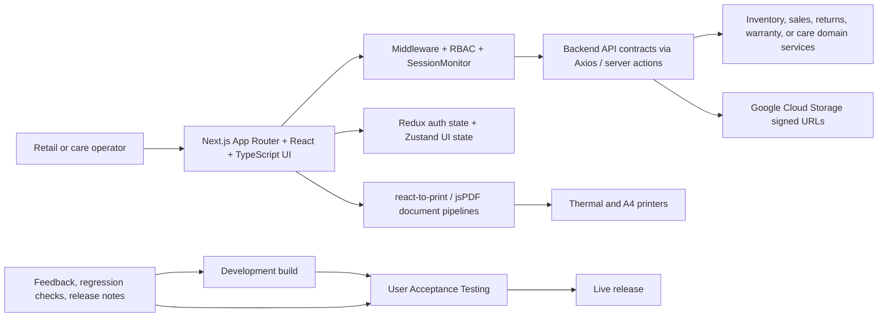

# APP360 Industrial Training - Electro and Caregiver Management

> Evidence-based internship case study derived from the complete document archive in
> `C:\projects\app-360`. This folder contains seven PDFs and no source repository. The technical
> implementation statements below therefore reflect the signed monthly assessments and final
> training report; they are not presented as an independent source-code audit.

- **Placement:** Software Engineering Intern, APP360 (Pvt) Ltd.
- **Programme:** University of Moratuwa, Faculty of Information Technology, IT-IS3900 Industrial
  Training
- **Period:** 21 February 2025 - 21 August 2025 (24 weeks)
- **Primary product streams:** Electro retail platform and CGM Caregiver Management
- **Evidence reviewed:** 35-page final report and six four-week assessment sheets (47 PDF pages in
  total)

---

## One-liner

A 24-week production internship delivering authentication, inventory, cashier, returns, document
printing, and caregiver-operations workflows across APP360's Next.js retail and care-management
platforms, with work promoted through Development, UAT, and Live release stages.

## Role and context

The placement progressed from supervised onboarding into ownership of complete vertical slices.
The reports attribute the following responsibilities to Mohamed MRI (Ifham Mohamed):

- authentication hardening, first-login password changes, session-expiry recovery, middleware,
  environment indicators, and a migration from the legacy Pages Router to the App Router;
- the Goods-Received Note, stock, transfer, cashier, payments, returns, counter-session, warranty,
  customer, and supporting configuration experiences in Electro;
- A4, A5, thermal, and generated-PDF document pipelines with brand fallbacks, signature areas, and
  print-only state;
- greenfield CGM foundations and workflows for packages, clients, patients, caregivers, care jobs,
  assignments, attachments, and attendance;
- release notes, Development and UAT build support, regression testing, stakeholder demonstrations,
  API-contract coordination, and mentoring a junior intern.

This was not a solo product build. The report describes cross-functional collaboration with
frontend/full-stack mentors, backend engineers, QA/UAT participants, support/release staff, HR, and
client stakeholders. APP360's proprietary repositories are not present in `C:\projects`, so file,
route, schema, test-coverage, and commit-count claims cannot be independently verified here.

## Business and engineering problem

APP360 builds operational software where small defects directly affect shop-floor or care-service
work: a wrong cost subtotal distorts purchasing data, a duplicate stock line corrupts inventory, a
blocked print window interrupts checkout, an expired session can discard in-progress work, and an
invalid shift/date combination can create an unusable care job.

The internship therefore focused on more than adding screens. Its recurring goals were to:

1. make high-volume retail actions fast and predictable for cashiers and back-office operators;
2. preserve inventory, serial, quantity, discount, payment, and status correctness across related
   workflows;
3. create audit-friendly thermal and A4 documents that render consistently across browsers;
4. recover gracefully from authentication expiry and environment/configuration differences;
5. establish a consistent UI foundation for long tables, filters, dialogs, status badges, and
   feedback;
6. transfer the lessons from the mature Electro platform into a new caregiver-management vertical.

No baseline timing, user-count, transaction-volume, uptime, or defect-rate measurement is included
in the archive. Statements such as "faster" and "fewer regressions" are qualitative observations
from the report, not benchmark results.

## Product and system landscape

APP360 is described as a multi-product company serving retail, service, and care organisations.
The report names POS360, BackOffice, TOKEN360, PAY360, CRM, InstaBuzz, ECOM360, DINE360, and CGM.
The internship's implementation work concentrated on the shared Electro retail stack and CGM.

The architecture is reconstructed from the training reports. Database technology, backend
framework, infrastructure provider, deployment topology, and exact API surface are not identified
in the supplied archive and should not be inferred.

## Technology and delivery stack

| Area | Evidence in the reports |
|---|---|
| Web application | Next.js App Router, React, TypeScript |
| UI and styling | Tailwind CSS, shadcn/ui, Sonner, Framer Motion, reusable dialogs/tables/badges |
| State | Redux Toolkit for authentication; Zustand for lightweight client UI state |
| Data access | Axios with interceptors; server actions in CGM |
| Authentication | Iron Session, HTTP-only cookies, JWT refresh, RBAC, middleware guards, SessionMonitor |
| Dates and scheduling | date-fns, react-day-picker, date/time/day-range controls, explicit timezone handling |
| Printing | react-to-print, jsPDF, print-specific CSS, browser print windows, thermal/A4/A5 layouts |
| Media | Google Cloud Storage signed URLs, profile-image cropping and fallbacks |
| Development | Visual Studio Code, Postman, Bitbucket, SourceTree |
| Work/release process | TeamTime, feature/bugfix branches, tickets, build identifiers, Development -> UAT -> Live |

## Electro - delivered functional scope

### Authentication and application foundations

- Implemented the first-login password-update flow and corrected post-update routing.
- Built a `SessionMonitor` and a shared session-expired trigger so users can re-authenticate after
  cookie/JWT expiry without immediately losing their current work.
- Corrected cookie path and SameSite behaviour and introduced public-route allow-lists.
- Applied route- and component-level role checks.
- Migrated layouts, middleware, navigation, and error boundaries from mixed Pages/App Router
  patterns to the App Router.
- Added an environment configuration service with timeouts/fallbacks and a visible Development/UAT
  environment badge.

### Inventory and purchasing

The reports describe full or substantial work in the following areas:

- **Goods-Received Notes:** search, table, create, single view, server-rendered edit, item CRUD,
  serial handling, status flow, discounts, totals, A4/thermal/bulk/PDF printing, and confirmation
  guards.
- **Financial correction:** GRN subtotals were changed to use cost price rather than selling price,
  keeping purchasing documents aligned with backend/accounting expectations.
- **Stock:** accessory and device lists and detail views, category/brand/status/warranty filters,
  null-safe currency output, product/serial lookup, stock summaries, and A4 prints.
- **Transfers:** creation, search, detail, edit, print, duplicate detection by stock identifier,
  positive-quantity checks, column preferences, cache clearing after completion, and terminology
  normalisation from "Mobile" to "Device".
- **Configuration:** colour options, brands, categories, manufacture countries, import regions,
  suppliers, warranty providers, employees, access privileges, roles, languages, address areas,
  and related CRUD/status dialogs.

### Cashier, orders, payments, and customers

- Reorganised the cashier into a 12-column customer/product -> order -> payment workflow.
- Added product/customer search, a walk-in customer path, stock- and discount-aware item selection,
  and keyboard shortcuts such as `Alt+S` and `Alt+C`.
- Built a typed payment table and summary for cash, card, bank transfer, and order-refund lines.
- Prevented negative or above-balance payments and added confirmed zero-value orders for fully
  discounted sales.
- Normalised amount/percentage discount entry around one internal source of truth.
- Delivered customer CRUD/profile/search/verification improvements and made last name optional.
- Added created-date filtering and standardised downstream order status wording.

### Returns, counter sessions, and warranty

- Implemented returns search/filtering, creation, item grouping, duplicate and maximum-quantity
  guards, detail views, status handling, and narrow thermal receipts.
- Carried returned-order identifiers through the flow for traceability.
- Implemented counter-session selection/opening, end-of-session reconciliation, username
  confirmation, notes, and thermal/back-office prints.
- Added warranty-claim filters, bill-based creation, full detail/timeline views, status dialogs,
  loading/empty states, and JSDoc on key components.

### Printing and document engineering

Printing was a cross-cutting engineering stream rather than a final styling task:

- A4 stock, GRN, transfer, invoice, and report layouts plus narrow thermal receipts.
- `react-to-print` for view-derived output and jsPDF for generated documents.
- print-state flags that remove interactive controls from the printed result;
- shared headers, teal branding, logo fallback order, reserved footer space, and signature blocks;
- grouped accessory quantities, serial/discount tables, and filter summaries;
- error handling for popup blockers and browser-specific print behaviour.

## CGM - delivered functional scope

CGM was bootstrapped as a greenfield care-provider application during the latter part of the
placement.

### Platform foundation

- Server-action login, exception schemas, layout theming, Redux auth slice, Iron Session, RBAC,
  middleware, and session-expiry recovery.
- User administration, status handling, role/privilege configuration, language/address-area/skill
  configuration, and package CRUD with pricing/scope inputs.
- Google Cloud Storage key validation, signed URL error surfacing, image fallbacks, and reusable UI
  primitives transferred from Electro.

### Care domain

| Domain | Implemented behaviour described in the evidence |
|---|---|
| Clients | CRUD, profile, active status, name/email/contact/address filters, search, skeletons |
| Patients | CRUD, client association, profile, gender/care-mode/weight/height/status filters, unit hints, age calculation |
| Caregivers | Multi-step profile, languages, specialisations, skills, experience, optional account, status, cropper, generated CV |
| Packages | Filtered/paginated CRUD, status, price and care-scope inputs |
| Care jobs | Client/patient/package selection, shift and care-type rules, date/time/day controls, contract validation, detail/audit context |
| Assignments | Care-job/caregiver filtering, quick assignment, weekly active/inactive-day validation, notes and status |
| Attachments | Configuration, create/select/add/manage/update/delete/status lifecycle, job linkage, table/full reports |
| Attendance | Filtered overview, create/view/edit, Singapore-time normalisation, caregiver/client/patient/job context |

The care-job creation path distinguishes stay-in, stay-out, and care-centre admission behaviour;
uses debounced selectors; limits selectable days; validates shift/time and contract consistency;
and clears the form on successful submission. UAT feedback also drove terminology cleanup
(`Care Job`, `AssignID`), inline related-entity views, attachment reporting, and more defensive
picker validation.

## End-to-end flows

### Retail receiving and stock flow

1. The operator searches/selects products or accessories for a GRN.
2. The UI validates quantities, prevents duplicate stock, captures serials, and normalises the
   discount calculation.
3. The GRN total uses cost price and exposes status/confirmation actions.
4. Completion updates the relevant stock domain through backend APIs.
5. The operator prints an A4/thermal document with brand, serial, totals, audit, and signature
   information.

### Cashier and return flow

1. The cashier chooses or creates a customer, searches products, and enters quantities/discounts.
2. The order panel derives totals and the payment panel validates multiple tender lines.
3. Successful checkout produces an invoice/receipt and supports counter-session reconciliation.
4. A later return is tied back to the original order, groups items, caps the returnable quantity,
   records refund/add-to-order behaviour, and prints a return document.

### Care-job operations flow

1. Configure skills, languages, packages, attachment types, users, and permissions.
2. Register client and patient profiles and create/maintain caregiver profiles.
3. Create a care job from the client, patient, package, dates, shift, selected days, address, and
   notes.
4. Assign an eligible caregiver and expose that assignment on the care-job detail.
5. Add/manage job attachments and record attendance with explicit timezone normalisation.
6. Inspect the connected client, patient, caregiver, attachment, status, and attendance context in
   operator views/reports.

## Engineering challenges and resolutions

| Challenge | Resolution documented in the archive |
|---|---|
| Mixed Pages Router and App Router caused route/auth ambiguity | Migrated Electro to the App Router, consolidating layouts, middleware, navigation, and error handling |
| Expired sessions and new-user password cookies produced confusing redirects | SessionMonitor, shared session-expired events, cookie path/SameSite fixes, and public-route allow-lists |
| Print output clipped footers or included live controls | Print-state flags, print-only CSS, reserved signature/footer space, shared headers, and logo fallbacks |
| Percentage and amount discounts drifted between rows and summaries | A single percentage source of truth with deterministic amount conversion and shared utilities |
| Duplicate/invalid stock and return lines | Stock-ID duplicate guards, positive/max quantity validation, grouping, confirmations, badges, and actionable toasts |
| Large filter panels overflowed small screens | Horizontally scrollable/truncated applied filters, sticky table regions, debounced search, and lazy fetching |
| Attendance dates varied by client/runtime timezone | Explicit Singapore-time normalisation and consistent formatting in CGM attendance |
| GCS signed URL failures were hard to diagnose | Service-account key checks, explicit error surfaces, fallbacks, and bounded retries |
| Local Windows/editor instability affected thermal-print testing | Shifted the print-testing environment to Ubuntu and retained browser/device validation |

## Release and assessment evidence

The signed assessments record progressively larger responsibilities:

- **Weeks 1-4:** onboarding, users, suppliers, warranty providers, accessory products, CRUD,
  responsive tables, and UI consistency.
- **Weeks 5-8:** first-login password and soft re-authentication, App Router migration, GRNs,
  stock, transfers, stronger validation, SSR pages, and standardised feedback.
- **Weeks 9-12:** GRN warranty data, customers and OTP verification, cashier/session/payment
  foundations, developer release, printing, and data-accuracy corrections.
- **Weeks 13-16:** 12-column cashier, complete returns flow, warranty claims, A4/thermal printing,
  access privileges/roles, and CGM bootstrap.
- **Weeks 17-20:** CGM configuration and caregiver vertical, jsPDF CV generation, Redux/Iron
  Session RBAC, print/billing upgrades, users and packages.
- **Weeks 21-24:** clients, patients, care jobs, caregiver assignment, attachments, attendance,
  stock A4 printing, password/admin reset flows, scheduling controls, and final regression work.

The final report also identifies Electro Development builds 39, 40, 45, 46, and 55; UAT build 16;
and CGM Development builds 5, 6, and 14 plus UAT builds 3 and 5 as evidence of release progression.
These are internal identifiers, not public software versions.

## Best practices demonstrated

- Ownership of complete operator workflows rather than isolated components.
- Server rendering for the first view of heavy tables, with debounced or lazy client queries.
- Centralised authentication/session behaviour and explicit route/permission boundaries.
- Data-integrity guards for quantity, duplicates, serials, discounts, payments, and schedules.
- Reusable UI patterns for tables, filters, dialogs, loaders, statuses, toasts, and print headers.
- Development -> UAT -> Live promotion with build identifiers, release notes, and regression loops.
- Print output treated as an auditable product surface with its own state and browser constraints.
- Continuous incorporation of user-acceptance feedback and shared API-contract troubleshooting.

## Outcomes

- Delivered broad production-facing scope in two business domains during a 24-week placement.
- Moved from onboarding tasks to ownership of complete GRN, transfer, returns, print, and care-job
  workflows.
- Corrected concrete integrity defects including cost-vs-selling-price subtotals, discount drift,
  duplicate stock/return items, invalid quantities, and timezone handling.
- Built reusable session, filtering, table, confirmation, and printing patterns that were applied
  across multiple modules.
- Participated in UAT demonstrations, publish cycles, regression work, release documentation, and
  junior-intern mentoring.

No numerical performance or adoption metric is supplied by the evidence. A public portfolio should
not invent checkout-time reduction, print-success percentage, active users, revenue, or defect-rate
figures.

## Current limitations and recommended verification

1. No proprietary source code is present, so implementation details are report-backed rather than
   code-verified.
2. The backend stack, schema, complete API inventory, automated tests, CI/CD implementation, and
   infrastructure are not documented precisely enough to claim.
3. The reports describe qualitative improvements but no reproducible performance benchmarks.
4. APP360 client/product confidentiality should be respected; screenshots and identifiers should
   be de-identified before public publication.
5. Claims of "production-grade," user counts, revenue impact, availability, or exact release
   frequency need employer confirmation.

## Concepts and skills demonstrated

Next.js App Router migration; React and TypeScript; SSR for data-heavy views; Iron Session and
HTTP-only cookies; JWT refresh; RBAC; middleware route guards; graceful re-authentication; Redux
Toolkit and Zustand; Axios interceptors; debounced search; optimistic/cache invalidation concerns;
financial calculation normalisation; inventory and serial traceability; multi-tender payments;
thermal/A4 print CSS; react-to-print; jsPDF; Google Cloud Storage signed URLs; image cropping;
date/time range validation; timezone normalisation; UAT; release notes; cross-functional API
contracts; operator-centred UX; mentoring.

## Repository and evidence map

| File | Scope |
|---|---|
| `215075J-Intern Final Report.pdf` | 35-page placement report covering company context, technology, Electro, CGM, challenges, outcomes, and reflection |
| `215075J_Month_01.pdf` | Weeks 1-4: onboarding, users, suppliers/warranty providers, accessory products, CRUD/UI work |
| `215075J_Month_02-signed.pdf` | Weeks 5-8: authentication, App Router, GRN, stock, transfer, validation and SSR |
| `215075J_Month_03-signed.pdf` | Weeks 9-12: GRN warranty, customers, cashier/payment/session, printing and release work |
| `215075J_Month_04-signed.pdf` | Weeks 13-16: cashier redesign, returns, warranty, print pipelines and CGM bootstrap |
| `215075J_Month_05-signed.pdf` | Weeks 17-20: CGM configuration/caregivers, CV generation, RBAC, users/packages, print upgrades |
| `215075J_Month_06-signed.pdf` | Weeks 21-24: clients/patients/care jobs/assignment/attachments/attendance and platform hardening |

## Links

- **Source archive:** local PDF evidence under `C:\projects\app-360`.
- **Public repository/demo:** unavailable in the supplied material; the work belongs to proprietary
  APP360 products.
- **Portfolio evidence to add:** a de-identified architecture diagram, one approved print sample,
  and employer-confirmed metrics if disclosure is permitted.
