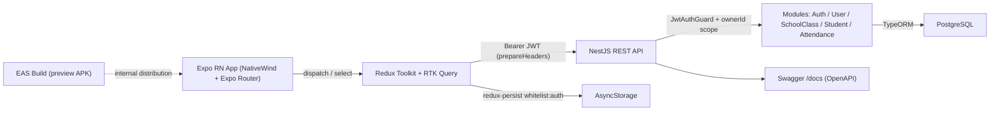

# Attendify — Classroom Attendance App

> Case-study documentation. The condensed version lives in
> `src/data/projects.data.tsx` (project id `attendify`) and on the site at
> `/projects/attendify`; the CV carries a one-line entry + a deep-link.
> Built from two repos: `attendify-be` (NestJS API) and `attendify` (Expo / React Native).

---

## One-liner
A mobile-first classroom attendance app that lets a teacher mark Present/Absent in one tap
per student and auto-produces the boys/girls-split daily, weekly, monthly and yearly
summaries their school requires.

## Role & context
Solo, end-to-end build (backend + mobile, design + implementation + EAS release) for **a
specific schoolteacher** whose paper register was slow to fill and even slower to re-tally
into the gender-split per-division reports the school expects each month. Scope: data model,
REST API, auth, mobile UI, state management, and internal APK distribution.

## Problem
The teacher's existing workflow is a **paper register**: mark each student daily, then at
month-end manually re-count Present days, split by gender, per class/division for school
reports. That re-tally is the painful step — error-prone, not reusable, and impossible to
audit. The goal was a phone-first tool that captures attendance in **one tap per student** at
the start of class, and produces school-format summaries **on demand** instead of at
month-end.
_To confirm — a baseline number from the teacher (e.g. "~15 min/day on paper, ~2 hr/month on
tally") so the problem statement has a metric._

## Approach / flow
- **Expo RN client** — NativeWind 4 styling, Expo Router 6 typed routes, every screen paired
  with a `use*.tsx` hook that owns its data logic.
- **State** — Redux Toolkit slice for auth, **RTK Query** for all server state with tag-based
  invalidation (`Auth`, `User`, `Classes`, `Students`, `Attendance`).
- **Persistence on device** — `redux-persist` whitelisting only the auth slice, backed by
  AsyncStorage, gated through `PersistGate` so the login screen never flashes on cold start.
- **Transport** — `fetchBaseQuery` with `prepareHeaders` injecting `Authorization: Bearer
  <jwt>` on every call.
- **NestJS API** — 5 feature modules (`Auth`, `User`, `SchoolClass`, `Student`, `Attendance`)
  behind a global `JwtAuthGuard`; Swagger/OpenAPI mounted at `/docs`.
- **Persistence on server** — PostgreSQL via TypeORM; idempotent writes via a composite
  unique index `(studentId, date)`.
- **Distribution** — EAS Build profiles: `development` (dev client), `preview` (internal APK,
  currently shipped), `production` (Play Store app bundle with `autoIncrement`).

## Tech stack
- **Languages:** TypeScript (strict mode both sides), SQL.
- **Backend:** NestJS 11, TypeORM, PostgreSQL, `@nestjs/jwt`, `bcryptjs` (10 salt rounds),
  `@nestjs/swagger`, `class-validator`, `@nestjs/config`.
- **Mobile:** Expo SDK 54, React Native 0.81 (New Architecture + React Compiler enabled),
  React 19, Expo Router 6 (`typedRoutes: true`), Redux Toolkit 2 + RTK Query, redux-persist 6
  + AsyncStorage 2, NativeWind 4, React Native Paper 5, Reanimated 4, community datetimepicker.
- **Tooling:** Jest + Supertest, ESLint flat config, Prettier, EAS Build.

## Best practices followed
1. **Multi-tenant ownership isolation** — every class/student/attendance query is scoped by
   `ownerId` from the JWT, so one teacher can never read or mutate another's data.
2. **Idempotent writes** — a composite unique index `(studentId, date)` plus an upsert path
   means the same mark can be sent twice without creating duplicates.
3. **Password hygiene** — bcrypt-hashed passwords and a `sanitize()` projection that strips
   the hash before any user object leaves the API; password reset requires the old password.
4. **Hook-per-screen separation of concerns** — each screen has a sibling `use<Screen>.tsx`
   holding data/effects, leaving the screen file as pure JSX (testable in isolation).
5. **Cache-correctness over manual refetch** — RTK Query tags drive invalidation, so marking
   a student automatically refreshes the dependent summary screens.
6. **End-to-end type safety** — TS `strict`, `@/*` path aliases, and Expo Router typed routes
   give compile-time guarantees from route name → API call → Redux state.

## Challenges → resolution
- **Four-granularity, gender-split reporting with a non-ISO "week".** School reports demand
  boys/girls splits daily, weekly, monthly and yearly, and the academic week is
  *week-within-the-month* (1–5), not ISO week. Naive per-endpoint SQL would be four
  near-duplicate queries disagreeing on edge cases (months spanning 5 partial weeks, students
  added mid-term).
  **Fix:** centralised the maths in the attendance service — fetch the marks for the date
  range once, then group in-memory by a custom week-of-month function and by `gender`. One
  source of truth feeds all summary endpoints; the client receives render-ready totals.
- **Login flash on Android cold start.** The login screen flashed before redux-persist
  rehydrated the saved JWT.
  **Fix:** wrapped the app in `PersistGate` (`whitelist: ['auth']`) and gated the entry route
  on the *rehydrated* `accessToken` before choosing login vs class-select; auth routes also
  suppress the bottom-tab layout.

## Outcomes
- **Shipped both halves end-to-end.** NestJS API on PostgreSQL with Swagger live at `/docs`;
  the mobile app is built and distributed as an **internal APK via the EAS `preview` profile**
  (Android package `com.akarms.attendify`).
- **Replaces the paper register**: per-student one-tap Present/Absent on a date-navigated
  list, with daily/weekly/monthly/yearly gender-split summaries computed server-side and
  rendered without an extra round-trip.
- **Footprint**: ~35 TypeScript files across 5 backend modules; ~25 mobile screen/component
  files plus a dedicated `utils/attendance.ts` for filter/count helpers — all under TS strict.
- _To confirm — # students tracked, # classes, time-per-session saved vs paper, month-end
  tally time eliminated._

## Concepts & skills learnt
JWT bearer authentication with NestJS Passport guards · Role-Based Access Control (TEACHER /
STUDENT / ADMIN) · Multi-tenant data isolation via ownership scoping · Composite unique
indexes for idempotent writes / upserts · TypeORM relations & cascading deletes · RTK Query
with tag-based cache invalidation · redux-persist + PersistGate rehydration · Expo Router
file-based & typed routes · NativeWind / Tailwind styling in React Native · DTO validation
with class-validator + auto-generated Swagger/OpenAPI · EAS Build profiles & internal APK
distribution · React Native New Architecture + React Compiler

## Links
- **Backend repo:** _To confirm — public GitHub URL for `attendify-be`._
- **Live API / Swagger:** _To confirm — deploy URL + `/docs` if you want the API discoverable._
- **APK:** internal-only via EAS preview; consider a GitHub Releases build for recruiters.
- **Demo:** _Recommended — a 60-second screen recording of mark-attendance → monthly-summary._

---

## Still to confirm (fills the remaining TODOs in `projects.data.tsx`)
1. The baseline metric (time on paper register / month-end tally).
2. The public `attendify-be` GitHub URL (and whether to link the mobile repo).
3. A live API / Swagger deploy URL, if any.
4. Usage metrics once the teacher reports back (students, classes, time saved).
5. A demo video / screenshots and `public/images/projects/attendify.png`.
