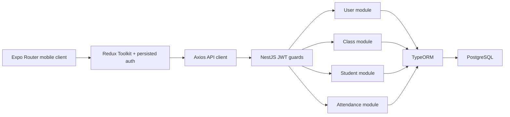
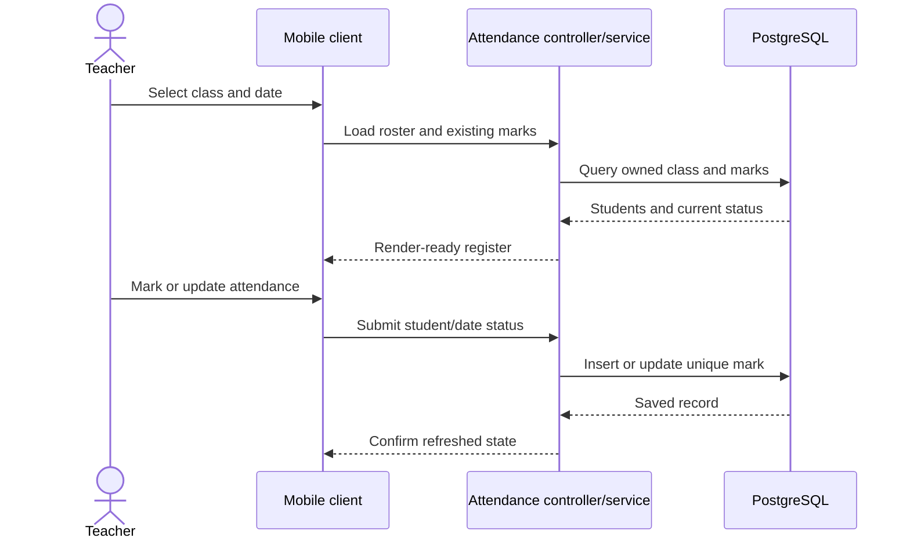

# Attendify - Mobile Attendance Management

> Source-verified case study covering both repositories under `C:\projects\attendify`:
> `attendify` (Expo client) and `attendify-be` (NestJS API). Ownership is reported from Git rather
> than inferred from the folder's presence in a portfolio workspace.

- **Project type:** Teacher-oriented class and attendance system
- **Client:** Expo / React Native / TypeScript
- **API:** NestJS / TypeORM / PostgreSQL
- **Repository scale:** 102 tracked mobile files and 51 tracked backend files

---

## One-liner

A cross-platform attendance application that lets a teacher organize classes and students, mark a
daily register efficiently, and review monthly and weekly summaries backed by a JWT-protected
NestJS API.

## Role and provenance

The checked-out Git histories do **not** support attributing this project to Ifham Mohamed. All 23
commits in the mobile repository and all five commits in the backend repository are authored by
`Akar` / `Akar Ahamadh`. Unless there is separate evidence of collaboration, this document should
be treated as a codebase analysis, not as an Ifham-owned portfolio case study.

That provenance distinction is important: the implementation can be described precisely, but a
personal role, client relationship, release responsibility, or outcome must not be invented from
source code alone.

## Problem and scope

Paper registers and ad-hoc spreadsheets make day-to-day attendance capture slow and monthly
reporting error-prone. Attendify turns the teacher's recurring workflow into four connected
capabilities:

- authenticate and retain a teacher session;
- maintain owned classes and their students;
- mark one attendance record per student per date;
- view render-ready class/student attendance summaries.

The entities include `ADMIN`, `TEACHER`, and `STUDENT` roles, but the audited application flow is
primarily teacher-oriented. No complete administrator or student self-service experience was
established during the audit.

## Architecture

The client uses Expo Router for file-based navigation and NativeWind for styling. Redux Toolkit
stores domain and request state; `redux-persist` retains authentication across reloads. An Axios
layer attaches the access token to API calls.

The NestJS server separates users, classes, students, and attendance into modules with DTOs,
controllers, services, and TypeORM entities. JWT guards protect the domain controllers, and service
queries scope class data to the authenticated owner.

## Domain model

| Entity | Main responsibility |
|---|---|
| `User` | Identity, credentials, role, and class ownership |
| `SchoolClass` | A teacher-owned teaching group |
| `Student` | A learner belonging to a class |
| `AttendanceMark` | A student's presence/status for one calendar date |

The attendance table enforces a unique `(studentId, date)` pair. This is a valuable integrity rule:
UI mistakes or repeated requests cannot silently create two registers for the same learner and day.

## Core workflows

### Authentication and restoration

1. The user signs in through the mobile client.
2. The API validates credentials and returns a JWT-backed response.
3. The client stores authentication state in Redux.
4. `PersistGate` waits for rehydration before the entry route chooses the authenticated or public
   path, avoiding a redirect flash on reload.
5. Axios includes the token on protected requests.

### Class and roster management

Authenticated teachers can create and manage classes, then add and maintain students inside an
owned class. Backend ownership filters are important because hiding another teacher's class in the
UI alone would not provide authorization.

### Daily attendance

### Summaries

The backend aggregates attendance so the client does not issue a query per visual cell. Summary
logic includes calendar-month grouping and a week-within-month concept (weeks 1–5), which should
not be confused with ISO week numbers. Centralizing that definition helps different screens show
consistent totals.

## Technology stack

| Area | Technology |
|---|---|
| Mobile | Expo, React Native, TypeScript |
| Navigation | Expo Router with typed routes |
| Styling | NativeWind / Tailwind-style utilities |
| State | Redux Toolkit and `redux-persist` |
| Networking | Axios |
| API | NestJS and TypeScript |
| Authentication | JWT and Nest guards |
| Validation | Nest DTO validation |
| Persistence | TypeORM and PostgreSQL |
| Mobile delivery | EAS configuration with development, preview, and production profiles |

## Engineering strengths

- Strict TypeScript and path aliases improve consistency across client features.
- File-based typed routes reduce navigation-string errors.
- Authentication is rehydration-aware rather than making an early decision from empty state.
- Domain controllers are guarded by JWT authentication.
- Backend queries enforce ownership instead of relying only on client filtering.
- A database uniqueness constraint protects one-mark-per-student-per-day integrity.
- Summary calculations are kept server-side and returned in display-friendly form.
- Environment-specific EAS profiles separate development, internal preview, and production builds.

## Challenges and implemented responses

### Correct summary semantics

“Week” can mean ISO week, a rolling seven-day period, or a numbered portion of the current month.
The project standardizes on week-within-month for its reporting view and calculates the aggregate
in one backend source of truth.

### Preventing authentication flicker

Persisted state is asynchronous. Routing before rehydration can briefly send a signed-in user to
login. `PersistGate` and token-aware entry routing delay that decision until the stored auth slice is
available.

### Protecting tenant-like teacher data

Class ownership is applied in server-side queries, so knowledge of an identifier does not by itself
grant access to another teacher's records.

## Outcomes

- The source implements the principal teacher workflow from authentication through class/roster
  setup, daily marking, and summaries.
- The mobile client and API are separately versioned and can be developed/deployed independently.
- Database and service rules address duplicate daily marks and cross-owner access.
- EAS profiles provide a path from developer builds through internal preview to an Android app
  bundle.

No verified deployment URL, store listing, user count, institutional rollout, performance result,
or author-attributable business outcome was found. Those facts require project-owner evidence.

## Current limitations and risks

- Git provenance conflicts with the former solo-Ifham attribution and must be resolved before this
  appears in a personal portfolio.
- The TypeORM configuration uses `synchronize: true`; production deployments should use reviewed
  migrations instead of automatic schema mutation.
- Tests are limited to scaffold/default application and user specs; the core attendance, class,
  authorization, uniqueness, and summary behaviors lack meaningful automated coverage.
- Role values exist, but comprehensive role authorization beyond authentication/ownership was not
  demonstrated across separate admin/student experiences.
- Token refresh, revocation, password recovery, rate limiting, audit logging, and production secret
  management were not established from the audited files.
- Offline attendance capture and later synchronization are not implemented.
- A production EAS profile proves packaging configuration, not a Play Store release.

## Recommended next steps

1. Confirm the portfolio owner's contribution and document it with commits, a fork, or team evidence.
2. Add API integration tests for ownership isolation and duplicate daily submissions.
3. Test month boundaries, leap years, locale/timezone behavior, and the week-within-month definition.
4. Replace `synchronize: true` with versioned database migrations.
5. Add explicit role guards if admin and student APIs are exposed.
6. Add a documented token refresh/revocation strategy and rate limiting on authentication.
7. Add mobile end-to-end coverage for restore, class selection, attendance edits, and summaries.

## Key concepts demonstrated

- Expo Router and typed mobile navigation
- Redux Toolkit persistence and rehydration
- NestJS modular architecture
- JWT authentication and resource ownership
- TypeORM relational modelling
- Database uniqueness constraints
- Server-side aggregation
- Mobile build profiles with EAS

## Evidence map

| Evidence | What it establishes |
|---|---|
| Mobile `package.json`, app config, and EAS config | Client stack, routing, and build profiles |
| Mobile routes/components/store | Teacher UI, persisted authentication, and feature state |
| Backend modules/controllers/services | API boundaries and protected workflows |
| TypeORM entities | Four-entity domain and daily-mark uniqueness |
| Backend specs | Present but narrow automated-test baseline |
| Both Git histories | All observed commits attributed to Akar/Akar Ahamadh |

## Links

- **Mobile Git remote:** [github.com/Attendify-Mobile-App/attendify](https://github.com/Attendify-Mobile-App/attendify)
- **Backend Git remote:** [github.com/Attendify-Mobile-App/attendify-be](https://github.com/Attendify-Mobile-App/attendify-be)
- **Local mobile source:** `C:\projects\attendify\attendify`
- **Local backend source:** `C:\projects\attendify\attendify-be`
- **Remote visibility, demo, and store listing:** not verified in the supplied material.
