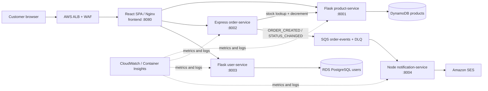

# CloudMart — AWS EKS Microservices E-Commerce Platform

> Comprehensive, code-verified project case study. Source audited from the complete
> `CloudMart` repository at commit `1ca425d0cfd4a3f4fbdd489691b27b6741826e7e`
> on 15 August 2026. The repository's last live-AWS audit is dated 10–11 June 2026;
> live-state statements below are attributed to that audit rather than presented as
> current, independently re-verified cloud state.

**Course:** IS 4630 Cloud Infrastructure Management, University of Moratuwa  
**Repository:** `github.com/zakiarkam/CloudMart`  
**Development window visible in Git:** 1 May–19 June 2026 · 62 commits  
**Cloud:** AWS, `ap-south-1` (Mumbai) · Terraform · Amazon EKS 1.30  
**Audit scope:** 180 tracked files; approximately 8,062 lines of application, infrastructure,
deployment, workflow, SQL, and operations code, plus the complete documentation tree.

---

## One-liner

A five-service e-commerce system that runs locally with in-memory adapters and deploys to AWS as
ARM64 containers on Amazon EKS, backed by DynamoDB, RDS PostgreSQL, SQS, and SES, with Terraform,
least-privilege IRSA, Kubernetes network isolation, CloudWatch observability, GitHub Actions, and
documented FinOps and disaster-recovery practices.

## Role and project context

CloudMart was built by a four-person group as the infrastructure-management assignment for
IS 4630. It is both a working shopping application and a demonstration of cloud-platform design:
containerisation, Kubernetes operations, AWS networking and managed data services, security,
observability, CI/CD, cost governance, and recovery planning are all first-class parts of the repo.

### Ifham's role

**Ifham — networking, VPC, infrastructure as code, and deployment lead.** The repository's formal
ownership records credit Ifham with:

- the Terraform root and the `networking` and `compute-eks` modules;
- the three-tier VPC, routing, NAT and VPC endpoints, security-group wiring, EKS cluster, ARM64
  managed node group, OIDC provider, and remote-state design;
- leading the image-push and EKS deployment phases and maintaining their command-based runbooks;
- integrating/fixing cross-cutting deployment blockers, including ALB `ingressClassName`, IRSA
  service-account names, RDS-managed `rds!db-*` secret access, Secrets Store CSI token audience,
  ARM64/QEMU CI builds, and Terraform dependency issues;
- the executive-summary and system-architecture report sections and the network/Kubernetes
  diagrams.

Git history shows multiple contributors, so this should be represented as a **team project with a
clearly scoped individual platform role**, not as a solo build.

### Team ownership

| Member | Primary ownership | Notable repository scope |
|---|---|---|
| **Ifham** | Networking, VPC, IaC, deployment lead | Terraform root, networking and EKS compute; deployment phases; architecture integration |
| **Arkam** | Containers and Kubernetes | Five hardened multi-stage Dockerfiles; Deployments, Services, Ingress, HPA, PDB, ConfigMaps; scaling demo |
| **Aadhil** | Security and CI/CD | IRSA/IAM, KMS, secrets, NetworkPolicy, WAF/GuardDuty, GitHub Actions, Trivy and OIDC design |
| **Zanar** | Observability, FinOps and DR | CloudWatch dashboard/alarms, cost analysis and budgets, RTO/RPO and recovery runbook |

## Problem and objectives

The assignment required the team to turn a small e-commerce application into an auditable,
cloud-managed platform rather than simply host a monolith. The implementation had to solve five
connected problems:

1. Split catalogue, order, identity, notification, and presentation responsibilities into
   separately deployable services.
2. Keep local development simple while switching to AWS-managed backends in the cluster without
   rewriting route logic.
3. Deploy safely on managed Kubernetes with health probes, rolling updates, horizontal scaling,
   disruption budgets, and network isolation.
4. Remove static cloud credentials from workloads and CI while encrypting data and retaining an
   audit trail.
5. Make the operational story demonstrable: test/build/deploy pipelines, dashboards and alarms,
   cost controls, backup/recovery procedures, ADRs, and a timed live-demo runbook.

## What the user-facing application does

- Browse a six-item seeded catalogue with name/description search and category filtering.
- View price, category, and current stock.
- Add products to an in-browser cart and remove cart lines.
- Register or sign in with email/password.
- Submit an order; the order service looks up canonical product data, checks and decrements stock,
  calculates line totals and the order total, then emits an event.
- View order cards and their item, status, timestamp, and total details.
- Consume order-created and order-status events asynchronously and send/log confirmation emails.
- Expose health/readiness endpoints for containers, Kubernetes, deployment gates, and demos.

The frontend is a compact React 18 SPA. It uses component-local state and inline styling rather than
a router or state-management library. Nginx serves the production bundle and reverse-proxies
`/api/products`, `/api/orders`, `/api/auth`, `/api/users`, and `/api/categories` to the internal
ClusterIP services.

## System architecture



The application follows an **adapter pattern**. Local mode selects in-memory stores, an in-memory
event log, and console email. AWS mode selects DynamoDB, PostgreSQL, SQS, SES, and CloudWatch through
environment variables. AWS SDKs and the PostgreSQL driver are lazy-loaded where practical, keeping
the local test path independent of cloud credentials.

## End-to-end flows

### Catalogue flow

1. The browser requests `/api/products`, optionally adding `search` and `category`.
2. Nginx forwards the request to `product-service:8001/products`.
3. The product adapter reads the in-memory dictionary locally or scans the DynamoDB table in AWS.
4. The service returns `{ products, count }`; the React product grid renders the result.

### Authentication flow

1. Registration validates name/email/password presence and a minimum eight-character password.
2. The user service normalises the email, rejects duplicates, hashes the password with bcrypt, and
   stores the user in memory or PostgreSQL.
3. Login compares the bcrypt hash and issues an HS256 JWT containing `sub`, email, name, role,
   issued-at, and expiry claims. Default expiry is 24 hours.
4. Protected profile routes use a `Bearer` token decorator; the SPA stores the token in
   `localStorage`.

### Order and notification flow

1. The browser posts `userId`, cart items, and shipping address to `/api/orders`.
2. Order-service validates that a user ID and non-empty items array exist.
3. For each item, it calls product-service for stock and product details, calculates the line total,
   and calls the stock-decrement endpoint.
4. It stores the completed order in its process-local `Map` and publishes `ORDER_CREATED` to the
   in-memory event log or SQS.
5. It emits the fire-and-forget `CloudMart/OrdersPlaced` custom metric when CloudWatch metrics are
   enabled.
6. Notification-service polls the local `/events` endpoint or SQS, formats a text email, and sends it
   through console logging or SES. Successfully handled SQS messages are deleted; failures remain
   available for retry and eventual DLQ redrive.

## Service catalogue

| Component | Runtime | Port | Local state/backend | AWS backend | Main responsibilities |
|---|---|---:|---|---|---|
| `frontend` | React 18, CRA 5, Nginx 1.27 | container 8080; Service 80; Compose host 3000 | Browser memory + token in `localStorage` | Same SPA behind ALB | Catalogue, cart, auth modal, checkout, order display, reverse proxy |
| `product-service` | Python 3.11, Flask 3, Gunicorn | 8001 | Seeded dictionary | DynamoDB on-demand table | Product CRUD, search/filter, categories, stock checks and conditional decrement |
| `order-service` | Node 20, Express 4 | 8002 | Process-local `Map` + event array | SQS only for events; orders remain in memory | Order CRUD subset, product calls, stock decrement, event publication, custom metric |
| `user-service` | Python 3.11, Flask 3, Gunicorn | 8003 | Seeded dictionary | RDS PostgreSQL 16 | Registration, login, JWT verification, current-user profile and public user summary |
| `notification-service` | Node 20, Express 4 | 8004 | Event polling + console email + memory log | SQS consumer + SES | Order email generation, deduplication attempt, queue deletion/retry behavior, debug log |

## Complete HTTP API surface

### Product service — 10 routes

| Method | Route | Purpose and response behavior |
|---|---|---|
| `GET` | `/health` | Liveness response for product-service |
| `GET` | `/ready` | Calls `store.get_all()`; returns 503 if the selected store is inaccessible |
| `GET` | `/products` | Lists products; optional `category` and `search`; returns product array and count |
| `GET` | `/products/:productId` | Fetches a product or returns 404 |
| `POST` | `/products` | Creates a product; requires `name` and `price`; returns 201 |
| `PUT` | `/products/:productId` | Updates supported fields and adds `updatedAt` |
| `DELETE` | `/products/:productId` | Deletes a product or returns 404 |
| `GET` | `/products/:productId/stock` | Returns stock and a boolean availability flag |
| `POST` | `/products/:productId/stock/decrement` | Conditionally decrements stock; returns 409 when insufficient |
| `GET` | `/categories` | Returns sorted unique category names |

The DynamoDB adapter converts Python numeric values to/from `Decimal`, paginates through scan
responses, and uses a conditional update (`attribute_exists(id) AND stock >= :qty`) to prevent a
single decrement from taking stock below the requested quantity.

### User service — 8 routes

| Method | Route | Access | Purpose |
|---|---|---|---|
| `GET` | `/health` | Public | Liveness response |
| `GET` | `/ready` | Public | Pings PostgreSQL with `SELECT 1` when the DB adapter exposes `ping` |
| `POST` | `/auth/register` | Public | Creates a customer and returns safe user data plus JWT |
| `POST` | `/auth/login` | Public | Checks bcrypt password and returns safe user data plus JWT |
| `GET` | `/auth/verify` | JWT | Validates the token and returns its claims |
| `GET` | `/users/me` | JWT | Returns the current stored user without `passwordHash` |
| `PUT` | `/users/me` | JWT | Updates supported profile fields |
| `GET` | `/users/:userId` | Public | Returns limited public profile fields |

Memory mode includes Alice, Bob, and an admin account; their demonstration password is
`password123`. These seed users are **not inserted into a fresh RDS database** by Terraform or the
service's schema bootstrap.

### Order service — 7 routes

| Method | Route | Purpose |
|---|---|---|
| `GET` | `/health` | Liveness response |
| `GET` | `/ready` | Attempts product-service health; still returns HTTP 200 with a note when unreachable |
| `GET` | `/orders` | Lists all process-local orders; optional `userId` filter; newest first |
| `GET` | `/orders/:orderId` | Returns a single order or 404 |
| `POST` | `/orders` | Validates/enriches items, decrements stock, stores order, emits event and metric |
| `PATCH` | `/orders/:orderId/status` | Accepts pending, confirmed, processing, shipped, delivered, or cancelled |
| `GET` | `/events` | Returns the in-memory event log for local notification polling/debugging |

### Notification service — 3 routes

| Method | Route | Purpose |
|---|---|---|
| `GET` | `/health` | Liveness response |
| `GET` | `/ready` | Static readiness response; it does not test SQS or SES |
| `GET` | `/notifications` | Returns the process-local sent-notification log for demos/debugging |

## Data and state model

### Products

`id`, `name`, `description`, `price`, `category`, `stock`, `imageUrl`, `createdAt`, and optional
`updatedAt`. DynamoDB uses the string `id` as its only key, `PAY_PER_REQUEST` billing, a
customer-managed KMS key, and point-in-time recovery. The cloud table starts empty; the PowerShell
seed script batch-writes the same six records used by memory mode.

### Users

The SQL schema contains UUID `id`, unique `email`, `password_hash`, `name`, `role`, `created_at`, and
`updated_at`, plus an email index. RDS runs PostgreSQL 16 with forced SSL, KMS encryption, an
RDS-managed master-password secret, automated backups, and optional Multi-AZ by environment.

The standalone `database/migrate.py` runner records applied SQL files in `schema_migrations` and can
run from Python or its own non-root container. It is deliberately **manual and currently redundant**:
`PostgresUserStore._ensure_schema()` executes the same initial DDL when the service starts. The
runner becomes necessary when numbered migrations evolve beyond the initial table.

### Orders and events

An order has `id`, `userId`, enriched items (`productId`, name, quantity, price, line total), rounded
total, status, shipping address, and created/updated timestamps. There is no managed order database:
the order `Map` and debug event log remain process memory in both local and AWS modes.

SQS is a standard queue with a 360-second visibility timeout, redrive after five receives, a DLQ
with 14-day retention, and a CloudWatch alarm when visible DLQ messages exceed zero. The
notification consumer supports `ORDER_CREATED` and `ORDER_STATUS_CHANGED`.

## Environment/configuration contract

| Component | Variables |
|---|---|
| Product | `PORT`, `FLASK_DEBUG`, `STORE_BACKEND=memory|dynamodb`, `DYNAMODB_TABLE`, `AWS_REGION` |
| User | `PORT`, `FLASK_DEBUG`, `DB_BACKEND=memory|postgres`, `DB_HOST`, `DB_PORT`, `DB_NAME`, `DB_USER`, `DB_PASSWORD`, `DB_SSLMODE`, `JWT_SECRET`, `JWT_EXPIRY_HOURS` |
| Order | `PORT`, `PRODUCT_SERVICE_URL`, `QUEUE_BACKEND=memory|sqs`, `SQS_QUEUE_URL`, `AWS_REGION`, `METRICS_BACKEND=cloudwatch|none`, `ENVIRONMENT` |
| Notification | `PORT`, `ORDER_SERVICE_URL`, `QUEUE_BACKEND=memory|sqs`, `SQS_QUEUE_URL`, `EMAIL_BACKEND=console|ses`, `FROM_EMAIL`, `NOTIFY_EMAIL`, `AWS_REGION`, `POLL_INTERVAL_MS` |
| Frontend build | `REACT_APP_PRODUCT_URL`, `REACT_APP_ORDER_URL`, `REACT_APP_USER_URL` |

Compose uses the memory/console variants and a known development JWT key. Kubernetes loads
non-secret values from `cloudmart-config`; DB username/password and the JWT signing key are synced
from AWS Secrets Manager through a `SecretProviderClass` into `user-service-secrets`.

## Containerisation and local orchestration

All five service images use two stages, minimal base images, non-root runtime users, explicit
ports, and image-level `HEALTHCHECK`s:

- Flask services: `python:3.11-slim`, dependencies copied from a builder, two Gunicorn workers.
- Node services: `node:20-alpine`, production dependencies copied from a builder.
- Frontend: React build on `node:20-alpine`, static runtime on `nginx:1.27-alpine` listening on
  non-privileged port 8080.

`.dockerignore` files exclude source-control metadata, local environments, dependency/build caches,
tests, and documentation. Docker Compose places all services on one bridge network, applies
dependency health conditions for product → order → notification startup, publishes ports
3000/8001/8002/8003/8004, and mirrors the service DNS names used in Kubernetes.

Local start:

```bash
docker compose up --build
```

The storefront is then available at `http://localhost:3000`; individual services remain reachable
on ports 8001–8004.

## Terraform infrastructure

The root configuration composes ten modules/concerns and applies common `Project`, `Environment`,
`Team`, `Owner`, and `ManagedBy=terraform` tags. Terraform requires 1.10+ because the S3 backend uses
native lockfiles (`use_lockfile=true`) rather than a DynamoDB lock table. Provider versions are
locked to AWS 5.100.0, TLS 4.3.0, and Random 3.9.0 in the audited checkout.

| Module/area | What it provisions |
|---|---|
| `networking` | VPC; IGW; public/private-app/private-data subnets across two AZs; NAT; route tables; ALB/node/RDS/Lambda/bastion/endpoint SGs; S3 and DynamoDB gateway endpoints; 11 interface endpoints; flow logs; WAF; optional ACM/Route 53 validation |
| `compute-eks` | EKS 1.30 control plane; public/private API endpoints; API/audit/authenticator logs; OIDC provider; IMDSv2 launch template; managed ARM64 node group; VPC CNI, CoreDNS and kube-proxy add-ons |
| `security` | Five IRSA roles/policies; three rotating CMKs; generated JWT secret; multi-region CloudTrail to encrypted S3 and CloudWatch |
| `rds` | PostgreSQL 16 instance, private subnet group, SSL parameter group, KMS storage, RDS-managed master secret, backups and environment-controlled Multi-AZ |
| `dynamodb` | On-demand products table with CMK encryption and PITR |
| `sqs` | Order-events queue, DLQ, redrive policy and DLQ alarm |
| `observability` | CloudWatch Observability EKS add-on, SNS topic/subscriptions, log group, dashboard, failed-node alarm, optional ALB error-rate alarm |
| `cost` | Monthly tag-scoped AWS Budget: 80% actual and 100% forecast email alerts |
| `threat-detection` | GuardDuty detector and optional EventBridge-to-SNS finding route |
| `cluster-autoscaler` | IRSA role and permissions for the Kubernetes Cluster Autoscaler |
| Root `ecr.tf` | Five immutable ECR repositories, scan-on-push, keep-most-recent-10 lifecycle |

### Network design

- Staging uses `10.20.0.0/16`; prod tfvars use `10.21.0.0/16`.
- Each environment defines two public, two private-app, and two private-data `/20` subnets.
- Public routes use the IGW; private-app routes use a shared NAT by default; data subnets have no
  internet default route.
- Gateway endpoints serve S3 and DynamoDB. Interface endpoints cover EC2, Secrets Manager, SQS,
  SNS, KMS, ECR API/DKR, CloudWatch Logs/Monitoring, STS, and Elastic Load Balancing.
- ALB accepts 80/443; nodes accept node-to-node traffic and ALB-originated TCP; RDS accepts 5432
  from the node and dormant Lambda SGs; flow logs record all traffic.
- WAF combines `AWSManagedRulesCommonRuleSet` with an IP rate rule (default 2,000 requests per
  five minutes).

### Compute and environment sizing

| Setting | Staging tfvars | Prod tfvars |
|---|---:|---:|
| VPC | `10.20.0.0/16` | `10.21.0.0/16` |
| Nodes | 2 desired/min, 3 max | 2 desired/min, 4 max |
| Node type / AMI | `t4g.medium`, AL2023 ARM64 | Same |
| RDS | `db.t4g.micro`, 20 GiB, Single-AZ, 7-day backup | `db.t4g.small`, 30 GiB, Multi-AZ, 14-day backup |
| Budget | USD 120/month | USD 240/month |

The node group ignores Terraform changes to `desired_size` so Cluster Autoscaler can own runtime
capacity. The ADR selects Graviton `t4g.medium` for cost/compatibility and names larger Graviton
instances as the upgrade path if burst credits or memory become limiting.

## Kubernetes runtime

Production-facing flat manifests target `cloudmart-prod`; the staging Kustomize overlay transforms
the same resources into `cloudmart-staging`.

### Base resource set

- Five ServiceAccounts annotated for IRSA.
- Five Deployments and five ClusterIP Services.
- Product/order: two replicas, 100m CPU/128 MiB requests, 500m/256 MiB limits, HPA 2–8 at 60% CPU.
- Frontend/user: two replicas; notification: one replica.
- RollingUpdate everywhere with `maxSurge: 1` and `maxUnavailable: 0`.
- HTTP readiness/liveness probes and a PDB with `minAvailable: 1` for every deployment.
- Pod/container hardening: non-root UID 10001, runtime-default seccomp, no privilege escalation,
  read-only root filesystem, all capabilities dropped, writable `emptyDir` mounts only where needed.
- One ALB Ingress routes `/` to the frontend Service; WAF and the provisioned ALB SG are attached by
  annotations.

### Staging overlay

The rendered overlay contains **39 resources**: one Namespace, ConfigMap, SecretProviderClass and
Ingress; five each of Deployments, Services, ServiceAccounts and PDBs; two HPAs; and 13
NetworkPolicies. It changes the namespace, pins all Deployments and HPA minima to one replica,
relaxes PDBs to zero, and gives staging a separate ALB name/group. It deliberately reuses the same
AWS data resources, secrets, sender identity, WAF and ALB SG as the base manifests.

### NetworkPolicy contract

A namespace-wide ingress/egress default deny is followed by explicit rules for:

- DNS to CoreDNS;
- ALB/VPC and `kube-system` traffic to frontend 8080;
- frontend → product 8001, order 8002, and user 8003;
- order → product 8001;
- product/order/notification → AWS HTTPS APIs;
- user → RDS 5432 inside the VPC and AWS APIs on 443.

Notification-service has no application ingress allow. Its Service exists for probes/debugging, but
the architecture treats it as an outbound queue consumer.

### Optional distinction-tier resources

- KEDA manifests propose SQS-depth scaling for notification-service: one warm replica, maximum ten,
  target five queued messages per replica, 30-second polling, 300-second cooldown. The controller is
  not installed by Terraform and the TriggerAuthentication still contains a role placeholder.
- Three Kyverno `ClusterPolicy` resources enforce non-root, non-privileged/no-escalation, and
  CloudMart-ECR-only images. They are present but the repository's dated checklist marks controller
  installation and enforcement demonstration as partial.
- The Cluster Autoscaler is included as RBAC + Deployment in `kube-system`, using IRSA and node-group
  tag discovery.

Metrics Server, AWS Load Balancer Controller, Secrets Store CSI driver/provider, KEDA, and Kyverno
are installed through documented Helm/CLI procedures where required; they are not all managed by
the Terraform root.

## Security model

### Identity and least privilege

Each workload assumes a role through the EKS OIDC provider with `sub` and
`aud=sts.amazonaws.com` conditions bound to its exact ServiceAccount name in both application
namespaces:

| Identity | Allowed cloud access |
|---|---|
| Frontend | `sts:GetCallerIdentity` only; no application data permissions |
| Product | CRUD/query/scan/batch/describe on the products table and its indexes |
| Order | Send/GetQueueUrl on the order queue; `cloudwatch:PutMetricData` restricted to namespace `CloudMart` |
| User | Read the RDS-managed master secret and JWT secret; decrypt/describe the secret CMK |
| Notification | Receive/delete/inspect/change visibility on the order queue; send SES mail from identities in the account/region |

The EKS node role carries only standard worker, CNI, ECR-read, and CloudWatch-agent policies; it does
not receive application data permissions.

### Encryption, secrets and audit

- Separate automatically rotating CMKs protect RDS, DynamoDB, and secrets/audit sinks; key policies
  name the owning service identity and required AWS service grants.
- Terraform generates a 64-character JWT signing value and stores it in Secrets Manager.
- RDS manages its master-user password in Secrets Manager.
- Secrets Store CSI mounts and syncs the selected fields into a Kubernetes Secret for user-service.
- CloudTrail is multi-region, logs all read/write management events, enables log-file validation,
  and writes to a versioned, public-blocked, KMS-encrypted S3 bucket plus a KMS-encrypted CloudWatch
  group.
- IMDSv2 is mandatory on nodes; WAF protects the ALB; GuardDuty continuously analyses the account;
  gitleaks scans Git history in CI.

## CI/CD and delivery

### `ci.yml`

On service changes to `main` or `develop`, CI:

1. runs flake8 + pytest for both Python services;
2. runs syntax checks and Node's built-in tests for order and notification;
3. installs/builds the React app;
4. gates a five-service build matrix on all test jobs;
5. assumes `cloudmart-ci` through GitHub OIDC;
6. uses QEMU/Buildx to build `linux/arm64` images;
7. tags each image with the full Git SHA and pushes to immutable ECR repositories;
8. scans the pushed image with Trivy and fails on fixable CRITICAL findings.

### `terraform-checks.yml`

For infrastructure/Kubernetes/database changes it runs Terraform format/init/validate, advisory
tfsec, full-history gitleaks, and strict kubeconform validation against Kubernetes 1.30 while
allowing missing schemas for CRDs.

### `deploy.yml`

- `develop` renders and applies the staging Kustomize overlay.
- `main` applies flat manifests to `cloudmart-prod` and references a GitHub environment intended to
  enforce manual approval.
- Both target the single EKS cluster named `cloudmart-staging`, wait up to 180 seconds for all five
  Deployment rollouts, then run NetworkPolicy-aware in-cluster health checks. Notification health is
  covered by its rollout/probes because the network design denies application ingress.

The deployment strategy is native Kubernetes rolling update. ADR-003 rejects blue/green's temporary
double capacity and canary-controller complexity at this small replica count, while recording Argo
Rollouts/Flagger plus metric-gated promotion as a future maturity step.

## Observability and operations

- Amazon CloudWatch Observability add-on provides Container Insights and Fluent Bit collection.
- Application records land in the managed Container Insights application log group, with one stream
  per pod/container and Kubernetes labels for per-service queries.
- The Terraform dashboard covers node CPU/memory, failed nodes, running pods, SQS depth,
  per-service CPU/memory, RDS connections, and—when ALB suffix inputs are supplied—request and 5xx
  error-rate widgets.
- Alarms cover failed EKS nodes, a non-empty DLQ, and optionally product/ingress 5xx rate above 5%
  for five consecutive one-minute periods. Notifications go to SNS email subscriptions.
- Order-service can publish `CloudMart/OrdersPlaced=1` with service/environment dimensions;
  `Sum` over one minute produces orders/minute. Publication is deliberately fire-and-forget so
  CloudWatch failure cannot reject an order.
- VPC flow logs capture `ALL` traffic; documented Logs Insights queries rank rejected source IPs,
  destination ports, and five-minute reject spikes.
- Operations scripts seed six DynamoDB products and export both application namespaces as timestamped
  YAML backups. Backups exclude Kubernetes Secrets and optionally stage/commit only the new snapshot.

## FinOps

The documented worked model assumes 30,000 orders/month and estimates approximately **USD 203/month**
and **USD 6.77 per 1,000 orders**, dominated by fixed EKS control-plane, node, NAT, and ALB/WAF costs.
It separates the marginal request-priced cost (DynamoDB/SQS/SES) from the fixed platform base,
compares Graviton to x86, models a one-year Compute Savings Plan, and defines p95 CPU/memory criteria
for later Compute Optimizer decisions.

Cost controls implemented in code include:

- default resource tags and a tag-filtered monthly budget;
- 80% actual and 100% forecast alerts;
- small Graviton node/RDS classes;
- one shared NAT;
- DynamoDB on-demand billing;
- immutable ECR images with a keep-10 lifecycle;
- 14-day operational log retention by default.

These are **estimates, not production business metrics**. The repository explicitly instructs the
team to replace them with Pricing Calculator/current Cost Explorer evidence.

## Disaster recovery

The runbook sets **RTO 1 hour / RPO 5 minutes** and covers:

- RDS automated backups and point-in-time restore to a separate instance before cutover;
- DynamoDB point-in-time recovery;
- SQS retention/DLQ behavior and replay decisions;
- reconstruction of EKS/infrastructure from Terraform and immutable ECR images;
- Git plus read-only live manifest exports for Kubernetes configuration;
- validation and rollback steps, ownership, communication, and evidence capture.

Staging is designed as Single-AZ with seven-day RDS retention; prod tfvars specify Multi-AZ and
14 days. The dated checklist says PITR was available but the full restore rehearsal, a deployed
Multi-AZ failover demonstration, and DNS failover/static error page were not complete.

## Architecture decisions and trade-offs

1. **ADR-001 — `t4g.medium` Graviton nodes.** Selected for ARM64 price/performance with multi-arch
   base images and explicit Buildx output. Trade-off: burst-credit/memory headroom must be watched.
2. **ADR-002 — RDS PostgreSQL for user-service.** Relational constraints and transactional identity
   records outweighed a NoSQL-only design; Single-AZ keeps staging economical while prod config
   enables Multi-AZ.
3. **ADR-003 — native rolling deployment.** `maxSurge:1`, `maxUnavailable:0`, probes, immutable tags,
   and rollback meet the current scale without a progressive-delivery controller or duplicate stack.

Notable implementation lessons recorded in Git/docs include ARM64 image compatibility, EKS Access
Entries, EC2 endpoint requirements for private-node bootstrap, exact IRSA subject names, the special
RDS-managed secret naming pattern, ALB controller API changes, and Secrets Store CSI's STS audience.

## Verification performed for this analysis

On 15 August 2026, against the audited checkout:

| Check | Result |
|---|---|
| Product pytest suite | **11 passed**; one Python `datetime.utcnow()` deprecation warning |
| User pytest suite | **11 passed**; ten `datetime.utcnow()` deprecation warnings |
| Order `node --test` suite | **14 passed** |
| Notification `node --test` smoke suite | **3 passed** |
| Total automated tests | **39 passed** |
| Frontend production build | **Passed**; gzip main bundle 48.92 kB |
| Terraform `fmt -check`, `init -backend=false`, `validate` | **Passed** with Terraform 1.15.5 |
| Docker Compose configuration | **Valid** |
| Staging Kustomize render | **Passed**; 1,058 rendered lines / 39 resources |
| Live-cluster client validation | Not repeated: the saved EKS endpoint did not resolve; live claims therefore remain tied to the dated repository audit |

Testing is strongest around memory-mode product/user routes, order validation, and custom-metric
failure isolation. The notification tests are intentionally syntax/package smoke tests because the
entry module starts the server and interval at import time.

## Dated deployment evidence from the repository

The canonical checklist records the following as observed in AWS on 10 June 2026 and reorganised on
11 June 2026:

- active EKS 1.30 cluster `cloudmart-staging` with two Ready `t4g.medium` nodes;
- live application workloads in `cloudmart-prod` and a code-ready staging namespace overlay;
- available Single-AZ `db.t4g.micro` RDS, active/seeded DynamoDB table, SQS + DLQ, five ECR repos,
  active ALB, attached two-rule WAF, enabled GuardDuty, Container Insights, dashboard, and budget;
- a proven browser/order → SQS → SES-sandbox email flow;
- at that audit point, several code-ready changes still required a Terraform apply/image rebuild or
  evidence capture, and the first full OIDC CD run remained incomplete.

This distinction matters: the repository contains both implemented resources and plans/runbooks for
optional or not-yet-applied improvements.

## Code-audit findings and current limitations

The following are implementation facts worth disclosing before presenting CloudMart as a
production-ready commerce system.

### Application correctness and security

1. **Orders are not durable or replica-safe.** Even in AWS mode, orders live in an in-process `Map`.
   Two Kubernetes replicas have different data, restarts erase orders, and requests can return
   different results depending on the selected pod.
2. **Business APIs do not enforce authentication/authorization.** Order routes ignore the supplied
   bearer token; product mutations and order status changes are public; `userId` is trusted from the
   request. The SPA's “My Orders” call omits `userId`, so a logged-in user can receive all orders.
3. **Quantity/value validation is incomplete.** Negative quantities and prices are not rejected. A
   negative decrement can increase stock, and multi-item checkout decrements each line before the
   full order succeeds. A later failure leaves earlier stock changes unreconciled.
4. **Order creation is not atomic/idempotent.** SQS publication occurs after stock and order state
   mutate; a queue failure returns 500 with partial state already committed. There is no idempotency
   key, reservation/transaction, compensation, or cancellation restock.
5. **Status events record the wrong old value.** The route assigns the new status before building
   `oldStatus`, so old and new status are identical in the emitted event.
6. **PostgreSQL registration has an ID/address mismatch.** `PostgresUserStore.create()` lets the DB
   generate a UUID, but the registration response/JWT keeps a separate `user-...` ID and ignores the
   inserted row returned by the adapter. `/users/me` can therefore fail immediately after cloud-mode
   registration. The SQL schema also lacks `address`, so a submitted shipping address is discarded.
7. **Notification deduplication can lose mail.** An event key is added to `processedEvents` before SES
   succeeds. If sending fails, the SQS message remains; on retry the in-memory key skips processing,
   after which the message is deleted. The set is also per replica/restart, so it cannot provide
   durable at-least-once idempotency.
8. **Session restoration is incomplete.** The SPA reloads a token from `localStorage` but never
   verifies it or restores the user object. Token storage also carries the normal XSS exposure of
   browser local storage.
9. **Cloud adapter behavior diverges.** Memory search is case-insensitive, whereas DynamoDB
   `contains` is case-sensitive. Catalogue reads use full table scans without pagination at the API
   boundary, and readiness scans the entire table.

### Platform and delivery gaps

10. **The two namespaces share staging data and identities.** Flat “prod” manifests contain
    staging-named tables, queues, DB endpoint, ECR images and IRSA roles; the overlay deliberately
    reuses them. Two notification consumers can compete for the same queue. This is namespace
    separation, not independent production/staging isolation.
11. **CI and CD are not automatically connected.** Service changes build/push images, while the
    deploy workflow triggers only on Kubernetes/workflow changes. Manifests pin a historical SHA and
    CI does not patch it, so a successful image build alone does not roll out a release. Main-branch
    CI also defaults to staging-named ECR repositories.
12. **Images are scanned after push.** A CRITICAL result fails CI but the unapproved image is already
    present in ECR. Promotion/deploy controls must ensure a failed scan tag is never selected.
13. **TLS is optional, not wired in the committed Ingress.** Terraform can create ACM certificates,
    but tfvars leave the domain empty and the Ingress lacks certificate/listen-port/HTTP-redirect
    annotations. The committed path is HTTP unless operators add those values.
14. **Network/API exposure needs hardening.** Both tfvars allow the EKS public API from
    `0.0.0.0/0`; the dormant bastion SG also defaults to open SSH. The manifests hardcode an AWS
    account, ARNs, ALB SG, queue URL, DB host and verified sender, reducing portability and exposing
    environment metadata.
15. **Optional policy tooling is incomplete and has an integration conflict.** KEDA retains a role
    placeholder. If the ECR-only Kyverno policy is enabled, the CD smoke pod using
    `curlimages/curl` in an application namespace will be denied unless mirrored to the allowed ECR
    or exempted.
16. **“Everything in Terraform” is qualified.** The remote-state bucket is bootstrapped manually;
    the GitHub OIDC role/access entry and several cluster add-ons use CLI/Helm procedures; the ALB is
    controller-created; SES identity/sandbox operations are external.
17. **RDS deletion safeguards are weak.** The module sets `skip_final_snapshot=true`,
    `deletion_protection=false`, and `apply_immediately=true` for all environments. Prod tfvars improve
    Multi-AZ and retention but do not override those lifecycle choices. The code also does not
    explicitly select the documented gp3 storage type.
18. **FinOps undercounts interface endpoints.** The USD 203 estimate includes NAT but does not price
    the hourly cost of 11 interface endpoints across two AZs. At assignment traffic volumes, that
    fixed endpoint fleet may cost more than the NAT data processing it avoids; the model should be
    recalculated from current regional prices.
19. **Some observability paths remain manual/unwired.** The Terraform-created shared application log
    group is not the managed add-on's actual Fluent Bit destination; the OrdersPlaced dashboard widget
    is manual; the ALB error alarm is omitted until ARN suffixes are supplied. GuardDuty's
    EventBridge target should also be verified with an SNS topic policy that permits event delivery.
20. **Test coverage stops at important boundaries.** There are no DynamoDB/RDS/SQS/SES integration
    tests, no order HTTP-route tests, no notification behavior tests, no frontend unit/E2E tests, and
    no full cloud transaction test in CI. Node/frontend dependency trees have no committed lockfiles;
    builds use `npm install`, so transitive versions are not reproducible.

These gaps do not erase the infrastructure achievement; they define the difference between a strong
cloud-infrastructure assignment/demo and a production commerce platform handling real customers.

## Best practices demonstrated

- Adapter-based local/cloud backend selection.
- Managed Kubernetes with probes, requests/limits, rolling updates, HPAs, PDBs, and node autoscaling.
- ARM64 multi-stage, non-root containers and immutable SHA-tagged ECR images.
- Per-service workload identity rather than application keys or broad node permissions.
- Default-deny network policy and explicit service communication contracts.
- Customer-managed encryption keys, managed secrets, IMDSv2, WAF, GuardDuty, CloudTrail, and secret
  scanning.
- S3 remote state with native locking and parameterised staging/prod sizing.
- Fire-and-forget telemetry that cannot break the business request.
- Cost budgets, tagging, unit-economics modelling, and explicit architecture trade-offs.
- Dated evidence, ADRs, per-owner handouts, demo fallbacks, viva preparation, and recovery runbooks.

## Outcomes

- Delivered a coherent five-service application with both zero-cloud-credential local execution and
  AWS adapters.
- Provisioned a two-AZ, three-tier AWS foundation and managed ARM64 Kubernetes cluster using
  reusable Terraform modules.
- Built a complete workload layer: five hardened images, Services/Ingress, scaling, disruption
  budgets, secrets integration, network policy, and operational health gates.
- Implemented the asynchronous order-notification path through SQS and SES, with a DLQ and custom
  order metric.
- Created three focused CI/CD workflows plus extensive operational, FinOps, DR, demo, and viva
  documentation.
- According to the dated live audit, demonstrated the core browser → services → managed data →
  queue → email flow on AWS.

## Concepts and skills demonstrated

AWS VPC/subnet/routing design · Amazon EKS and managed node groups · ARM64/Graviton containers ·
Terraform modules, outputs, environment tfvars and S3 lockfiles · Kubernetes Deployments, Services,
Ingress, HPA, PDB, NetworkPolicy, Kustomize and IRSA · DynamoDB conditional updates and PITR · RDS
PostgreSQL, SSL, managed credentials and backups · SQS/DLQ event processing · SES · Secrets Manager
and CSI · KMS key policies · CloudTrail · WAF · GuardDuty · CloudWatch/Container Insights/custom
metrics · Docker multi-stage/non-root builds · GitHub Actions OIDC, QEMU/Buildx, Trivy, tfsec,
gitleaks and kubeconform · FinOps/unit economics · RTO/RPO and PITR recovery · ADR-driven trade-offs.

## Repository map

| Path | Purpose |
|---|---|
| `services/` | React frontend plus product, order, user, and notification services and tests |
| `infra/` | Terraform root, staging/prod variables, provider lock, and ten platform modules/concerns |
| `k8s/` | Base workloads, namespaces, ConfigMap, CSI secrets, NetworkPolicies, autoscaler, staging overlay, optional KEDA/Kyverno |
| `.github/workflows/` | Service CI/image pipeline, EKS deployment pipeline, Terraform/security/manifest checks |
| `database/` | Manual SQL migration runner and initial user schema |
| `scripts/` | DynamoDB seed and cross-platform read-only Kubernetes backup scripts |
| `docs/` | Assignment brief, architecture, canonical checklist, runbooks, ADRs, diagrams, status views, handouts, FinOps, DR, demo and viva material |
| `docker-compose.yml` | Five-service memory-mode local environment |

## Recommended next implementation sequence

1. Add authenticated authorization boundaries and ownership checks to product/order APIs.
2. Introduce durable order storage, strict schemas, positive quantity/price validation, idempotency,
   and a transactional reservation/compensation design.
3. Fix the PostgreSQL registration ID/address mapping and add adapter integration tests.
4. Move notification idempotency to durable storage and mark events only after successful side
   effects; separate app construction from startup for behavior tests.
5. Separate staging/prod AWS resources and values; template manifests with a proper base/overlays or
   Helm and remove committed account-specific data.
6. Join build → scan → manifest image update → deploy into an artifact-promotion pipeline; mirror the
   smoke image to ECR if Kyverno is enabled.
7. Enable real HTTPS, restrict public CIDRs, add RDS deletion protection/final snapshots, and review
   GuardDuty→SNS delivery policy.
8. Commit dependency lockfiles, upgrade Create React App/deprecated dependencies, and add integration,
   frontend, and end-to-end tests.
9. Recalculate FinOps with all interface-endpoint hourly charges and current Mumbai prices.

## Links and facts still to confirm for a public portfolio

1. Whether the GitHub repository should be linked publicly or represented by a sanitised mirror.
2. Current live URL and whether the 2026 teaching stack still exists; the saved EKS endpoint was not
   resolvable during this audit.
3. Final marks/outcome, exact assignment submission date, and four student IDs.
4. Measured deployment duration, request latency, load-test/HPA results, availability, and actual AWS
   spend—none should be inferred from the worked cost/load assumptions.
5. A portfolio screenshot/diagram and a shorter site entry in `src/data/projects.data.tsx` if this
   case study is to appear on the public projects page.

