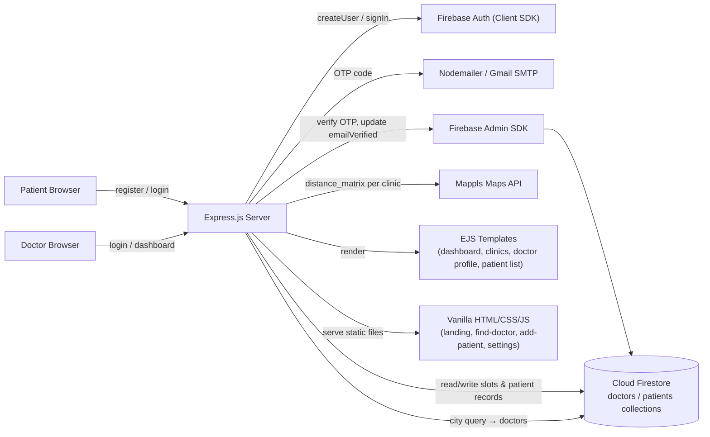

# Doc-Q — Healthcare Appointment & Queue Management Platform

> Case-study documentation. The condensed version belongs in
> `src/data/projects.data.tsx` (project id `doc-q`) and rendered at
> `/projects/doc-q`; the CV carries a one-line entry + deep-link.
> Repo: _confirm GitHub URL — group org or personal fork?_

---

## One-liner
A full-stack healthcare appointment platform — Node.js / Express / Firebase backend serving
EJS-rendered dashboards and REST endpoints — that eliminates hospital queue wait times by
letting patients search nearby clinics by geolocation, book hourly time slots directly from
a doctor's live schedule, and receive OTP-verified accounts via email.

## Role & context
- **Role:** contributing developer in a 9-person group project.
- **Team:** Pallavi B, Bharat Chavhan, Satish Kumar, Usama Riaz Ansari, Ifham Mohamed,
  Vikash Kumar, Md Muzaffarul Haque, Bondugula Aadhi, Mustafa Kenliç.
- **Scope:** university / bootcamp collaborative build. The codebase splits into a
  `Doc-Q_Backend` (Express server + Firebase Admin) and `Doc-Q_Frontend` (vanilla
  HTML/CSS/JS static pages).
- **Ifham's specific contributions:** _TODO(confirm) — which routes / pages / features
  did Ifham own? e.g. appointment-booking flow, clinic-search, OTP verification, dashboard UI?_

## Problem
Patients at private clinics in India spend hours in physical queues because there is no
shared, real-time availability view for a doctor's daily schedule. Clinics are also hard to
discover: patients don't know which doctors practise near them without calling ahead. The
platform aimed to solve both discovery (find a doctor by city + geolocation radius) and
queue management (claim one of 8 hourly slots before arriving).

## Approach / flow

**Components**

- **Landing page** — static HTML/CSS/JS marketing site with hero, service list, and
  "Book Appointment" CTA linking to register.
- **Auth flow** — Express routes wrap Firebase Client SDK
  (`createUserWithEmailAndPassword` / `signInWithEmailAndPassword`). On first sign-up a
  6-digit OTP is generated, emailed via Nodemailer/Gmail SMTP, and stored in
  `express-session` with a 5-minute TTL; the `/api/verify-otp` endpoint marks
  `emailVerified: true` via Firebase Admin if the code matches.
- **Dual-role onboarding** — after email verification, doctors are redirected to a
  profile-completion form (name, phone, specialization, clinic/firm, city) and patients to
  a separate form (name, phone, city, gender, age). Both are persisted to the correct
  Firestore collection (`doctors` / `patients`).
- **Doctor dashboard** — EJS-rendered page (served at `/api/dashboard`) with a sidebar
  linking to Patient List, Add Patient, Tasks, Services, Settings; includes stat cards and
  a vanilla-JS calendar widget.
- **Appointment slot engine** — a doctor's availability lives in
  `doctors/{uid}/dates/{YYYY-MM-DD}` as a map of 8 hourly slots
  (`'10-11': true/false`, …, `'5-6': true/false`). The first request for any date
  auto-initialises all slots to `true`. Booking calls `doctorRef.update({ [time]: false })`
  atomically and writes a patient record into `doctors/{uid}/patients`.
- **Clinic search** — patients POST their GPS coordinates to `/api/fetchHouseLocation`
  (stored in-memory server-side), then POST a city name to `/api/search/clinics`. The
  server queries Firestore for doctors matching that city, then fans out to the Mappls
  `distance_matrix` API to compute driving distance for each result. Results render in an
  EJS `clinics` view.
- **Doctor profile view** — `/api/doctor/profile/:id` fetches the doctor doc + today's
  slot map and renders them in an EJS template with clickable time-slot buttons.
- **Patient management** — doctors can add detailed patient records
  (`/api/addPatients`) stored in `doctors/{uid}/doctorsPatients`; a summary record is
  mirrored to `doctors/{uid}/patients`. The patient list is fetched and EJS-rendered at
  `/api/patientslist`.

**Data flow**
1. Patient registers → Firebase Auth creates account → Nodemailer sends 6-digit OTP →
   patient submits OTP → Firebase Admin marks `emailVerified: true` → redirect to login.
2. Patient logs in → `signInWithEmailAndPassword` → session cookie set → Firestore profile
   completeness checked; if incomplete, redirect to profile-completion form.
3. Patient searches clinic → GPS coords POSTed → city query hits Firestore → Mappls
   distance_matrix called per result → EJS renders sorted clinic list.
4. Patient views doctor profile → slot map fetched / auto-initialised → time-slot buttons
   rendered; patient selects slot → POST `/api/appointments` → slot flipped to `false` →
   patient record written under doctor's subcollection.
5. Doctor logs in → served static dashboard HTML → `/api/patientslist` fetches their
   patient subcollection via Firebase Admin.

## Tech stack
- **Runtime & framework:** Node.js (ESM), Express.js 4.
- **Templating:** EJS 3 (server-side rendered views: dashboard, doctor profile, clinic
  list, patient list).
- **Database & backend services:** Cloud Firestore (NoSQL), Firebase Authentication —
  accessed via Firebase Admin SDK 12 (server) and Firebase JS SDK 10 (client-side auth
  calls on the server).
- **Session & auth:** `express-session` (10-minute cookie), Firebase Auth
  `emailVerified` flag as the gate, custom JWT middleware (`jsonwebtoken`) present but not
  wired into active routes.
- **Email:** Nodemailer 6 with Gmail SMTP (`officialdocq@gmail.com`), 6-digit OTP with
  5-minute server-session TTL.
- **Geolocation / maps:** Mappls `distance_matrix` REST API (driving profile) for
  clinic-to-user distance calculation.
- **Frontend:** Vanilla HTML5, CSS3, JavaScript (ES6+); Font Awesome 4 icons; no
  framework or bundler.
- **Dev tooling:** nodemon, dotenv, CORS middleware.
- **Languages:** JavaScript (Node.js backend + browser JS), HTML, CSS.

## Best practices followed
1. **Dual Firebase SDK pattern** — Firebase Admin SDK used exclusively for privileged
   server operations (OTP verification → `updateUser`, Firestore writes on behalf of the
   server); Firebase Client SDK used only for auth operations that must originate from a
   verified client context (`signInWithEmailAndPassword`, `createUserWithEmailAndPassword`).
2. **Role-enforced Firestore collections** — doctors and patients are stored in separate
   top-level collections (`doctors` / `patients`) with a `type` field guard on login,
   preventing cross-role access by construction.
3. **Slot auto-initialisation** — the appointment engine lazily creates a day's slot
   document on first request, keeping Firestore storage minimal while ensuring every doctor
   always has a valid availability map to read from.
4. **OTP TTL in session** — the 6-digit code and its creation timestamp are stored in
   `express-session`, never in the database; the server computes the 5-minute window on
   verify and rejects expired codes, limiting the attack window without a persistent token
   table.
5. **Parallel distance computation** — `Promise.all` fans out Mappls API calls for all
   matched clinics concurrently rather than sequentially, minimising latency on the
   clinic-search endpoint.
6. **Two-phase profile setup** — registration creates a minimal Firestore document
   (email + nulled fields + type) immediately, then a post-verification redirect enforces
   profile completion before the user can access any authenticated view — preventing
   partial-profile states in production data.

## Challenges → resolution
- **Dual-SDK Firebase auth on a single server.** Firebase Client SDK must be initialised
  with the public config to call `signIn*` and `createUser*`, but `updateUser` (to set
  `emailVerified: true`) requires Admin SDK privileges. Running both SDKs in the same
  Node process caused initialisation-order issues and `currentUser` being null at the
  wrong moment.
  **Fix:** split into `firebase-client.js` (Client SDK, exports `clientAuth`, collection
  refs) and `firebase-admin.js` (Admin SDK, exports `admindb` and `auth`); imported
  independently in each route file; Admin SDK calls never depend on `clientAuth.currentUser`.
- **OTP session expiry vs. email delivery lag.** A 5-minute OTP window is tight when
  Gmail delivery is delayed (promotional tab, spam filter). Early testing had users report
  expired codes immediately on arrival.
  **Fix:** a `/api/resend-otp` endpoint regenerates a fresh code and resets the session
  timestamp with a single button click on the verification page, without requiring the user
  to re-register. _TODO(confirm Ifham's involvement in this fix)._

## Outcomes
- **Full appointment lifecycle shipped:** patient registration with OTP email
  verification → role-based onboarding → clinic discovery with live geolocation distance →
  doctor profile with 8 real-time hourly slots → atomic slot booking → patient records
  under doctor's Firestore subcollection.
- **~14 REST endpoints** across auth, scheduling, clinic search, patient management, and
  static-page serving.
- **Firestore data model:** `doctors/{uid}` with subcollections `dates/{date}` (slot maps),
  `patients` (appointment summaries), `doctorsPatients` (full patient records); `patients/{uid}`
  top-level collection for patient profiles.
- **Doctor-facing dashboard** with stat cards, a vanilla-JS interactive calendar, and
  sidebar navigation across 6 views (Dashboard, Patient List, Add Patient, Tasks, Services,
  Settings).
- **Patient-facing flows:** landing page → find doctor (city + geolocation) → doctor
  profile with slot selector → booking confirmation.
- _TODO(confirm): Is / was the project deployed? (Firebase Hosting / Render / Railway?) Any
  live URL? Any real clinic users or demo only?_
- _TODO(confirm): Final team grade or presentation outcome if this was a graded project._

## Concepts & skills learnt
Firebase Authentication (Client SDK) + Firebase Admin SDK dual-pattern on a single Node
server · Cloud Firestore NoSQL data modelling (nested subcollections for per-doctor slot
maps and patient records) · OTP-based custom email verification with session-stored TTL ·
Express.js ESM routing with `Router` modularisation · EJS server-side templating ·
`express-session` for stateful auth across redirects · Nodemailer / Gmail SMTP transactional
email · Mappls Maps `distance_matrix` REST API · `Promise.all` for concurrent API fan-out ·
role-based access enforcement via Firestore `type` field + session guards · two-phase user
onboarding (stub record → email verify → profile completion) · vanilla JavaScript DOM
manipulation (calendar widget, time-slot selection, geolocation `navigator.geolocation`).

## Links
- **GitHub repo:** _TODO(confirm) — group org URL or ifham-mohamed fork._
- **Live demo / deployment:** _TODO(confirm) — any hosting URL?_
- **Project report / presentation:** _TODO(confirm) — any PDF or slide deck?_

---

## Still to confirm
1. Ifham's specific feature ownership within the 9-person team.
2. GitHub repository URL (group org or personal fork).
3. Whether the project was deployed and any live / demo URL.
4. Whether this was a graded course project — final grade or outcome.
5. A screenshot or demo video to embed (`public/images/projects/doc-q.png`).
