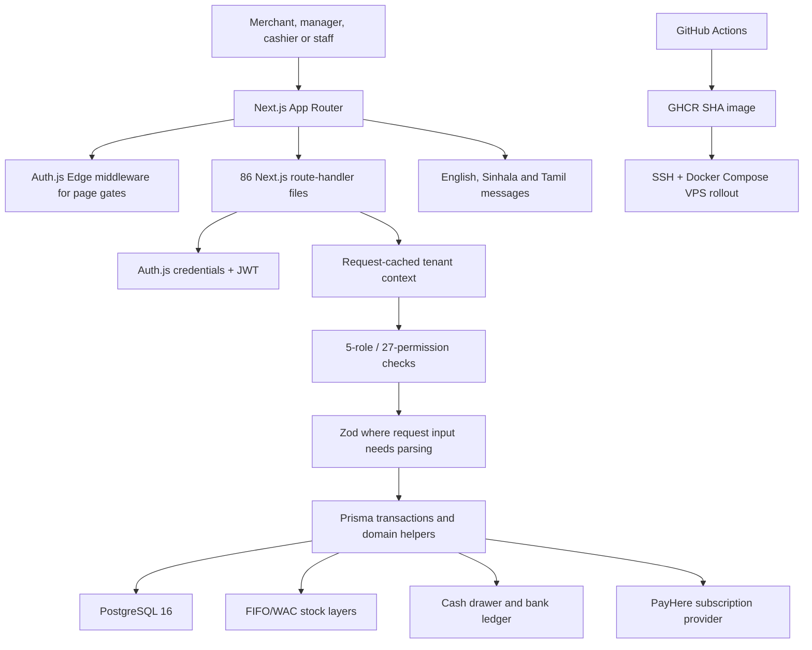
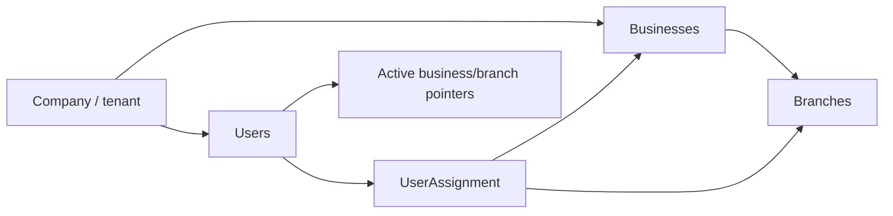

# DynaPOS - Multi-Tenant SaaS Point of Sale

> Source-verified case study based on `C:\projects\DynaPOS` at commit `409e8fd`. The audit covers
> the application, Prisma history, 86 API route files, 60 pages, manual/test documentation, BDD
> implementation status, containers, deployment workflows, Git provenance, and secret hygiene.
> Source-present functionality is not presented as a verified production outcome.

- **Project type:** Team-built multi-tenant POS SaaS
- **Primary stack:** Next.js 15.5, React 19, TypeScript 5.6, Prisma 5.22, PostgreSQL 16
- **Repository scale:** 820 tracked files
- **Application scale:** 42 Prisma models, 18 enums, 22 migrations, 86 API route files, 60 pages
- **Git history:** 21 commits from 27 April to 17 July 2026
- **Delivery design:** GitHub Actions, GHCR, Docker, SSH deployment to a self-managed VPS

---

## One-liner

A multi-tenant POS platform that serves nine retail/service business types from one Next.js codebase,
combining scoped companies/businesses/branches, five-role permissions, configurable FIFO/WAC costing,
decimal units, local PayHere subscriptions, industry-specific workflows, and cash-to-bank operations.

## Role and provenance

DynaPOS is a two-author repository:

| Author | Commits | Source-supported contribution pattern |
|---|---:|---|
| Arkam | 12 | Initial and core application, vertical features, pricing/UoM, inventory costing, PayHere, cash/bank features, fixtures, manuals/test material |
| Ifham Mohamed | 9 | Large BDD/QA automation and test-documentation import, automation fixes, standalone Docker packaging, production configuration, and deployment workflow |

Ifham's largest commit added or revised 244 files and more than 22,000 lines, predominantly the
Serenity/JS + Playwright + Cucumber harness, generated feature catalogue, QA documents, local setup,
and CI workflow. Later commits added the standalone container and SSH/VPS deployment configuration.

The evidence therefore supports describing Ifham as **QA automation and deployment engineer / major
project contributor**. It does not support the former claim that Ifham was the lead architect and
owner of the Prisma schema, core application, FIFO/WAC implementation, or PayHere integration; those
features appear in Arkam-authored commits. Exact planning/review responsibilities outside Git still
require team confirmation.

## Status and documentation drift

The root README calls the checkout “v1.0 / Phase 1” and lists billing, transfers, staff management,
industry modules, and multi-currency as deferred. The source has since advanced through migrations
named up to v9.0 and implements many of those areas. Conversely, the prior portfolio page called the
system production SaaS on Vercel and claimed approximately 210 automated features; neither statement
matches the audited evidence.

The accurate status is: **broad, late-phase codebase with a self-hosted delivery pipeline and a large
BDD specification catalogue; production operation and most automated scenarios are unverified.**

## Problem and product strategy

Small and medium businesses often need the same core POS capabilities but differ in product metadata,
inventory behavior, and service workflows. A mobile retailer tracks serial/IMEI numbers; a pharmacy
needs prescriptions and expiry awareness; a restaurant needs tables, tabs, and kitchen state; a salon
needs staff schedules and appointments. Separate applications multiply maintenance, while a generic
schema forces important data into notes.

DynaPOS uses a shared tenant/accounting core plus seeded business-type definitions. One company can
operate multiple businesses and branches while each business type activates different fields and
modules. Sri Lankan defaults include LKR, 18% VAT, and PayHere billing, while the current source also
contains a broader currency catalogue.

## Architecture

### Request boundary

Middleware protects `/app/*` and `/onboarding/*` page paths. API authorization is implemented inside
route handlers rather than inherited from middleware. A static audit of the 86 route files found:

- 81 with an authentication or tenant-context signal;
- 57 with an explicit `requirePermission()` signal;
- 79 with company/business/branch scoping signals;
- 56 with Zod parse/validation signals.

The five routes without auth/context signals are the expected public boundaries: signup, email
verification, the Auth.js handler, billing webhook, and health endpoint. These counts are useful
coverage indicators, not a proof that every query and mutation is correctly authorized.

## Tenant and identity model

The hierarchy is:

`lib/tenant.ts` resolves the authenticated user, company, active business, and active branch. React
`cache()` deduplicates those lookups inside a server request. If a stored active pointer is missing or
invalid, it falls back to the oldest allowed business/branch and asynchronously persists the new
pointer. `setActiveContext()` verifies that the selected business belongs to the user's company and
that the branch belongs to that business.

### Authentication

Auth.js v5 beta uses a JWT session and a credentials provider:

- email and bcrypt-verified password;
- active-account check;
- Business ID requirement for manager, cashier, and staff roles;
- assignment validation for non-owner business access;
- email-verification and forced-password-change state in the JWT/session;
- Edge-safe auth configuration separated from Node-only Prisma/bcrypt authorization.

The five roles are `super_admin`, `admin`, `manager`, `cashier`, and `staff`. A centralized matrix
defines 27 permissions across sales, products, inventory, purchase orders, reports, staff, customers,
expenses, settings, restaurant/KDS, appointments, and cash drawers.

## Database model

The Prisma schema has 42 models and 18 enums. The major groups are:

| Domain | Models |
|---|---|
| Tenant and identity | `BusinessType`, `Company`, `User`, `Business`, `Branch`, `UserAssignment`, `EmailVerification`, `StaffInvitation`, `WorkSchedule` |
| Catalogue and pricing | `Product`, `ProductUnit`, `Category`, `PriceTier`, `ProductTierPrice`, `ProductQuantityBreak`, `ProductSerial` |
| Inventory/procurement | `Inventory`, `StockLayer`, `SaleItemConsumption`, `Supplier`, `PurchaseOrder`, `PurchaseOrderItem`, `StockTransfer`, `StockTransferItem` |
| Sales and customers | `Customer`, `Sale`, `SaleItem`, `SaleReturn`, `SaleReturnItem`, `CustomerPayment` |
| Industry workflows | `Appointment`, `Prescription`, `Table` and sale/order/KDS state carried through related models/enums |
| Subscription | `Subscription` plus plan/status/payment-provider state |
| Cash and banking | `BankAccount`, `BankLedgerEntry`, `CashDrawer`, `CashDrawerMovement`, `PettyCash`, `PettyCashMovement`, `DepositBatch`, `DepositBatchSplit` |

Twenty-two migration directories progress from the initial schema through billing/CRM/loyalty, staff,
industry modules, categories, currency/locale, returns, branding, restaurant, salon, FIFO layers,
decimal UoM, pricing tiers, cost-method selection, subscription renewals, and v9 cash/bank features.

## Business-type configuration

Nine seeded types drive dynamic product fields and navigation modules:

| Slug | Display name | Specialized behavior visible in configuration/source |
|---|---|---|
| `mobile_shop` | Mobile & Electronics Shop | IMEI/serial-oriented fields and registry |
| `bookshop` | Book Shop | ISBN, author, genre-oriented fields |
| `clothing_store` | Clothing & Apparel | Apparel-specific product metadata |
| `grocery` | Grocery & Supermarket | Batch/expiry-oriented module |
| `pharmacy` | Pharmacy & Medical | Expiry and prescription logging |
| `restaurant` | Restaurant & Cafe | Tables, tabs, and KDS |
| `hardware_store` | Hardware & Materials | Decimal UoM, tier/quantity pricing use case |
| `salon` | Salon & Beauty Parlour | Appointments and work schedules |
| `general` | General Retail | Baseline POS/catalogue/inventory/reporting |

The shared product model holds common commercial fields while JSON field definitions and modules
shape each vertical's user experience.

## Inventory accounting

### FIFO and WAC

The company selects `fifo` or `wac`. `lib/stock-layers.ts` receives a Prisma transactional client and
implements:

- spawning stock layers from purchase, transfer, return, adjustment, or opening-balance sources;
- oldest-layer FIFO consumption;
- weighted-average calculation across remaining layer quantity/cost;
- WAC consumption that still decrements physical layers but snapshots one average unit cost;
- `SaleItemConsumption` records linking a sale item to every layer it consumed;
- restoration into original layers for returns.

This is a stronger audit basis than a single mutable product cost: past sales retain the cost used at
sale time even if later receipts or company cost method change.

### Decimal units and pricing

Product units and quantities use decimal-oriented schema changes for material sold by meter, weight,
box, drum, or conversion unit. Price tiers and quantity breaks allow customer- or volume-specific
pricing. Financial correctness still depends on every JavaScript conversion/rounding boundary; no
application unit-test suite was found for these helpers.

### Inter-branch transfers

Sending a transfer records a cost breakdown for source layers. Receiving it creates corresponding
destination layers at the preserved unit costs. This retains cost lineage rather than valuing moved
stock at a branch's current product default.

## Sales, returns, and industry workflows

The route/page tree includes:

- product, category, supplier, and purchase-order management;
- POS sale creation, product lookup/search, receipts, and sale lookup;
- inventory adjustments, serial search/state, and stock transfers;
- customers, balances, sales, payments, and loyalty;
- returns linked to original sales/items;
- pharmacy prescriptions;
- restaurant tables, open tabs, multi-round tab items, sending, closing, and KDS item states;
- salon appointments, completion, and staff schedules;
- company, branch, business, pricing, staff, language, subscription, and cash settings;
- daily, product, category, cash-drawer, and bank-ledger reports.

The audited tree has 60 `page.tsx` files and 40 TSX component files. It represents a broad product,
but page presence does not prove every happy/error/concurrency path is production-ready.

## Cash drawer and bank reconciliation

The v9 schema models:

- one cash drawer session for a cashier/branch;
- drawer movements for sales, refunds, deposits, petty cash, and adjustments;
- expected versus counted close amounts;
- petty-cash top-ups/movements;
- bank accounts and ledger entries;
- deposit batches split across accounts.

A partial PostgreSQL unique index enforces at most one **open** drawer per branch/cashier while
retaining unlimited closed history. This is a useful database-level invariant rather than a UI-only
check.

## Subscription billing

Three plan tiers are defined in source:

| Plan | Recorded monthly LKR price | Capacity concept |
|---|---:|---|
| Starter | 2,500 | One business, two branches, three staff |
| Pro | 6,500 | Three businesses, five branches each, fifteen staff |
| Enterprise | 15,000 | Unlimited sentinel values and broader roadmap |

The PayHere provider creates hosted-checkout requests, records the outbound order ID, validates
form-encoded webhook fields with a schema, verifies the provider-required uppercase MD5 signature,
maps status transitions, and uses the latest payment ID for successful-payment retry idempotency.

The billing webhook is intentionally unauthenticated because PayHere must call it; its security
boundary is signature verification. Provider sandbox/production settings and live merchant behavior
were not executed during this audit.

## Locale and currency

The UI includes English, Sinhala, and Tamil message files via `next-intl`. The source currency
catalogue contains Sri Lankan/South Asian, global, Middle Eastern, Southeast Asian, and African
currencies, and `Company.currencyCode` drives formatting. VAT remains globally hard-coded to 18%, so
selecting a non-Sri Lankan currency does not make tax behavior jurisdiction-correct. Multi-currency
within one transaction/accounting ledger is not established.

## QA documentation and automation

The repository includes an unusually large quality catalogue:

| Area | Files | Composition |
|---|---:|---|
| `docs/test` | 220 | 216 Markdown specs, one DOCX, three XLSX trackers/reference files |
| `docs/manual` | 18 | Six Markdown, ten DOCX, and two XLSX manuals/index artifacts |
| `e2e/features` | 192 | Cucumber feature files covering shared and nine-industry scopes |

The 192 feature files contain 2,117 `Scenario` declarations. Their actual automation status is:

- 38 scenarios/tag lines marked `@implemented`;
- 2,079 scenarios/tag lines marked `@todo`;
- eight feature files contain implemented scenarios;
- the remaining catalogue is bound to generic pending skeleton steps.

The current E2E README's “210 files / ~2,170 scenarios” and the former portfolio's “~210 automated
features” are stale or misleading. About 1.8% of the current scenario declarations are tagged
implemented. The rest are valuable traceable test specifications, not executable behavioral proof.

### Automation architecture

The implemented slice uses:

- Cucumber.js and Serenity/JS;
- Playwright for browser work;
- Serenity Screenplay actors/tasks/questions;
- REST calls for API scenarios;
- a real Auth.js CSRF/credentials/cookie flow for API login;
- per-actor notes for sharing created identifiers;
- seeded fixtures and an environment-driven base URL;
- a Serenity living-documentation report.

The root E2E GitHub workflow provisions PostgreSQL 16, migrates/seeds, builds/starts the app, installs
Chromium, runs only `@implemented` scenarios, generates the report, and uploads it as an artifact.
No local `node_modules`, `.next` build, or Serenity result existed during this audit, so the checkout
was analyzed statically rather than represented as a fresh green run.

### Testing gaps

- No application unit or integration test files were found outside the E2E project.
- Core FIFO/WAC, decimal conversion, pricing, transfer, webhook, cash, and tenant logic lack a fast
  source-level regression suite.
- Most documented security, concurrency, atomicity, accessibility, and industry scenarios remain
  pending skeletons.
- A generated Office lock file is tracked in the test-document tree and should be removed.

## Container and deployment design

```mermaid
flowchart LR
    PUSH["Push to main"] --> GHA["GitHub Actions build"]
    GHA --> IMG["Multi-stage Node 22 image"]
    IMG --> GHCR["GHCR latest + sha tag"]
    GHCR --> SSH["SSH action to VPS"]
    SSH --> PULL["Compose pulls SHA image"]
    PULL --> START["docker compose up -d"]
    START --> MIG["Entrypoint: prisma migrate deploy"]
    MIG --> APP["Standalone Next.js server on host port 8080"]
```

The Dockerfile uses dependency, builder, and non-root runner stages, copies standalone Next.js output
plus Prisma CLI/schema/migrations, adds a health check, and starts through an entrypoint that applies
migrations before `server.js`.

The deploy workflow logs into GHCR, publishes both `latest` and `sha-<commit>` tags, then uses the SHA
tag on the VPS. The repository targets a self-managed VPS, not Vercel.

### Deployment limitations

- The Dockerfile copies `/app/public`, but no `public` directory exists in the tracked checkout;
  Docker normally fails when a required `COPY` source is absent.
- The SSH deployment runs `up -d` without waiting for the health check, verifying the application,
  or automatically rolling back.
- `prisma migrate deploy` runs in every starting application container; concurrent replicas would
  need controlled migration orchestration.
- Compose publishes port 8080 directly and no TLS/reverse-proxy configuration is included here.
- The workflow uses immutable SHA deployment, but also pushes mutable `latest`.
- Current server health, deployment history, backup/restore, observability, and incident response are
  not proven by local files.

## Security audit

### Strengths

- Passwords are bcrypt-verified and session claims are minimized.
- Page middleware separates Edge-safe code from Prisma/bcrypt Node code.
- Tenant/business/branch checks are widespread across API routes.
- A centralized permission matrix supports consistent role decisions.
- PayHere notifications are schema-checked and signature-verified before database mutation.
- The app container runs as a non-root user.
- Database partial indexes and foreign keys protect important invariants.

### Critical secret-hygiene finding

`.env.production` is tracked by Git and contains 19 populated configuration entries. Their names cover
authentication, database, Cloudinary, and PayHere configuration; values were deliberately not copied
into this documentation. Twelve values did not resemble obvious placeholders during a non-disclosing
check. Treat every credential in that file/history as potentially exposed:

1. rotate authentication secrets, database credentials, Cloudinary keys, and PayHere credentials;
2. remove the production file from tracking and add it to `.gitignore`;
3. preserve only sanitized `.env.example` files;
4. review Git history and provider logs before deciding whether history rewriting is needed.

### Other security gaps

- No application rate limiter was found for signup/login-sensitive behavior.
- Two-factor authentication, session revocation, and explicit audit-log models are not established.
- `trustHost: true` assumes the reverse proxy strictly controls the Host header, but proxy config is
  outside the repo.
- Company-wide 18% tax and financial logic require jurisdictional/accounting review.
- Static route scans cannot prove absence of cross-tenant object-reference bugs; implemented
  isolation scenarios cover only a small part of the catalogue.

## Engineering strengths

- Tenant context and permission decisions are centralized instead of duplicated in every screen.
- API routes consistently authenticate except for deliberate public/provider endpoints.
- Forty-two relational models and 22 migrations show careful domain expansion.
- FIFO/WAC layer consumption and cost snapshots are designed for historical accounting integrity.
- Transfer cost breakdowns preserve source valuation across branches.
- Decimal UoM, tier prices, and quantity breaks address non-piece retail.
- Restaurant, pharmacy, salon, mobile, and cash/bank modules reuse one tenant foundation.
- PayHere webhook validation includes constant-time-style signature comparison and payment retry
  idempotency.
- The QA corpus provides traceability from manual cases to generated Cucumber scenarios.
- CI provisions an ephemeral database and tests the implemented BDD slice.
- Deployment uses a SHA-specific image rather than relying solely on `latest`.

## Outcomes supported by evidence

- A broad multi-tenant POS implementation exists with nine configurable business types.
- Source includes 42 models, 18 enums, 22 migrations, 86 route files, and 60 pages.
- Inventory, pricing, purchase/transfer, returns, vertical workflows, billing, and cash/bank domains
  are represented in active source and route trees.
- Ifham delivered the large BDD/documentation framework and self-hosted deployment configuration.
- Thirty-eight BDD scenarios are tagged implemented and the CI workflow is configured to run that
  slice on an ephemeral database.
- The deployment pipeline builds a standalone container, pushes a SHA tag to GHCR, and invokes a VPS
  rollout over SSH.

No source evidence proves current production availability, real merchants, transaction volume,
business savings, successful container builds after the missing-public-directory issue, green CI
history, or complete execution of 2,117 scenarios. Those former outcome claims have been removed.

## Current limitations and recommended next steps

1. Rotate and remove all tracked production credentials before any further deployment.
2. Add a tracked empty `public` directory strategy or make the Docker copy conditional, then verify a
   clean image build.
3. Add health-gated deployment, rollback, migration coordination, TLS/reverse-proxy configuration,
   database backup, and monitoring/runbooks.
4. Update the root and E2E READMEs to the actual v9 schema and exact 192/2,117/38/2,079 counts.
5. Convert the highest-risk pending scenarios first: tenant isolation, permissions, concurrent stock,
   pricing precision, returns, webhook retries, drawer reconciliation, and deposits.
6. Add unit/property/integration tests for stock layers, UoM conversion, money rounding, pricing,
   PayHere parsing/idempotency, and cash/bank invariants.
7. Add rate limiting, stronger session controls, security headers, and audited resource-level
   authorization tests.
8. Replace one global VAT rate with jurisdiction/company tax configuration before enabling broader
   currencies.
9. Remove generated Office lock files and define which Markdown/DOCX/XLSX artifact is canonical.
10. Confirm team roles, current hosting, and quantitative business outcomes before public claims.

## Key concepts demonstrated

- Multi-tenant SaaS hierarchy and row-level scoping
- Auth.js v5 Edge/Node separation
- Five-role permission matrices
- Prisma/PostgreSQL schema evolution
- FIFO/WAC inventory accounting and cost snapshots
- Decimal units, tier pricing, and quantity breaks
- Industry-configurable POS modules
- PayHere signature verification and webhook idempotency
- Cash-drawer and bank-ledger reconciliation
- Cucumber/Playwright/Serenity Screenplay automation
- Traceable test catalogues and pending skeleton management
- Standalone Next.js Docker images and SHA-pinned VPS delivery
- Secret-hygiene and deployment-readiness auditing

## Evidence map

| Evidence | What it establishes |
|---|---|
| `package.json` and lockfile | Current Next.js/React/Prisma/Auth.js stack |
| `app` and `components` | 86 API route files, 60 pages, and implemented UI surface |
| `prisma/schema.prisma` and 22 migrations | 42-model domain and its versioned evolution |
| `lib/tenant.ts`, auth, permissions | Tenant context, identity, and five-role authorization design |
| Stock/pricing/billing/cash helpers | Accounting and provider algorithms |
| `docs/test`, `docs/manual`, and `e2e` | Manual catalogue, user manuals, 2,117 scenarios, and automation status |
| `e2e-tests.yml` | Ephemeral-Postgres CI for the implemented slice |
| Docker/Compose/entrypoint/deploy workflow | GHCR plus SSH/VPS delivery architecture and current gaps |
| Tracked environment-file audit | Critical potential credential exposure without revealing values |
| Git history and commit diffs | Two-author ownership and Ifham's QA/deployment contribution |

## Links

- **Git remote:** [github.com/POS-Dart/DynaPOS](https://github.com/POS-Dart/DynaPOS)
  _(remote is verified locally; visibility is not)._
- **Local source:** `C:\projects\DynaPOS`
- **Live deployment and merchant metrics:** not verified in the supplied repository.
