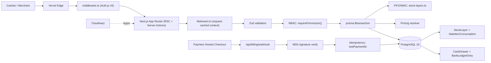

# DynaPOS — Multi-Tenant SaaS POS Platform

> Case-study doc. Condensed in `src/data/projects.data.tsx` (id `dynapos`), site at
> `/projects/dynapos`. Production multi-tenant SaaS. Repo private; live URL to confirm.

## One-liner
A multi-tenant SaaS point-of-sale platform for small/medium retail, pharmacy, restaurant, salon
and service businesses, with built-in FIFO/WAC inventory costing, tiered pricing, multi-branch
stock transfers, cash-drawer/bank reconciliation, and PayHere subscription billing.

## Role & context
- **Role:** lead developer in a small team — owned end-to-end architecture and the majority of
  implementation: the Prisma schema + multi-tenant model, RBAC, accounting primitives (FIFO stock
  layers, WAC dispatch, decimal UoM), PayHere webhook integration, and the Playwright/Cucumber E2E
  harness.
- **Scope:** v1.0 "Foundation" (auth, onboarding, dynamic per-business-type product schema, POS,
  inventory, basic reports) → v9.0 (cash drawer, bank ledger, deposit batching): 18 versioned
  migrations, 9 industry templates from one codebase.
- _To confirm — team size / who owned what; client build vs internal product._

## Problem
Small/mid-size businesses in Sri Lanka had to choose between generic global POS products that don't
model LKR / 18% VAT / PayHere subscriptions, per-vertical point solutions that lock a merchant into
one business type, or spreadsheets that lose audit trails on stock movements and cash drawers. None
handled DynaPOS's combination: one company running multiple businesses across branches with strict
tenant isolation, accounting-correct FIFO/WAC inventory across transfers, tiered pricing,
end-of-day cash-drawer-to-bank reconciliation, and local payment rails. _To confirm — a baseline
(e.g. manual daily-close time)._

## Approach / flow
Vercel hosts the Next.js 15 build; middleware gates `/app/*` via Auth.js v5. `lib/tenant.ts`
resolves `(companyId, activeBusinessId, activeBranchId)` once per request via React `cache()`. An
RBAC matrix gates the server (`requirePermission()`) and UI (`<Can>`); every API route Zod-parses
before any DB work. Stock/cash mutations wrap in `prisma.$transaction`: FIFO consumption walks
`StockLayer` rows by `receivedAt`, decrements `qtyRemaining`, and writes a `SaleItemConsumption`
row per layer touched (snapshotting `unitCost`). PayHere checkout returns a webhook that's
MD5-verified, Zod-parsed, and idempotent on `lastPaymentId`. PostgreSQL 16 with composite indexes
on FIFO hot paths and a partial unique index enforcing one open cash drawer per cashier.

## Tech stack
TypeScript 5.6 (strict), Next.js 15 (App Router, RSC + Server Actions), React 19; Prisma 5.22 +
PostgreSQL 16; Auth.js v5 (credentials, bcryptjs, JWT, Edge/Node split); TanStack Query v5;
Tailwind + shadcn/ui (Radix), Recharts, CVA; Zod; PayHere (REST + MD5 webhooks); Cloudinary;
Playwright 1.48 + Cucumber.js 10.9 + Serenity/JS (~210 feature files); GitHub Actions (ephemeral
Postgres); Vercel; docker-compose (postgres:16-alpine) for local infra.

## Best practices followed
1. **Defence-in-depth tenant isolation** — context resolved once per request via React `cache()`;
   every Prisma `where` scopes by `companyId`/`businessId`; a partial unique index enforces one open
   cash drawer per cashier at the DB layer.
2. **Accounting integrity by construction** — stock/cash mutations in `prisma.$transaction`;
   `SaleItemConsumption` snapshots per-layer `unitCost` so historical P&L is immutable across a
   FIFO↔WAC switch.
3. **Decimal precision discipline** — money `DECIMAL(12,2)`, fractional qty `DECIMAL(18,4)` for UoM
   conversions, explicit rounding at every write boundary.
4. **Schema-validated boundaries** — every API entry point Zod-parses before side effects; webhooks
   use the same pattern.
5. **BDD-style E2E in CI** — ~210 Cucumber features driven by Playwright across sales/returns/
   transfers/billing/RBAC and 5 business types, with idempotent seed fixtures.
6. **Targeted composite indexes** — `StockLayer(productId, branchId, receivedAt)` for the FIFO walk;
   `Sale(branchId, createdAt)` for daily reports.

## Challenges → resolution
- **Inter-branch transfers had to preserve original layer costs without breaking FIFO.** **Fix:**
  `StockTransferItem.costBreakdown` JSON snapshots the `(layerId, qty, unitCost)` tuples consumed
  from source layers; the receiving branch spawns mirror `StockLayer` rows at the original
  `unitCost`, so a unit's cost basis survives any number of inter-branch hops.
- **PayHere webhooks can be re-delivered, and duplicate processing would double-charge.** **Fix:**
  MD5-verify the signature, Zod-parse, then key idempotency on `lastPaymentId` per subscription so a
  duplicate `payment_id` short-circuits to a no-op; the design distinguishes initial-charge vs
  renewal correctly.

## Outcomes
- Shipped to production on Vercel, multi-tenant, serving real merchants across business types.
- 18 versioned, forward-only Prisma migrations (v1.0 → v9.0), including a v7.6 backfill that spawned
  `opening_balance` `StockLayer` rows for every `(product, branch)` so FIFO/WAC could light up over
  historical inventory.
- 9 industry templates from a single codebase via dynamic product field definitions.
- ~210 Cucumber/Playwright E2E scenarios in CI on ephemeral Postgres, with a Serenity/JS report per
  run.
- _To confirm — merchant/active-user counts, transactions/month, and any business outcome (e.g.
  daily-close time reduced)._

## Concepts & skills learnt
Multi-tenant SaaS with row-level tenant isolation · RBAC (server + UI) · FIFO & WAC inventory
accounting · stock-layer journals & per-sale cost snapshotting · decimal precision in financial
software · tiered/quantity-break pricing · webhook idempotency & MD5/HMAC verification ·
cash-drawer reconciliation & bank-ledger batching · Prisma schema evolution, migrations & backfills
· Next.js App Router / RSC / Server Actions · BDD with Cucumber + Playwright + Serenity/JS · CI with
ephemeral Postgres & idempotent seeds · PostgreSQL partial unique indexes · Auth.js v5 Edge/Node
split.

## Links
- **Repo:** private. **Live demo:** _To confirm — Vercel production URL._
- _To confirm — `public/images/projects/dynapos.png` and any merchant/usage metrics._
