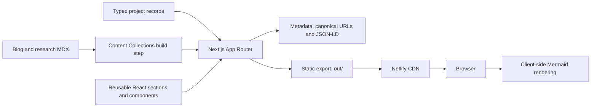

# ifham.dev Portfolio Platform

> Source-verified case study based on the repository at `C:\projects\ifham.dev`. Counts and
> implementation notes reflect the checked-out codebase at commit `b62c0e9` on 15 August 2026.

- **Project type:** Personal portfolio, technical writing platform, and project case-study site
- **Primary stack:** Next.js 16, React 19, TypeScript 5.9, Tailwind CSS 4, Content Collections, MDX
- **Deployment model:** Static export hosted on Netlify
- **Repository scale:** 206 tracked files; 75 commits on the checked-out history and 84 across all
  local refs

---

## One-liner

A statically exported, content-driven engineering portfolio that combines typed project data,
MDX articles and research, interactive Mermaid case-study diagrams, structured SEO, and a
security-conscious Netlify delivery configuration.

## Role and context

This is Ifham Mohamed's personal portfolio codebase and content system. Git history is dominated
by Ifham's author aliases and supports describing the project as personally designed, built, and
maintained. It is also the documentation destination for the repository-wide audit in
`docs/projects`.

The project is more than a landing page. It provides three connected publishing surfaces:

- a profile and contact-oriented home page;
- a typed project catalogue with detail pages and architecture diagrams;
- MDX-backed blog and research collections with generated reading metadata.

The checked-in CV PDFs and LaTeX sources are supporting portfolio artifacts rather than runtime
application dependencies.

### PDF artifact inventory

| File | Audit interpretation |
|---|---|
| `content/Ifham_Mohamed_SE.pdf` | Two-page software-engineering CV content artifact |
| `content/Ifham_Mohamed_SE_2page.pdf` | Explicit two-page CV variant |
| `public/Ifham_Mohamed_SE.pdf` | Publicly served copy used for download/distribution |

The duplicate content/public placement supports authoring plus static serving; it should be kept in
sync through the CV build/copy process rather than edited independently.

## Problem and goals

A useful engineering portfolio must communicate work at several levels: a quick visual overview
for recruiters, enough implementation detail for technical reviewers, and durable long-form
content for search and reference. Hand-authored pages tend to drift in structure and metadata,
while a runtime CMS would add infrastructure and operational cost that this site does not need.

The repository addresses that by making the codebase the source of truth:

- project records are typed TypeScript data;
- articles and research are version-controlled MDX;
- static route generation makes every content page deployable without a server;
- reusable sections keep project narratives consistent;
- metadata, canonical URLs, Open Graph data, and JSON-LD are generated alongside page content;
- Netlify headers provide a production security and caching baseline.

## System architecture

### Runtime and build boundaries

The site uses the Next.js App Router but is configured with `output: "export"`. Routes are
resolved at build time, images are unoptimized for static hosting, and no application server or
database is required in production. Content Collections compiles local MDX into typed records;
the browser receives only the generated site assets and client-side interactions.

## Information architecture

The audited route tree contains seven page modules covering:

| Surface | Route shape | Purpose |
|---|---|---|
| Home | `/` | Hero, profile, skills, featured work, experience, and contact entry points |
| Projects | `/projects` | Browse the typed project catalogue |
| Project detail | `/projects/[slug]` | Long-form case study, stack, role, outcomes, and diagrams |
| Blog | `/blog` | Browse technical articles |
| Blog detail | `/blog/[slug]` | Render a compiled MDX article |
| Research | `/research` | Browse research-oriented content |
| Research detail | `/research/[slug]` | Render a compiled MDX research dossier |

At audit time the source catalogue contains 17 project records. Content Collections contains
seven blog posts and one research dossier. The repository also includes 73 TSX component files,
which reflects a componentized presentation layer rather than seven monolithic pages.

## Content model

### Projects

Project data is expressed as typed TypeScript objects. The model supports the fields needed for a
technical case study rather than only a card thumbnail: identity, summary, role, problem,
approach, architecture/flow, technology stack, best practices, challenges, outcomes, concepts,
and external links. Detail pages consume the same structured records used by catalogue views,
which reduces duplicated copy and inconsistent links.

The Mermaid diagrams embedded in project records are rendered client-side. This preserves a
plain-text, version-controlled diagram source while keeping the published case studies visual.

### Blog and research

Content Collections defines separate blog and research collections. During compilation it derives
useful reading metadata from raw MDX, including:

- word count;
- estimated reading time;
- heading data used for navigation or a table of contents;
- typed frontmatter consumed by indexes and detail pages.

Keeping research separate from general blog posts allows the site to present structured technical
investigations without forcing both content types into one schema or route.

## Rendering and user experience

- React 19 and the App Router provide the page/component model.
- Tailwind CSS 4 supplies the design tokens and responsive utility layer.
- Reusable project and content components keep hierarchy and spacing consistent.
- Static generation provides fast first delivery and removes runtime database latency.
- Client components are limited to behavior that needs the browser, including interactive
  navigation and Mermaid rendering.
- Responsive layouts serve portfolio content on desktop and mobile from the same component tree.

## SEO and discoverability

The implementation includes several layers that are often omitted from portfolio sites:

- route-specific Next.js metadata;
- canonical URLs;
- Open Graph and social-sharing metadata;
- structured JSON-LD where appropriate;
- static parameters for dynamic project, blog, and research routes;
- semantic long-form project content rather than image-only showcases.

Static output also gives crawlers complete HTML without depending on a live API.

## Deployment and operational design

`next.config.mjs` wraps the application with the Content Collections plugin and enables static
export. `netlify.toml` records the deployment contract:

- `pnpm` is used for the production build;
- `out` is the publish directory;
- Node.js 22 is selected for the build environment;
- security headers include a Content Security Policy and related browser protections;
- cache behavior is customized for immutable/static assets and page content.

This is an intentionally low-operations architecture: a failed content or type build is caught
before publishing, and the deployed site has no database, application process, or server-side
secret to operate.

## Engineering practices

### Type and content safety

- TypeScript models make project records structurally consistent.
- Content Collections validates frontmatter and generates typed MDX data.
- Route parameters are generated from the content catalogue, reducing dead dynamic paths.
- Shared components prevent project pages from independently reimplementing the same layout.

### Performance and reliability

- Full static export minimizes runtime dependencies and cold starts.
- CDN hosting places immutable assets close to visitors.
- Content is available even when no API service is running.
- Build-time compilation surfaces invalid imports, broken types, and malformed content before
  deployment.

### Security posture

- The public site does not expose an application database or authentication surface.
- Netlify response headers establish CSP and other browser protections.
- Static hosting narrows the production attack surface compared with a stateful server.

The CSP and dependency versions should still be reviewed whenever new embeds, analytics, or
client packages are introduced.

## Challenges and resolutions

### Combining data-driven projects with authored prose

Project pages benefit from a predictable schema, while blog and research writing benefit from MDX.
The solution is a split content architecture: TypeScript records for comparable project facts and
Content Collections for long-form authored documents.

### Preserving diagrams in a static site

Mermaid diagram definitions remain text in the project model and are rendered by a browser
component. Authors can review changes in Git and update architecture without checking in an image
for every revision.

### Static hosting with modern Next.js

The repository avoids runtime-only Next.js features, generates dynamic paths ahead of time, and
uses unoptimized images so the output can be served directly by Netlify.

### Maintaining a portfolio as projects evolve

Typed data and reusable sections reduce structural drift, but factual drift remains a content
governance concern. The `docs/projects` audit adds source-verified records that can be used to
correct public summaries before publishing them.

## Outcomes

- One codebase publishes the profile, 17-project catalogue, seven blog posts, and one research
  dossier.
- The production architecture has no always-on backend or database dependency.
- Project and content pages are pre-generated for direct CDN delivery.
- Each project can carry an implementation narrative and architecture diagram instead of only a
  screenshot and stack list.
- Security, cache, SEO, and social metadata are handled as part of the deployment contract.

No analytics export, Lighthouse report, conversion metric, or measured performance benchmark was
found in the repository. Claims about audience growth, load-time improvement, or search ranking
would therefore need external evidence.

## Current limitations and technical debt

- The README still describes an older Next.js 14-era stack and mentions libraries that are not
  representative of the current package manifest; onboarding documentation should be refreshed.
- No automated unit, component, end-to-end, or accessibility test suite was found.
- No repository CI workflow was found; Netlify can reject a failed build, but a pre-merge quality
  gate is not documented in source.
- Project facts are maintained manually and can diverge from their underlying repositories unless
  periodically audited.
- Client-side Mermaid adds JavaScript and needs graceful handling for invalid diagrams.
- The contact experience and any external analytics behavior should be documented separately if
  they are configured outside this repository.

## Recommended next steps

1. Update the README to the current Next.js 16/React 19/Content Collections architecture.
2. Add CI for type-checking, linting, static build, link validation, and a small route smoke suite.
3. Add automated accessibility checks for the home, catalogue, and content-detail templates.
4. Generate the public project records from, or validate them against, the audited Markdown files.
5. Add dated Lighthouse and accessibility artifacts if performance claims will appear publicly.
6. Add a content-review field such as `lastVerifiedAt` to time-sensitive project records.

## Key concepts demonstrated

- Next.js App Router and static-site generation
- React 19 component architecture
- TypeScript content modelling
- MDX and build-time content pipelines
- Content Collections schema generation
- Mermaid architecture visualisation
- SEO metadata and JSON-LD
- Netlify static hosting and security headers
- Content governance for a technical portfolio

## Evidence map

| Evidence | What it establishes |
|---|---|
| `package.json` and lockfile | Current Next.js, React, TypeScript, and package ecosystem |
| `next.config.mjs` | Static export, image behavior, and Content Collections integration |
| `netlify.toml` | Build, publish, runtime, cache, and security-header configuration |
| `content-collections.ts` | Blog/research schemas and computed reading metadata |
| `src/app` | Seven application page modules and dynamic route generation |
| `src/components` | Componentized UI and Mermaid presentation layer |
| `src/data/projects` | Typed project catalogue with 17 records |
| `content` | Seven blog articles and one research dossier at audit time |
| Three CV PDF files and LaTeX sources | Authored/downloadable portfolio documents |
| Git history | Personal ownership and the evolution of the portfolio |

## Links

- **Git remote:** [github.com/ifham-mohamed/ifham.dev](https://github.com/ifham-mohamed/ifham.dev)
  _(remote is verified locally; public visibility is not)._
- **Local source:** `C:\projects\ifham.dev`
- **Documentation audit:** `C:\projects\ifham.dev\docs\projects`
- **Public site URL:** use the canonical value configured in the application before publishing this
  case study; current availability was not checked.
