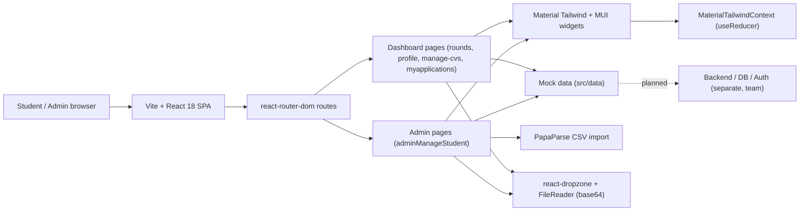

# Internify — Intern Tracking System (ITS Batch 21)

> Case-study documentation for the front-end repo (`web_frontend_achieved`). The condensed
> version lives in `src/data/projects.data.tsx` (project id `internify`) and on the site at
> `/projects/internify`; the CV carries a one-line entry + a deep-link.
>
> Honest framing: this was a **group project**. My role was **front-end developer**, and my
> specific contribution was the **CV upload and management** features. The front-end repo is a
> React 18 + Vite + TypeScript SPA with **mock data** (no backend/DB/auth/tests *in this
> repo*); the Node/Express/PostgreSQL/AWS backend was the team's, separate service.

---

## One-liner
A React/Vite/TypeScript student recruitment portal for the ITS Batch 21 program, providing a
multi-round company application flow for students and a CSV-driven admin dashboard for managing
the student roster.

## Role & context
- **My responsibility:** front-end developer on a group build; my specific contribution was the
  CV upload and management features. _To confirm — any other features you owned end-to-end._
- **Team / client:** built under the **ITS-Development-Team** GitHub org (visible in merged PR
  sources: `feature/student-profile`, `epic/application-round`). End users are **ITS Batch 21**
  students.
- **Scope:** _To confirm — is "ITS" a university IT society / institute program / company
  internship cohort? Course, club, paid, or volunteer build?_
- **Timeframe:** June 2024 – September 2024.

## Problem
The recruitment program needed a central place for Batch 21 students to view the companies
offered each application round and submit applications, plus a way for admins to manage the
student roster. The admin Manage-Student page supports **bulk CSV import** (`papaparse`),
indicating the prior bottleneck was manual, one-by-one entry of student records.
_To confirm — the previous workflow (spreadsheets / email / paper?), and batch size / companies
per round / rounds per cycle._

## Approach / flow
**Components**
- **Vite + React 18 SPA** — client-side only; no SSR or API routes in this repo.
- **`react-router-dom` v6** — routes: `/home`, `/profile`, `/manage-cvs`, `/tables`,
  `/notifications`, `/rounds`, `/myapplications`, `/sign-in`, `/sign-up`, `/auth/login`.
- **Layouts** — shared sidenav/navbar shell (`dashboard.tsx`, `auth.tsx`).
- **Pages** — student dashboard (`pages/dashboard/*`) and admin
  (`pages/adminDashboard/adminManageStudent.tsx`).
- **Widgets** — reusable cards, dialogs, forms (`addStudentForm`, `editStudentForm`,
  `StudentCSVuploadForm`), and the drag-and-drop `image-upload` component (`react-dropzone`).
- **Mock data layer** (`src/data/*.ts`) — stands in for the backend; no fetch layer/API client.
- **Global UI state** — `MaterialTailwindContext` (`useReducer`) for sidenav/theme.

**Data flow (current state):** user → React Router route → page component → reads mock data from
`src/data/*.ts` → renders Material Tailwind UI → form submit calls an in-memory handler (no
persistence); CSV uploads parsed in-browser via PapaParse; image/PDF uploads converted to base64
DataURL via FileReader.

## Tech stack
- **Front-end (this repo):** TypeScript 5.2 (`strict`), React 18.3, Vite 5.3,
  `react-router-dom` 6.25, Tailwind CSS 3.4, `@material-tailwind/react` 2.1, `@mui/material` 6,
  `papaparse` 5.4, `react-dropzone` 14.2, React Context + `useReducer`, ESLint +
  `@typescript-eslint`.
- **System (team-owned backend):** Node.js, Express.js, PostgreSQL, AWS.
- **Not in the front-end repo:** no Redux/Zustand/React Query, no auth provider, no DB, no
  tests, no S3/Cloudinary.

## Best practices followed (front-end, verifiable in code)
1. **Strict TypeScript** — `strict: true` plus unused-locals/params enforcement.
2. **Zero-warning lint gate** — `eslint … --max-warnings 0` in the build scripts.
3. **Feature-aligned folder layout** — `dashboard/` vs `adminDashboard/`, widgets co-located
   per feature.
4. **Mock-data abstraction** — one module per entity, so the swap to a real API is a one-file
   change per entity.
5. **Reusable upload widget** — one `react-dropzone` wrapper reused for avatar, cover, and CV.
6. **Bulk-import path** — CSV via PapaParse instead of N manual submissions.

_Not present (intentionally not claimed): automated tests, route-level auth guards, a11y
instrumentation, schema validation, error boundaries, code-splitting._

## Challenges → resolution
- **CV/image uploads working end-to-end with no storage backend (my contribution).** Used
  `react-dropzone` for drag-and-drop and `FileReader.readAsDataURL` to convert files to base64
  for in-memory preview/storage, with a 50 MB client-side guard — structured to swap to
  presigned-URL uploads once a storage service is wired in.
- **Admin onboarding at scale.** A dual-path Add Student flow — manual entry plus bulk CSV
  ingest (PapaParse) — both feeding the same admin table. _To confirm — whether this admin CSV
  path was your work or a teammate's._

## Outcomes
- Front-end shipped: a multi-round company application page (filter by round / role /
  apply-limit), a student profile editor (avatar + cover upload), and an admin manage-student
  table (search, edit/delete, add via manual form or CSV).
- **My contribution:** the CV upload and management features (drag-and-drop, base64 preview,
  50 MB guard).
- Two merged feature PRs (`epic/application-round`, `feature/student-profile`) under the team
  org.
- _To confirm — how many Batch 21 students/companies/rounds used it; whether/where it was
  deployed (the repo has no deploy config — but your CV cites "Internify Live")._

## Concepts & skills learnt
React 18 with TypeScript (strict) · Vite build tooling & HMR · SPA routing with
`react-router-dom` v6 (nested routes, layouts) · Tailwind CSS · Material Tailwind + MUI
composition · React Context + `useReducer` · drag-and-drop upload UX (`react-dropzone`) ·
client-side CSV ingestion (PapaParse) · browser `FileReader` / base64 DataURL · feature-based
folder architecture & component reuse · ESLint + TypeScript strict-mode gating · Git
feature-branch + PR workflow under a team org.

## Links
- **Live:** https://internify.fit _(your CV cites "Internify Live" — confirm it's current)._
- **Repo:** _To confirm — exact URL under `https://github.com/ITS-Development-Team`._
- **Report / write-up:** _To confirm._

---

## Still to confirm (fills the remaining TODOs in `projects.data.tsx`)
1. What "ITS" is, and the engagement type (course / club / paid / volunteer).
2. Whether the admin CSV path was your work or a teammate's.
3. Batch size / companies / rounds, and any usage numbers.
4. The exact repo URL and confirmation that internify.fit is the live deployment.
5. `public/images/projects/internify.png`.
