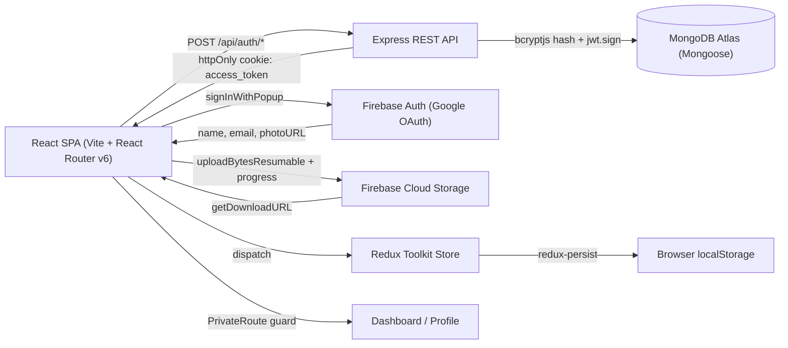

# Master Blogmium — Blogging Platform (Auth MVP)

> Case-study documentation. The condensed version lives in
> `src/data/projects.data.tsx` (project id `master-blogmium`) and on the site at
> `/projects/master-blogmium`. Kept **off the 1-page CV** until blog-post CRUD ships.
>
> Honest framing: this is currently an **auth MVP for a planned blogging platform** — blog-post
> CRUD is not implemented yet (the `User` model is the only collection; the public pages are
> placeholders). The image-upload pipeline (Firebase resumable upload + circular progress) was
> implemented across commits `7912282 → 521c96b` and **later stripped in HEAD** (`edd10bf`),
> where `DashProfile.jsx` is now a stub. Documented as shipped work with a reverted-during-
> refactor note.

---

## One-liner
A MERN-stack blogging-platform foundation with end-to-end JWT authentication, Google OAuth, and
a resumable Firebase Storage profile-picture upload, built for individual bloggers who want to
publish and manage their own content.

## Role & context
- **Role:** solo developer — full ownership of architecture, backend, frontend, auth, storage
  integration, and state management.
- **Team/client:** none. Self-directed personal/learning project.
- **Scope:** full-stack — Express/MongoDB REST API, React/Redux SPA, Firebase Authentication,
  Firebase Cloud Storage, local dev tooling.

## Problem
I had built isolated React UIs and isolated Node scripts, but had never owned an end-to-end
auth + media pipeline from sign-up to authenticated profile-picture upload. The gap was the glue
work: cookie-based JWT sessions across a separate API origin, an OAuth provider callback,
resumable file upload with real-time client-side progress, and Redux state that survives a hard
refresh without re-hitting the API. *(A learning gap, not a production pain point.)*

## Approach / flow
**Components:** a React SPA (Vite + React Router v6, `<PrivateRoute>` wrapping `/dashboard`); a
Redux Toolkit store with redux-persist (userSlice + themeSlice → localStorage); an Express REST
API (`/api/auth/*`, `/api/user/*`, centralised error middleware); MongoDB Atlas via Mongoose
(single `User` collection); Firebase Authentication (Google OAuth); and the (historical)
Firebase Cloud Storage client-direct resumable upload.

**Data flow:**
1. **Sign-up** → `POST /api/auth/signup` → `bcryptjs.hashSync(pw, 10)` → `User.save()`.
2. **Sign-in** → bcrypt verify → `jwt.sign({id, isAdmin})` → set as an **httpOnly**
   `access_token` cookie → respond with user minus password → Redux → redux-persist.
3. **Google OAuth** → Firebase `signInWithPopup` → post `{name, email, googlePhotoUrl}` to
   `/api/auth/google` → backend upsert → same JWT-cookie flow.
4. **Route protection** → `<PrivateRoute>` reads `currentUser` from Redux → `<Outlet/>` or
   `<Navigate to='/sign-in'/>`.
5. **Profile-picture upload (historical)** → hidden `<input type=file>` triggered by a `useRef`
   click-forward → `URL.createObjectURL` preview → `uploadBytesResumable()` → progress snapshot
   drives `react-circular-progressbar` → `getDownloadURL()` on completion.

## Tech stack
- **Frontend:** React 18.2, Vite 5 (SWC), React Router 6.21, Redux Toolkit 2, redux-persist 6,
  Tailwind CSS 3.4, Flowbite React, react-circular-progressbar, react-icons.
- **Backend:** Node.js, Express 4.18, Mongoose 8.1, bcryptjs, jsonwebtoken 9, dotenv, nodemon.
- **Database:** MongoDB Atlas.
- **External services:** Firebase Authentication (Google), Firebase Cloud Storage.
- **Tooling:** ESLint, PostCSS, autoprefixer, Vite dev proxy for `/api`.

## Best practices followed
1. Passwords salted + hashed with bcryptjs (cost 10); `password` stripped before any response.
2. JWT delivered as a server-set `httpOnly` cookie (not response body) — mitigates XSS token
   exfiltration.
3. Separation of concerns: API `routes → controllers → models` with a shared `errorHandler`;
   client `pages / components / redux / slices`.
4. Client-direct resumable upload to object storage instead of streaming through the API — keeps
   Express memory flat and unlocks byte-level progress UX.
5. Hydrated global state via redux-persist; token (cookie) and profile (store) stored separately
   and appropriately.
6. Vite dev proxy (`/api` → backend) for same-origin dev requests, avoiding CORS workarounds.

## Challenges → resolution
- **A polished file-picker with a real progress ring.** The native `<input type=file>` is
  unstylable and I wanted a ring tied to actual bytes, not a fake spinner. **Fix:** hid the
  input, used `useRef` to click-forward from a styled avatar preview, generated an instant
  `URL.createObjectURL` preview, then wired Firebase's `uploadBytesResumable` snapshot
  (`bytesTransferred/totalBytes`) into state driving `react-circular-progressbar`. *(Implemented
  in `7912282..521c96b`, later stripped in HEAD during a refactor.)*
- **Stay signed in across a hard refresh while keeping the JWT out of JS reach.** **Fix:** split
  storage by purpose — the token in an httpOnly cookie the browser sends automatically (JS can't
  read it); the profile in Redux, rehydrated from localStorage by redux-persist on boot.

## Outcomes
- Shipped working email/password sign-up, sign-in, and Google OAuth with JWT-cookie sessions on
  MongoDB Atlas.
- Implemented (and later refactored out) a Firebase resumable upload pipeline with a `useRef`
  picker, `URL.createObjectURL` preview, and a real-progress `react-circular-progressbar` UI.
- Redux Toolkit + redux-persist for reload-surviving auth state; a `<PrivateRoute>` gating
  `/dashboard`; light/dark theme with persisted preference.
- **Honest status:** auth MVP — blog-post CRUD is the next milestone, not yet built. No
  production deploy / metrics.

## Concepts & skills learnt
JWT-based stateless authentication · httpOnly cookies for session tokens (XSS mitigation) ·
password hashing with bcrypt · OAuth 2.0 / OIDC via Firebase Authentication · resumable / chunked
uploads with progress callbacks · client-direct upload to object storage · Redux Toolkit +
redux-persist rehydration · React Router v6 protected routes (`Outlet` / `Navigate`) · Mongoose
ODM & MongoDB modeling · REST API layering (routes → controllers → models) · Express centralised
error middleware · Vite dev proxy for cross-origin API in local dev.

## Links
- **Git remote:** [github.com/ifham-mohamed/Master-Blogmium](https://github.com/ifham-mohamed/Master-Blogmium)
  _(remote is verified locally; public visibility is not)._
- **Demo:** none (no deploy config in the repo).
- **Report:** none.

---

## Still to confirm (fills the remaining TODOs in `projects.data.tsx`)
1. Repository visibility and the build dates.
2. Whether to revive the Firebase upload feature or keep it documented as reverted.
3. `public/images/projects/master-blogmium.png` (and CV inclusion once blog CRUD ships).
