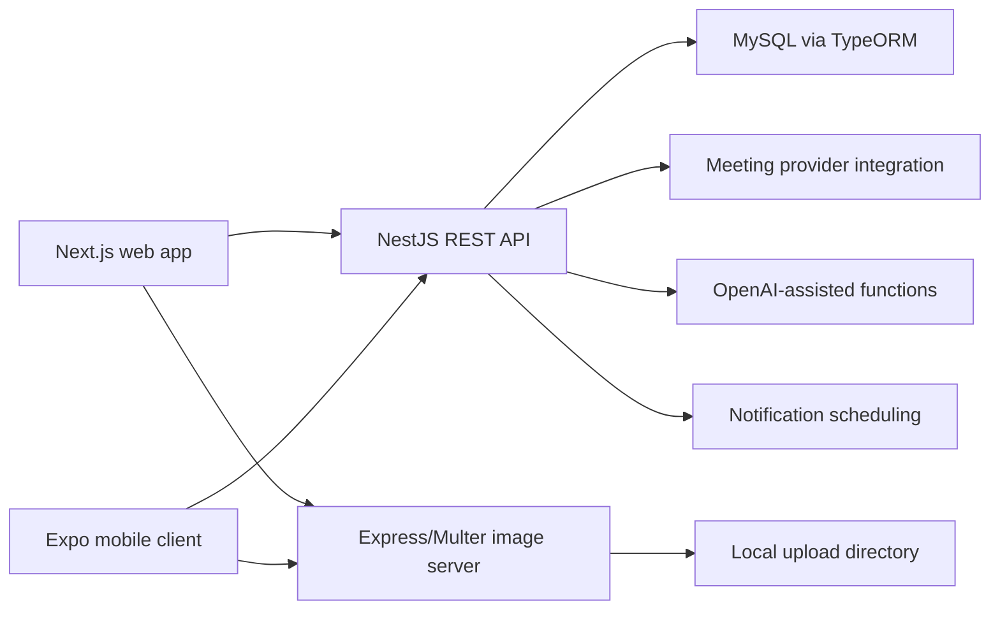
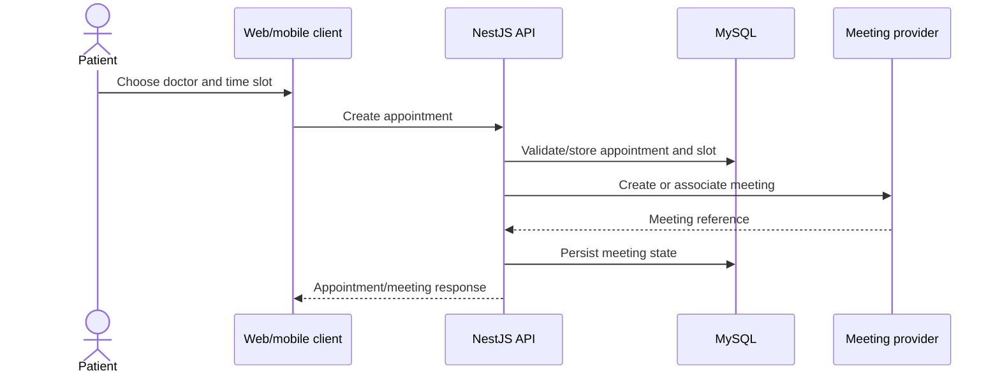

# PharmaConnect - Telehealth and Prescription Platform

> Source-verified analysis of all four repositories under `C:\projects\PharmaConnect`: `backend`,
> `PharmaConnect-WebApp`, `pharmaConnect-MobileApp`, and `Image-server`. This replaces an earlier page
> that described authorization and ownership more strongly than the code or Git history supports.

- **Project type:** Multi-client healthcare workflow platform
- **Primary stack:** NestJS, Next.js, Expo/React Native, MySQL/TypeORM
- **Audited repositories:** Four independently versioned codebases
- **Status:** Broad application prototype; production security and operations are not established

---

## One-liner

A multi-surface telehealth system connecting users, appointments, consultations, prescriptions,
notifications, clinical notes, and AI-assisted functions through a NestJS API, a Next.js web
client, an early Expo client, and a separate upload service.

## Role and provenance

The supplied Git history does **not** support the former claim that Ifham Mohamed built this system
solo. All commits in all four checked-out repositories are authored by `Akar` / `Akar Ahamadh`:

| Repository | Commits | Tracked files | Observed authorship |
|---|---:|---:|---|
| Backend | 15 | 142 | Akar aliases |
| Image server | 5 | 773 | Akar aliases |
| Mobile | 3 | 34 | Akar aliases |
| Web app | 23 | 227 | Akar aliases |

The image-server count is inflated because its dependency directory is committed. Unless separate
team evidence is available, this should be presented as an external codebase analysis rather than
an Ifham-owned portfolio project.

## Problem and intended users

Healthcare interactions span more than a video call. A workable telehealth experience needs
identity, scheduling, clinician availability, meeting records, prescriptions, follow-up actions,
patient notes, attachments, and timely reminders. PharmaConnect attempts to keep these workflows
inside one domain API while exposing purpose-specific web experiences.

The user model and client paths refer to administrator, doctor, patient, and pharmacist contexts.
However, role labels and role-segmented screens are not equivalent to enforced API authorization;
the security audit below makes that distinction explicit.

## Repository map

| Component | Purpose | Audited shape |
|---|---|---|
| `backend` | Main REST API and relational domain | NestJS 11, 127 TypeScript files, MySQL/TypeORM |
| `PharmaConnect-WebApp` | Primary browser experience | Next.js 15 App Router, 137 TSX files, 26 page/route files |
| `pharmaConnect-MobileApp` | Mobile client experiment | Small Expo project with 34 tracked files |
| `Image-server` | Upload and file retrieval | Single Express/Multer service with committed dependencies |

## Architecture

This is a four-process architecture in source. The main backend stores domain records in MySQL.
The image service stores files on its own local filesystem; it is not an object-storage abstraction
and has different backup, scaling, and authorization characteristics from the API.

## Backend domain and modules

The NestJS application contains the following feature areas:

| Feature | Responsibility |
|---|---|
| Auth | Credentials/token-related authentication flows |
| Users | User profile and account operations |
| Prescription | Prescription creation and management |
| Meeting | Consultation meeting lifecycle/integration |
| Appointment | Booking and appointment state |
| Doctor schedule / time slot | Provider availability and selectable slots |
| Notification | Notification records and firing behavior |
| OpenAI | AI-assisted domain endpoints |
| Image uploads | Upload metadata/API integration |
| Condition book / book entry | Structured clinical-condition notes and entries |
| Follow-up | Post-consultation actions and tracking |

### Persistence model

Twelve entity files were found:

- `User`
- `Prescription`
- `Meeting`
- `Appointment`
- `DoctorSchedule`
- `TimeSlot`
- `Notification`
- `FiredNotification`
- `ConditionBook`
- `BookEntry`
- `FollowUp`
- `ImageUpload`

The `ImageUpload` entity file exists, but it was not included in the audited `AppModule` entity list,
so its active persistence status should be verified. TypeORM is configured against MySQL with
`synchronize: true`, which is convenient for development but unsafe as a production schema-change
strategy.

## Web application

The web client uses Next.js 15's App Router and contains 26 page/route files. Its source provides
substantial role-oriented UI for administrative, doctor, patient, and pharmacy-related workflows,
including dashboards and screens for several backend domains. Client authentication is hydrated
before protected navigation decisions, preventing the common flash/redirect caused by checking an
empty persisted store too early.

RTK Query-style data access and tag invalidation are used to coordinate client reads and mutations.
This can make appointment/prescription updates visible without manually forcing every screen to
reload, but it does not provide server authorization by itself.

## Mobile application

The mobile repository is much smaller than the web application. Its three-commit, 34-file history
supports describing it as an early client or scaffold, not feature parity with the web product.
Any claim that all clinical workflows ship on mobile should be validated route by route before
publication.

## Image service

The Express service uses Multer to accept files into a local directory and exposes a file-serving
route such as `/files/:filename`. It is operationally simple but has material limitations:

- uploaded bytes live on one server's local disk;
- file retrieval is not protected in the audited service;
- explicit file-size and MIME-type restrictions were not found;
- backups, replication, malware scanning, retention, and signed access are not implemented;
- committing `node_modules` creates an unnecessarily large and stale source tree.

This component should not be described as secure medical-document storage without remediation.

## Representative workflows

### Appointment to consultation

The presence of meeting integration code does not prove provider reliability, production webhook
handling, or successful deployment. Those require integration tests and environment evidence.

### Prescription and follow-up

The domain separates consultations, prescriptions, condition-book entries, and follow-up records.
That allows a doctor-facing experience to add structured post-appointment information while patient
and pharmacy views consume the relevant records. Exact access rules must be enforced server-side
before this is safe for real health data.

### Notifications

The `Notification` and `FiredNotification` model pair represents scheduled information separately
from already-fired events, reducing duplicate delivery risk. Operational correctness still depends
on a scheduler, idempotency, retry behavior, and delivery telemetry that were not proven by the
repository audit.

## Technology stack

| Area | Technology |
|---|---|
| Web | Next.js 15, React, TypeScript, App Router |
| Mobile | Expo / React Native |
| Web state/data | Redux Toolkit / RTK Query patterns |
| API | NestJS 11 and TypeScript |
| Database | MySQL and TypeORM |
| Authentication | Passport/JWT-related NestJS implementation; Google OAuth scaffolding/integration |
| API description | Swagger/OpenAPI decorators and `/api` documentation path |
| Meetings | External video/meeting provider integration in source |
| AI | OpenAI-oriented backend module |
| Files | Express and Multer local-disk server |

## Security and authorization audit

The earlier documentation claimed four-role RBAC across the system. The code does not support that
claim. No global authentication guard was found. `JwtAuthGuard` is applied to only some user routes,
while many appointment, prescription, meeting, notification, AI, condition-book, and follow-up
controllers have no guard at controller or route level. A role guard was not found.

Consequences include the possibility that a caller can reach sensitive handlers without a verified
identity or invoke operations outside their role. Client route segmentation and hidden buttons do
not mitigate an unguarded API.

For healthcare-like data, production readiness additionally requires:

- deny-by-default authentication on all sensitive controllers;
- explicit role and resource-ownership policies;
- validation that patients, clinicians, and pharmacists can access only appropriate records;
- audit logs for sensitive reads and mutations;
- secrets and token-lifetime management;
- encryption, retention, backup, deletion, and breach-response policies;
- rate limiting and abuse protection for auth, AI, and upload endpoints.

## Engineering strengths

- The backend is organized into clear NestJS domain modules.
- Separate schedule/time-slot models provide a more useful booking foundation than a single free-text
  appointment time.
- The domain accounts for prescriptions, consultation records, clinical notes, follow-ups, and
  notification state rather than stopping at video-call creation.
- Swagger decorators make the broad REST surface inspectable during development.
- The web client uses route segmentation and hydration-aware authentication UX.
- RTK Query invalidation patterns can keep related screens consistent after mutations.
- The four-repository separation makes component ownership and independent deployment possible.

## Testing and maintainability

The backend contains roughly 22 `*.spec.ts` files, but their shape is predominantly generated NestJS
service/controller scaffolding. File count should not be reported as meaningful behavior coverage.
No evidence was found for cross-module integration tests, database authorization tests, provider
contract tests, or end-to-end clinical workflows.

The committed dependency directory in `Image-server` is a significant repository-hygiene issue. It
should be removed from version control and reproduced from a lockfile.

## Outcomes

- A broad telehealth domain is represented across API, web, mobile, and file-service codebases.
- The web client and NestJS backend implement multiple appointment, prescription, meeting,
  notification, clinical-note, and follow-up surfaces.
- The schema captures provider availability and fired-notification state explicitly.
- AI and meeting-provider integration points exist in source.

There is no verified production URL, deployment record, active-user count, clinical pilot evidence,
security assessment, or measured outcome in the supplied repositories. “Prototype with broad
functional coverage” is more accurate than “production healthcare platform.”

## Current limitations and risks

- Most sensitive backend controllers are not protected by an observed global or local auth guard.
- No server-side role guard was found despite role-oriented clients.
- TypeORM `synchronize: true` risks uncontrolled production schema changes.
- Local-disk uploads are unauthenticated on retrieval and lack robust validation/operations.
- The image-server commits third-party dependencies.
- The mobile client is substantially smaller than the web client and should not be presented as
  feature-complete.
- Test files are largely scaffolds; critical authorization and workflow behavior is unverified.
- The `ImageUpload` entity's registration in the active ORM configuration is unclear.
- Medical privacy, consent, audit, retention, and compliance controls are not established.
- Git provenance contradicts personal ownership claims in the former case study.

## Recommended next steps

1. Apply authentication globally with explicit public-route exceptions.
2. Implement and test role plus resource-ownership policies for every sensitive endpoint.
3. Replace schema synchronization with reviewed, repeatable migrations.
4. Replace the upload server with authenticated object storage using limits, MIME validation,
   malware scanning, signed access, retention, and backups.
5. Remove committed dependencies and rotate/review any secrets that may have entered history.
6. Add integration tests for appointment conflicts, prescriptions, clinical records, and notification
   idempotency.
7. Add provider-contract/error-path tests for meetings and AI.
8. Confirm project authorship before using the work in a personal portfolio.

## Key concepts demonstrated

- Modular NestJS domain design
- Relational appointment and availability modelling
- Next.js role-oriented application structure
- Client cache invalidation
- Meeting and AI integration boundaries
- Notification idempotency modelling
- Multi-client/multi-service architecture
- Security review of authentication versus authorization

## Evidence map

| Evidence | What it establishes |
|---|---|
| Backend `AppModule`, modules, controllers, and entities | Active API domains, MySQL setup, and ORM registration |
| Guard-usage search | Authentication is not consistently applied and no role guard was found |
| Backend spec files | Test scaffolding exists but broad behavior coverage does not |
| Web route tree and package manifest | Next.js client scale and role-oriented navigation |
| Mobile source tree | Early/small Expo client scope |
| Image-server `server.js` and tracked files | Local Multer storage, public file serving, and committed dependencies |
| Four Git histories | All observed commits belong to Akar aliases |

## Links

- **Local project root:** `C:\projects\PharmaConnect`
- **Git remotes:** [backend](https://github.com/PharmaConnect-ms/backend),
  [web app](https://github.com/PharmaConnect-ms/PharmaConnect-WebApp),
  [mobile app](https://github.com/PharmaConnect-ms/pharmaConnect-MobileApp), and
  [image server](https://github.com/PharmaConnect-ms/Image-server)
- **Remote visibility, deployed API/Swagger, demo, and mobile listing:** not verified.
