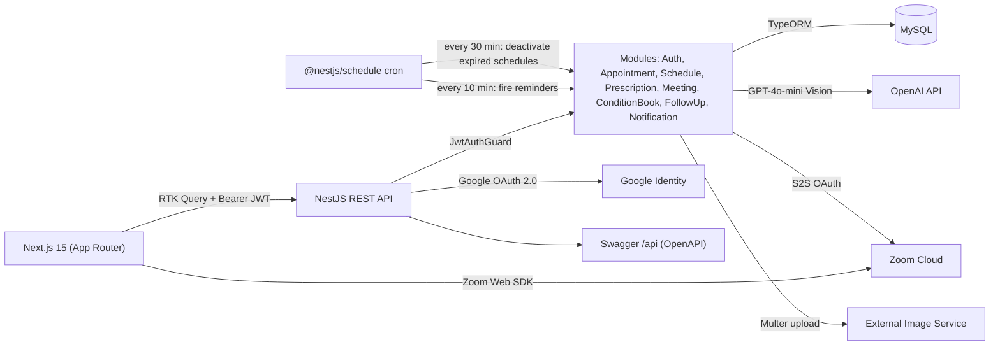

# PharmaConnect — Telehealth & Prescription Platform

> Case-study documentation. The condensed version lives in
> `src/data/projects.data.tsx` (project id `pharmaconnect`) and on the site at
> `/projects/pharmaconnect`; the CV carries a one-line entry + a deep-link.
> Two repos: `backend` (NestJS API) + `PharmaConnect-WebApp` (Next.js 15 client).

---

## One-liner
A role-based telehealth and prescription-management platform where doctors run Zoom
consultations, generate digital prescriptions whose contents are auto-extracted from photos by
GPT-4 Vision, and maintain per-condition patient timelines that drive automated follow-up
reminders.

## Role & context
Solo, end-to-end portfolio build — sole owner of system design, data model, REST API, AI
integration, frontend, auth, and DevOps. Scope spans two repositories (NestJS API + Next.js
App-Router web client) and four roles (`admin`, `doctor`, `patient`, `pharmacist`). No team, no
client — built to demonstrate a non-trivial healthcare workflow across the full stack, including
third-party integrations (Zoom Server-to-Server OAuth, OpenAI GPT-4o-mini Vision, Google OAuth).

## Problem
Paper prescriptions are lost, illegible, and have no audit trail. A misplaced slip means the
dose history is gone; a misread drug name can't be disproven; nothing ties a condition (e.g.
*Type 2 Diabetes*) to the prescriptions issued for it, the follow-ups due, the labs reviewed, or
the appointments held. Small clinics can't justify a heavyweight EMR for this. PharmaConnect
targets the slice between "WhatsApp + paper" and a full EMR: a digital prescription is generated
alongside the consultation, AI extracts its contents from an uploaded image, and every action is
pinned to a per-condition timeline a patient or doctor can scroll.
_To confirm — a baseline metric (e.g. "~30% of paper scripts misread per pharmacist survey", or
your own time-on-paper estimate)._

## Approach / flow
- **Next.js 15 client** — App Router with role-segmented route trees (`/admin`, `/doctor`,
  `/user`); Turbopack dev; Tailwind + MUI v6 + shadcn/ui.
- **State** — Redux Toolkit slice for auth + RTK Query for every server resource with tag-based
  invalidation across ~12 tags (Appointments, prescription, ConditionBooks, FollowUps,
  DoctorSchedule, TimeSlot, Notifications, …).
- **Auth** — JWT bearer injected via `fetchBaseQuery` `prepareHeaders`; a global 401 handler
  dispatches `authLogout()`, clears localStorage, and redirects to `/login`. Rehydration gated
  behind `InitAuthGate` so protected routes don't flash unauth.
- **NestJS API** — 11 feature modules (auth, appointment, doctor-schedule, time-slot,
  prescription, meeting, notification, condition-book, book-entry, follow-up, image-uploads,
  openai) behind `JwtAuthGuard`; Google OAuth via Passport; Swagger/OpenAPI at `/api`.
- **AI extraction** — on `POST /prescription/add-prescription` the uploaded image is converted
  to a base64 data URI and sent to **GPT-4o-mini Vision**; a follow-up call **merges** the new
  prescription into the patient's running summary instead of overwriting it.
- **Telehealth** — Zoom Server-to-Server OAuth with token caching (5-min buffer); supports
  appointment-linked, ad-hoc, and instant meetings. The client embeds the Zoom Web SDK and falls
  back to a static Google Meet link if SDK init fails.
- **Persistence** — MySQL via TypeORM; compound unique indexes prevent overlapping schedules and
  per-day appointment-number collisions.
- **Async** — `@nestjs/schedule` cron: deactivate expired schedules every 30 min; fire due
  reminders every 10 min, writing a `FiredNotification` audit row per dispatch.
- **Storage** — prescription images uploaded to an external image service; the API holds only
  the URL.

## Tech stack
- **Languages:** TypeScript (strict both sides), SQL.
- **Backend:** NestJS 11, TypeORM 11, MySQL (mysql2), Passport-JWT, Passport-Google, bcryptjs,
  `@nestjs/schedule` 6, `@nestjs/swagger` 11, OpenAI SDK 5, Multer, class-validator, SWC.
- **Frontend:** Next.js 15 (App Router, Turbopack), React 18+, TypeScript 5, Tailwind 3.4, MUI
  6.5 + MUI X Date Pickers, shadcn/ui (Radix), Redux Toolkit 2.8 + RTK Query, TipTap 3, Zoom Web
  SDK 2.18, Jitsi React SDK, `qrcode.react`, framer-motion, date-fns / dayjs.
- **Third-party:** Zoom (S2S OAuth), OpenAI GPT-4o-mini Vision, Google OAuth 2.0, external image
  microservice.
- **Tooling:** Jest + Supertest, ESLint flat config, Prettier.

## Best practices followed
1. **Double-booking impossible by design** — compound unique indexes on
   `Appointment(doctor, scheduledAt, appointmentNo)` and `DoctorSchedule(doctor, date,
   time-range)` make race-condition double-bookings a DB error, not application logic.
2. **Auditable reminder dispatch** — every fire writes a `FiredNotification` row
   (success/failure + error); reminders past 24 h auto-expire.
3. **AI merge, not overwrite** — a new prescription is merged into the patient summary
   (preserving prior medications) instead of replacing it.
4. **Token cache with safety buffer** — Zoom S2S tokens cached with a 5-minute pre-expiry
   refresh window, eliminating per-call OAuth round-trips.
5. **Tag-based cache correctness** — ~12 RTK Query tags drive automatic refetches, so creating a
   prescription invalidates the dependent lists without manual `refetch()`.
6. **Role-segmented routing + hydrated guard** — `useRequireAuth(roles?)` waits for hydration
   from `InitAuthGate` before redirecting, so a refresh on a protected route doesn't bounce a
   logged-in user to `/login`.

## Challenges → resolution
- **GPT-4 Vision can invent medications, and naive "replace summary" destroys history.**
  **Fix:** a two-call pipeline — (1) a Vision call extracts only what's visible as structured
  fields; (2) a second text call merges the extraction into the existing summary under a strict
  prompt contract that preserves historical medications and flags conflicts rather than
  overwriting. The model's role is additive, never destructive.
- **Zoom Web SDK init can fail on slow networks / behind proxies, killing trust on the first
  call.** **Fix:** wrapped SDK init in try/catch with a fallback to a static Google Meet link so
  the consultation still happens; the failure is surfaced to telemetry, and the backend `Meeting`
  table stores join/start URLs so the doctor can share the link out-of-band.

## Outcomes
- Two repositories shipped to a working dev demo. Backend: 11 feature modules, ~12 entities,
  MySQL, Swagger/OpenAPI at `/api`. Frontend: Next.js 15 App Router with three role-segmented
  dashboards and ~20 routes.
- End-to-end demoable flow: doctor creates a schedule → time slots auto-generate → patient books
  → doctor starts a Zoom call → uploads a prescription photo → GPT-4o-mini Vision extracts and
  merges it → cron fires the follow-up reminder.
- Condition-book timeline: per-condition typed entries (visit / note / lab / vitals / med_change
  / imaging / attachment) cross-linked to appointments and prescriptions, plus typed follow-ups
  (review / lab_review / repeat_rx / procedure) with push/sms/email channels — the most
  distinctive feature vs a generic appointment app.
- _To confirm — current state is a local-only dev demo (no live URLs / real users). Add
  user/appointment/prescription counts once piloted, or label "demo build, deployment pending"._

## Concepts & skills learnt
OpenAI GPT-4o-mini Vision (image→structured data) · prompt design for additive AI merges · Zoom
Server-to-Server OAuth with cached tokens · embedded video SDK with graceful fallback (Zoom →
Google Meet) · JWT + Google OAuth 2.0 via Passport in NestJS · RBAC across four roles · compound
unique indexes for race-condition-free booking · TypeORM relations, cascading deletes, enum
status columns · cron-driven jobs (`@nestjs/schedule`) · auditable notification dispatch
(FiredNotification pattern) · RTK Query tag-based invalidation (~12 tags) · hydration-aware route
protection · Next.js 15 App Router role-segmented trees · Swagger/OpenAPI from NestJS decorators.

## Links
- **Frontend repo:** _To confirm — public GitHub URL for `PharmaConnect-WebApp`._
- **Live demo:** none yet — local-only dev demo. Cheapest path: deploy the client to Vercel and
  the API to Railway/Render, and make the `main.ts` CORS origin env-driven (currently hardcoded
  to `http://localhost:3000`).
- **Demo video:** none — _strongly recommended:_ a 90-second Loom of the doctor →
  prescription-upload → AI-extraction → follow-up-reminder flow (the AI-merge step is the most
  CV-worthy moment).
- **Swagger:** `/api` on the backend, once deployed.

---

## Still to confirm (fills the remaining TODOs in `projects.data.tsx`)
1. Exact dates of the build.
2. The public `PharmaConnect-WebApp` GitHub URL.
3. A baseline problem metric and any usage numbers (or label "demo build, deployment pending").
4. A live demo URL + a demo video, and `public/images/projects/pharmaconnect.png`.
5. Before publishing the repo: confirm `.env*` is git-ignored and no Zoom/OpenAI/Google secrets are in history.
