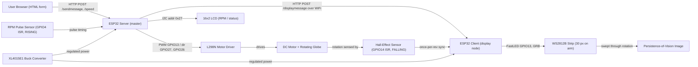

# POV Globe — IoT Persistence-of-Vision LED Signboard

> Case-study documentation. The condensed version lives in
> `src/data/projects.data.tsx` (project id `pov-globe`) and on the site at
> `/projects/pov-globe`; the CV carries a one-line entry + a deep-link.
> Repo: https://github.com/ifham-mohamed/POV_GLOBE

---

## One-liner
An IoT-controlled persistence-of-vision (POV) 3D globe LED signboard that renders text and
graphics on a spinning WS2812B LED array, updatable live from any web browser over WiFi —
built for advertising, events and ambient lighting.

## Role & context
- **Setting:** 4-person university hardware/IoT coursework project.
- **My responsibility:** end-to-end ownership across all four subsystems — (1) ESP32
  firmware (C++/Arduino: FastLED rendering, interrupt-driven sync, motor control, RPM math),
  (2) a 2-layer PCB in Altium Designer (top + bottom), (3) the web/IoT control layer
  (ESPAsyncWebServer UI + inter-device HTTP), and (4) the mechanical rotating assembly and
  power delivery.
- **Scope:** a complete, demonstrable prototype taken schematic → PCB → firmware → browser
  control UI.
- _To confirm — course/module + institution to credit; how the four subsystems were split
  with teammates (SARA, RAJI, DENU, REEZ folders) vs. solo engineering with build/report
  support._

## Problem
Traditional signboards are static, single-message and non-interactive — updating one means
reprinting or rewiring, and a flat LED matrix that could show animated content needs one
physical LED per pixel (hundreds for even a small display). POV Globe closes that gap two
ways: it makes the display remotely re-programmable in real time over WiFi, and it uses
persistence of vision so a single 30-LED strip swept through rotation emulates a full
cylindrical display surface a fixed matrix would need hundreds of LEDs to reproduce.
_To confirm — any measured baseline (cost vs. a comparable fixed LED matrix, or update time
vs. a printed sign)._

## Approach / flow
- **Web UI (browser):** an HTML form served by the master — text message field, LED
  brightness slider (0–255), motor-speed slider (0–255 PWM).
- **ESP32 "Server" (master):** runs `ESPAsyncWebServer` on port 80 (static IP, WiFi station
  mode); handles `POST /sendmessage` and `POST /speed`, relays the message to the display node
  via `HTTP POST /displaymessage`. Drives the **L298N** motor (PWM enable + direction),
  measures **RPM** from a pulse sensor via a RISING-edge ISR with a moving-average filter, and
  prints status (WiFi, RPM, brightness) to a **16×2 I²C LCD** (0x27).
- **WiFi network:** both ESP32s join the same 2.4 GHz AP; communication is plain HTTP POST.
- **ESP32 "Client" (display):** receives the message on `/displaymessage`. A **Hall-effect
  sensor** (FALLING-edge ISR) gives one positional reference per revolution; on each trigger
  the node advances to the next character and paints it as a **16×16 bitmap**, column-by-
  column, onto the **WS2812B** strip via **FastLED**. Persistence of vision assembles the full
  image as the arm spins.
- **Power:** an **XL4015E1** buck converter regulates the supply; motor and logic/LED rails
  are separated to keep motor noise off the MCU and LEDs.

## Tech stack
- **Language:** C++ (Arduino framework).
- **Embedded platform:** ESP32 (DOIT DevKit v1), dual-core 240 MHz — two units in a
  master/slave split.
- **Firmware libraries:** FastLED, `WiFi.h`, ESPAsyncWebServer, AsyncTCP, HTTPClient,
  LiquidCrystal_I2C, Wire.
- **Protocols / buses:** HTTP (port 80), WiFi 2.4 GHz (station mode), I²C, PWM.
- **EDA / PCB:** Altium Designer (2-layer PCB — top + bottom).
- **Key ICs / components:** WS2812B addressable RGB LEDs (30 px), L298N H-bridge motor
  driver, XL4015E1 DC-DC buck converter, Hall-effect sensor (A41F / 44E family), 16×2 I²C LCD
  (0x27), DC gear motor.
- **Supporting tools:** Arduino IDE / PlatformIO; Wokwi and Tinkercad for design/simulation.

## Best practices followed
1. **Separation of concerns (two-MCU master/slave):** control (web UI, motor, RPM) on one
   ESP32, time-critical LED rendering + rotation sync on a second, so web traffic never stalls
   the POV refresh.
2. **Non-blocking I/O:** the asynchronous `ESPAsyncWebServer`/`AsyncTCP` stack keeps HTTP
   event-driven so it doesn't block the tight LED loop.
3. **Interrupt-driven synchronization:** Hall-effect (FALLING) and RPM-pulse (RISING) ISRs
   instead of polling, for deterministic POV alignment independent of loop jitter.
4. **Signal conditioning:** a moving-average filter to smooth the noisy tachometer signal.
5. **Power integrity / rail isolation:** a dedicated XL4015E1 buck converter with motor power
   separated from logic/LED power to prevent motor-induced brownouts and noise.
6. **Reproducible hardware:** a complete 2-layer Altium PCB (top + bottom, with PDF exports)
   plus an archived per-component datasheet library, so the build can be re-fabricated.

## Challenges → resolution
- **POV timing — aligning the image to rotation.** Characters smeared or drifted because
  rendering had to stay locked to the globe's angular position even as motor speed varied.
  **Fix:** drove character advancement from a Hall-effect interrupt (one positional reference
  per revolution) rather than fixed delays, painting each 16×16 character at a known
  rotational position; tuned per-row timing (~2 ms/row) against the measured RPM so the image
  stayed crisp across speeds.
- **Delivering power to the spinning assembly.** Feeding stable power to the LEDs and
  electronics on a continuously rotating arm without brownouts or wires tangling.
  **Fix:** regulated the supply with an XL4015E1 buck converter and separated motor and
  logic/LED rails. _To confirm — exact method feeding the rotating arm (slip ring / brushes /
  on-board battery / only the arm spins while the control board stays stationary)._
- *Also navigated:* reliable dual-ESP32 WiFi comms (a master/slave HTTP-POST link to a fixed
  `/displaymessage` endpoint on a shared AP) and mechanical balance/vibration at >1000 RPM.

## Outcomes
- A fully working, demonstrated prototype, submitted as graded university coursework.
- Live text/graphics on a spinning 30-LED WS2812B array via persistence of vision, with a
  stable image sustained at **>1000 RPM** (live RPM shown on the on-board 16×2 LCD).
- Real-time browser control over WiFi of message content, LED brightness (0–255) and motor
  speed (0–255 PWM) — no reflash or rewiring to change the display.
- A complete 2-layer fabricated PCB (top + bottom) and a full component datasheet/design
  archive.
- Effective 16×16 character-cell display surface from just 30 physical LEDs swept through
  rotation.
- _To confirm — grade/mark; max characters/effective resolution; any expo/public showing._

## Concepts & skills learnt
Persistence of vision (POV) display · Addressable RGB LEDs (WS2812B / NeoPixel) & FastLED ·
Embedded interrupt service routines (ISRs) on ESP32 · Hall-effect rotational sensing & RPM
tachometry · PWM motor control via H-bridge (L298N) · DC-DC buck conversion & power-rail
isolation (XL4015E1) · Asynchronous embedded web server (ESPAsyncWebServer / AsyncTCP) ·
Master/slave microcontroller architecture over HTTP · I²C peripheral interfacing · ESP32 WiFi
(station-mode) IoT control · 2-layer PCB design & layout (Altium Designer) · Bitmap-to-LED
framebuffer mapping & real-time embedded synchronization.

## Links
- **Repository:** https://github.com/ifham-mohamed/POV_GLOBE
- **Demo videos:** three GitHub-hosted clips in the README ("Project Inception", "Hardware
  Selection", "Progress and Achievements"). _Note — the README's embedded asset URLs reference
  an "Ifham1111" account (likely a former username); verify the links resolve and add a stable
  public URL (e.g. YouTube) if available._
- **Report:** _To confirm — written report, poster, or slide deck to link._

---

## Still to confirm (fills the remaining TODOs in `projects.data.tsx`)
1. Course/module + institution, and how the four subsystems were split with teammates.
2. The power-delivery method to the rotating arm (slip ring / brushes / battery / stationary board).
3. Grade/mark, effective resolution / max message length, and any expo/public showing.
4. A stable demo-video URL and `public/images/projects/pov-globe.png`.
