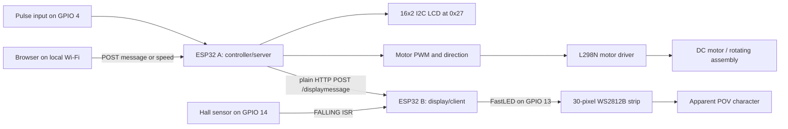
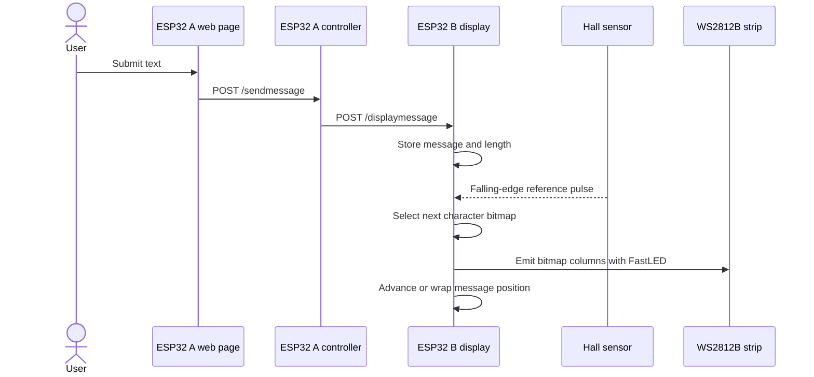

# POV Globe - IoT Persistence-of-Vision LED Display

> Source- and PDF-verified case study based on `C:\projects\POV_GLOBE` at commit `4faf5d3`.
> The audit covers all firmware variants, PCB/CAD artifacts, reference images, eleven PDFs, the
> README media links, and Git provenance. Demonstrated, partially wired, and planned features are
> distinguished explicitly.

- **Project type:** University/team embedded-systems prototype
- **Primary platform:** Two ESP32 DevKit boards using the Arduino framework
- **Display:** 30-pixel WS2812B strip driven with FastLED
- **Repository scale:** 37 tracked files, including 11 Arduino sketches and 11 PDFs
- **Recorded portfolio period:** July 2023 - June 2024
- **Git snapshot:** 11 commits, all imported on 13 August 2023 by Mohamed MRI

---

## One-liner

A two-ESP32 persistence-of-vision prototype that accepts a message from a local browser, relays it
between controller and display nodes, and paints 16-by-16 letter bitmaps on a rotating 30-pixel
WS2812B strip synchronized by a Hall-effect interrupt.

## Role and provenance

Git records all 11 repository commits under Mohamed MRI / Ifham Mohamed, supporting ownership of
the assembled repository, documentation, and final submission snapshot. The source itself contains
separate teammate-named experiments under `DENU`, `REEZ`, and `SARA&RAJI`, and the README consistently
uses plural team language. The defensible framing is therefore **team university project with Ifham
as repository integrator and a major firmware/hardware contributor**, not a proven solo build.

The exact group size, course/module, institution, and division of physical assembly, PCB layout,
firmware, and testing are not recoverable from the repository. Those facts should be confirmed with
the original team before publication. The CV's July 2023-June 2024 period also cannot be derived
from Git because every checked-in commit has the same August 2023 date.

## Problem and design objective

A conventional animated sign needs a physical matrix of LEDs. A persistence-of-vision display can
reuse one vertical LED strip across many angular positions: the viewer's visual persistence combines
rapidly emitted columns into a larger apparent surface. The project combines that display technique
with browser-based message and motor control so content can change without reflashing firmware.

The intended product scope in the README includes text/graphics, live customization, decorative
lighting, and RPM feedback. The final source snapshot fully supports message entry and the core
display path, partially supports speed/RPM/brightness controls, and does not contain a general
graphics/animation authoring system.

## Repository and artifact map

| Area | Contents | Audit interpretation |
|---|---:|---|
| `CODES/CLIENT` | One 1,003-line Arduino sketch | Final display-node candidate |
| `CODES/SERVER` | One 415-line Arduino sketch | Final controller-node candidate |
| Earlier feature folders | Six smaller experiments plus two 1,000-line combined variants | Incremental message, brightness, sensor, and integration work |
| Teammate folders | Three sketches named for Denu, Reez, Sara/Raji | Evidence of team experimentation/contribution |
| `PCBS` | Two `.pcbdoc`, two JSON, two copper PDFs, and two rendered-board screenshots | Two ESP32 controller-board designs and manufacturing/reference artwork |
| `DATA SHEETS` | Nine PDFs plus seven PNG/JPG references | Component/prototyping reference library, not a final BOM by itself |
| README | Architecture images and three GitHub-hosted video links | Demonstration/context evidence; links should be checked periodically |

Across all 11 sketches the repository contains approximately 3,418 lines of Arduino/C++ source.
There is no Arduino CLI/PlatformIO project file, dependency lock, automated build, hardware test
procedure, BOM, schematic, Gerber package, or DRC report.

## Implemented architecture

The final architecture uses two ESP32s on one Wi-Fi network:

- **ESP32 A** serves an embedded HTML page, accepts the text message and motor-speed input, drives
  the motor-control pins, collects a pulse signal, and cycles status on an I2C LCD.
- **ESP32 B** exposes `/displaymessage`, stores the received text, watches the Hall sensor through a
  minimal interrupt flag, and renders the next character bitmap when the flag is observed.

The split keeps the large character renderer separate from browser/motor responsibilities. Network
traffic can still affect timing because both nodes use blocking delays and dynamic `String` values.

## Firmware evolution

The source is an archive of experiments rather than one clean build target.

1. `USERINPUT_SERVER` and `USERINPUT_CLIENT` prove message transfer between two ESP32 web servers.
2. `BRIGHTNESSCONTRLLING_SERVER` and `BRIGHTNESSCONTRLLING_CLIENT` explore a brightness endpoint and
   LCD feedback.
3. `WHOLECODE_WITHOUUT_LEDBRIGHTNESSCONTRLLING_*` combines motor, RPM, message relay, and font
   rendering while explicitly excluding working brightness control.
4. `CLIENT` and `SERVER` are the newest/final-named pair, containing the full A-Z bitmap renderer
   and the controller UI.
5. `DENU`, `REEZ`, and `SARA&RAJI` isolate team experiments such as sensor synchronization and
   display behavior.

Keeping every stage is useful historical evidence, but the repository should identify one canonical
pair and move superseded sketches into a labelled archive.

## Display-node implementation

The final client sketch uses:

- `FastLED.addLeds<WS2812B, DATA_PIN, GRB>` on GPIO 13;
- a 30-element `CRGB` buffer;
- fixed brightness initialized to 128;
- a Hall-effect input on GPIO 14 with an `IRAM_ATTR` ISR;
- a volatile boolean set inside the ISR and consumed in the main loop;
- an asynchronous web server with `/` and `/displaymessage` routes;
- hard-coded 16-by-16 bitmap arrays and switch dispatch for letters A-Z plus a space/fallback.

Digit bitmap calls are present only as commented code. The source therefore supports alphabetic
messages, not a verified full alphanumeric/graphics engine.

### Message-to-light flow

This is a character-per-trigger implementation in the checked-out loop, with an additional 800 ms
delay after a rendered character or wrap. The exact angular mapping, readable RPM range, and maximum
message length were not measured in source.

## Controller-node implementation

The final server sketch contains:

- an `ESPAsyncWebServer` page with message, brightness, and speed controls;
- message forwarding to a fixed display-node IP using a raw HTTP request;
- L298N enable/direction pins on GPIO 13, 27, and 26;
- a rising-edge pulse interrupt on GPIO 4;
- an RPM averaging/calculation function;
- LCD screens for Wi-Fi, RPM, brightness, and current input.

### What works in source

- `/sendmessage` is registered and calls the display node's `/displaymessage` endpoint.
- `/speed` is registered and changes motor direction/PWM output.
- LCD initialization and status-screen functions are called from the main loop.

### What is incomplete or inconsistent

- The web page posts brightness changes to `/sendbrightness`, but that handler is commented out.
- A `sendToESP32B()` brightness function exists but is not connected to an active handler.
- The final display node registers no `/setbrightness` route and keeps brightness fixed at 128.
- `Displayrpm()` calculates the RPM value but is never called from `loop()`; the LCD therefore has
  no source-level path to a refreshed RPM value.
- The speed slider declares 0-255, while `map()` treats the input as 0-100 before generating 0-255.
- `HTTPClient` is instantiated without an explicit `#include <HTTPClient.h>` in the final server,
  which is a likely normal-toolchain compile failure even though the unused function is disconnected.

The former case study's claims of live browser brightness control and verified real-time RPM display
were therefore too strong.

## PCB and hardware artifacts

The rendered PCB PDFs contain clean copper artwork, while the two screenshots show distinct boards:

- **ESP32 A board:** ESP32 DevKit footprint, motor-control header, LCD connections, LM393/sensor
  header, push-button/enable connections, and supply points.
- **ESP32 B board:** ESP32 DevKit footprint, Hall 44E header, WS2812B connection, enable/button,
  capacitors, and supply points.

The filenames `PCB TOP` and `PCB BOTTOM` appear to refer to the two physical controller assemblies,
not conclusively to the top and bottom copper layers of one board. `.pcbdoc`, JSON, PDF, and rendered
screenshots demonstrate board design work, but no Gerbers, drill files, assembly photos tied to these
revisions, or fabrication receipt prove that these exact layouts were manufactured.

## PDF inventory

| PDF | Pages | Relevance |
|---|---:|---|
| `PCBS/PCB TOP.pdf` | 1 | Copper artwork for one controller-board design |
| `PCBS/PCB BOTTOM.pdf` | 1 | Copper artwork for the second controller-board design |
| `DATA SHEETS/esp32 datasheet.pdf` | 5 | DOIT ESP32 DevKit v1 reference |
| `DATA SHEETS/ESP32 MODULE.pdf` | 5 | Duplicate/alternate copy of the DOIT ESP32 reference |
| `DATA SHEETS/ESP32-DOIT-DEV-KIT-v1-pinout-mischianti.pdf` | 1 | Pinout diagram |
| `DATA SHEETS/hall effect sensor 41f.pdf` | 5 | Honeywell SS41F/SS41G Hall-sensor datasheet |
| `DATA SHEETS/L298N Motor Driver.pdf` | 7 | L298N dual H-bridge user guide |
| `DATA SHEETS/dcdriver.pdf` | 8 | Secondary L298N motor-driver article/reference |
| `DATA SHEETS/1811081616_XLSEMI-XL4015E1_C51661.pdf` | 10 | XL4015 5A buck-converter datasheet |
| `DATA SHEETS/dotstar led strip.pdf` | 2 | Adafruit DotStar reference; final firmware instead uses WS2812B |
| `DATA SHEETS/1682209.pdf` | 4 | Arduino Uno reference; final firmware targets ESP32 |

The DotStar and Arduino documents show evaluation/prototyping context and should not be listed as
final components merely because their PDFs are present.

## Technology stack

| Area | Technology |
|---|---|
| Language/framework | Arduino C++ on ESP32 |
| Networking | ESP32 Wi-Fi station mode, AsyncTCP, ESPAsyncWebServer, raw HTTP |
| Display | FastLED, WS2812B, 30-pixel buffer, 16-by-16 bitmap font |
| Timing/sensing | GPIO interrupts, Hall-effect sensor, pulse-period RPM logic |
| Motor | L298N H-bridge, DC motor, PWM/direction GPIO |
| Status | 16-by-2 I2C LCD at address `0x27` |
| Power reference | XL4015 buck converter material |
| PCB/CAD | `.pcbdoc`, EasyEDA-like JSON exports, copper PDFs, rendered board screenshots |
| Simulation/reference | Wokwi/Tinkercad images and component pinout diagrams |

## Engineering strengths

- Splitting controller and display responsibilities across two ESP32s is a sensible prototype
  architecture for timing-sensitive rendering.
- The display ISR only sets a flag; heavy LED rendering is kept out of interrupt context.
- FastLED and a table-driven bitmap font make the optical output reproducible in source.
- The project retains incremental experiments, final candidates, CAD source, and reference material.
- Browser-to-controller-to-display flow demonstrates embedded web, inter-device HTTP, PWM, I2C,
  sensor interrupts, and addressable LEDs in one physical-system concept.
- The PCB screenshots map connectors clearly to the two ESP32 roles.

## Challenges and design responses

### Synchronizing light with rotation

The design uses a Hall-effect edge as a repeatable mechanical reference rather than relying only on
loop timing. The current code advances message characters on the trigger, but a production-quality
POV renderer would measure revolution period and schedule each angular column from that period.

### Keeping web/motor work away from the renderer

A dedicated controller ESP32 handles the web interface, LCD, motor, and pulse input, while a second
ESP32 owns the font and LED buffer. This reduces contention but introduces Wi-Fi/IP provisioning and
cross-node failure states.

### Prototyping multiple subsystems

Separate sketches demonstrate message input, brightness, and sensor logic before integration. The
final merge did not fully reconnect brightness and RPM behavior, illustrating why an explicit
hardware integration checklist and canonical build are necessary.

### Hardware reproduction

CAD sources, copper PDFs, and reference documents improve reproducibility, but manufacturing-ready
handoff still needs schematics, BOM, Gerbers, drill files, DRC results, connector/power ratings, and
assembly instructions.

## Security, safety, and reliability audit

- Wi-Fi credentials and the peer IP are hard-coded in tracked sketches. Any still-valid credentials
  should be rotated, removed from history where appropriate, and replaced by provisioning/config.
- The HTTP servers have no authentication or TLS; anyone on the same network can attempt control.
- Message input has no documented length limit or character validation.
- Dynamic Arduino `String` operations and long-lived requests can fragment constrained memory.
- Blocking 700-800 ms delays reduce responsiveness and complicate precise timing.
- Motor speed is not closed-loop; the pulse sensor is not used to regulate speed.
- No overspeed, stall, imbalance, enclosure, emergency-stop, current-limit, or thermal protections
  are documented.
- A rapidly rotating LED assembly is a physical hazard; safe operation requires mechanical balancing,
  containment, rated bearings/fasteners, guarded power delivery, and verified maximum RPM.
- Separate logic/LED and motor power is mentioned in prior documentation, but a complete schematic
  proving rail isolation is absent.

## Outcomes supported by evidence

- A two-node message-to-POV architecture and A-Z bitmap renderer are implemented in Arduino source.
- The repository includes iterative firmware for browser input, motor control, sensors, LCD feedback,
  and inter-ESP32 HTTP.
- Two controller-board CAD designs, copper outputs, reference diagrams, and component datasheets are
  archived.
- The README contains architecture media and three GitHub-hosted demonstration clips.

The repository does **not** provide measured proof of greater-than-1,000-RPM operation, image
stability, effective resolution, fabrication of the exact PCB revision, grade, expo presentation, or
reliable brightness/RPM controls. Those former outcome claims have been removed.

## Current limitations and recommended next steps

1. Create a canonical PlatformIO/Arduino CLI project with pinned board core and library versions.
2. Restore and test an authenticated brightness handler end-to-end, or remove the inactive UI.
3. Call the RPM calculation on a non-blocking schedule and use it to derive angular column timing.
4. Make slider range and PWM mapping consistent; adopt ESP32 LEDC APIs explicitly.
5. Replace hard-coded credentials/IPs with provisioning, mDNS/service discovery, and safe defaults.
6. Bound and validate messages; define supported glyphs and add digits/punctuation deliberately.
7. Replace long delays with a state machine driven by `millis()`/timers.
8. Add compile CI plus bench tests for routes, sensor edges, PWM bounds, and glyph rendering.
9. Produce schematics, BOM, Gerbers, drill files, DRC, power/current budget, and assembly guide.
10. Document mechanical balancing, guarded testing, power transfer to the rotating assembly, and a
    verified safe RPM envelope.
11. Confirm the team roster and individual contribution split before publishing the role statement.

## Key concepts demonstrated

- Persistence-of-vision display fundamentals
- ESP32 dual-node embedded architecture
- Addressable WS2812B LEDs and FastLED
- Interrupt-driven Hall sensing
- Bitmap font rendering
- Embedded asynchronous HTTP servers
- PWM motor control and H-bridge integration
- I2C LCD interfacing
- PCB/CAD artifact production
- Embedded security, timing, and mechanical-safety review

## Evidence map

| Evidence | What it establishes |
|---|---|
| Final `CLIENT` and `SERVER` sketches | Active message, display, motor, sensor, LCD, and web code |
| Earlier/teammate sketches | Iterative integration history and team evidence |
| `.pcbdoc`, JSON, screenshots, and two PCB PDFs | Two controller-board designs and copper artwork |
| Nine reference PDFs and seven images | Evaluated components, pinouts, and prototype context |
| README images/videos | Intended architecture and demonstration media |
| Git history | Repository imported through Ifham's account in 11 same-day commits |

## Links

- **Git remote:** [github.com/ifham-mohamed/POV_GLOBE](https://github.com/ifham-mohamed/POV_GLOBE)
- **Local source:** `C:\projects\POV_GLOBE`
- **Demo media:** three GitHub-hosted asset links are embedded in the repository README; their
  long-term availability should be checked before public portfolio use.
- **Report/poster/grade:** not present in the supplied project folder.
