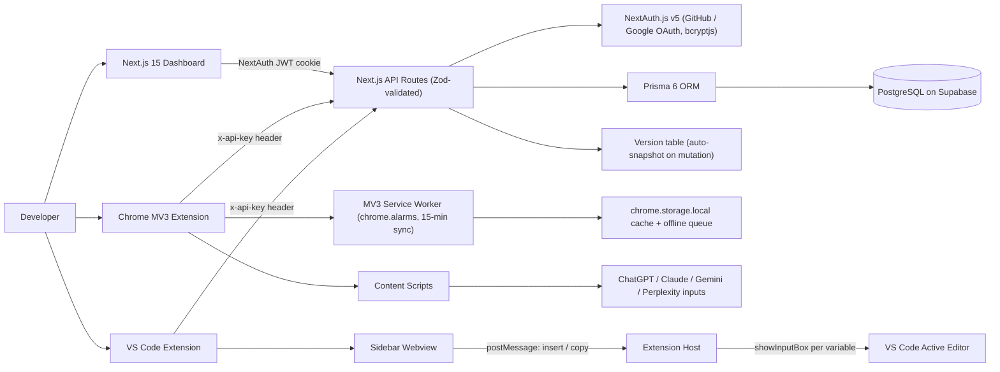

# Prompt Copilot — Cross-Surface AI Prompt Manager

> Case-study documentation. The condensed version lives in
> `src/data/projects.data.tsx` (project id `prompt-copilot`) and on the site at
> `/projects/prompt-copilot`; the CV carries a one-line entry + a deep-link.
> Repo: https://github.com/ifham-mohamed/prompt-copilot
>
> Honesty note: aspirational SRS claims (real-time WebSocket sync, E2E encryption,
> JetBrains plugin, 80% test coverage) are **not** counted as shipped.

---

## One-liner
A cross-surface prompt-management ecosystem — a Next.js 15 dashboard, a Chrome Manifest V3
browser extension, and a VS Code extension backed by a single Prisma/PostgreSQL API — that
lets developers organise, version, and one-click-insert reusable AI prompts into ChatGPT,
Claude, Gemini, Perplexity, and their IDE.

## Role & context
- **Role:** solo developer, end-to-end owner.
- **Scope:** personal portfolio project. Designed the relational schema, the REST API
  contract, the multi-modal auth layer, and built all three client surfaces (web dashboard,
  Chrome extension, VS Code extension) plus the cross-surface sync model.
- **Span:** SRS authoring → schema design → API → three independently bundled clients. The
  extension manifests/package metadata are store-ready, but no Chrome Web Store or VS Code
  Marketplace publication evidence was found.

## Problem
Working daily across ChatGPT, Claude, Gemini, and VS Code, the best prompts a developer
writes end up scattered across Notion, screenshots, and chat scrollback. Every reuse means
alt-tabbing out of flow, re-finding the prompt, re-typing template variables by hand, and
losing the version history of what actually worked. No existing tool indexes prompts across
all four major AI websites **and** the IDE under one searchable, versioned library with
template-variable substitution.

## Approach / flow
**Components**
- **Web dashboard** — Next.js 15 (App Router, React 19, Server Components): auth pages, prompt
  CRUD, category tree, settings, dashboard stats.
- **REST API** — Next.js Route Handlers with Zod-validated request bodies.
- **Auth layer** — NextAuth.js v5 with GitHub + Google OAuth and a credentials provider
  (bcryptjs) for the browser; a per-user `apiKey` and an `x-api-key`-header path for the
  extensions.
- **Persistence** — PostgreSQL on Supabase via Prisma 6. Ten models: `User`, `Account`,
  `Session`, `VerificationToken`, `Prompt`, `Version`, `Category`, `Tag`, `AIIntegration`, and
  `AuditLog`. The prompt/category/version domain sits alongside Auth.js persistence, tags,
  provider integration metadata, and audit records; soft deletion is used where defined.
- **Chrome extension** — Manifest V3: React popup, MV3 service-worker background with a
  `chrome.alarms` 15-minute sync tick, content scripts injected at `document_idle` into
  chatgpt.com / claude.ai / gemini.google.com / perplexity.ai, `chrome.storage.local` cache
  and an offline write queue.
- **VS Code extension** — sidebar webview provider; an activation entry registering `insert`
  and message handlers; `{{variable}}` substitution in the extension host via
  `vscode.window.showInputBox`.
- **Search** — fuse.js client-side fuzzy matching in the popup; PostgreSQL filtering +
  pagination on the server.

**Data flow**
1. **Create/edit:** dashboard form → Zod-validated POST/PUT `/api/prompts` → Prisma write →
   `Prompt` row + automatic `Version` snapshot.
2. **Sync to browser:** the service worker calls `performSync()` every 15 min (or on demand),
   flushes the offline queue, GETs `/api/prompts` + `/api/categories`, and caches to
   `chrome.storage.local`. The popup reads cache first, falls back to API.
3. **Insert into an AI site:** popup → background sends `INSERT_PROMPT` → content script
   resolves the right textarea/contenteditable per host, writes text, and fires `input` +
   `change` so React/Lexical-controlled inputs re-render and Send enables.
4. **Insert in VS Code:** webview posts `insertPrompt` → host scans for `{{var}}` tokens,
   prompts via `showInputBox` for each, inserts the substituted text at the cursor (or copies
   to clipboard if no editor is focused).
5. **Usage tracking:** every surface POSTs to `/api/prompts/{id}/use` to increment
   `usageCount`; the extension queues this offline if the request fails.

## Tech stack
- **Languages:** TypeScript 5.7 (strict everywhere).
- **Web:** Next.js 15 App Router, React 19 (Server + Client Components).
- **DB & ORM:** PostgreSQL (Supabase), Prisma 6, Prisma Migrate.
- **Auth:** NextAuth.js v5 / Auth.js — GitHub + Google OAuth, credentials (bcryptjs, 12
  rounds); per-user API key + `x-api-key` for non-browser clients.
- **Validation:** Zod on every REST endpoint.
- **UI:** Tailwind CSS, shadcn/ui on Radix primitives, Lucide, Framer Motion, Sonner,
  next-themes.
- **State:** Zustand (client UI) + TanStack Query (server state, stale-while-revalidate).
- **Search:** fuse.js (client) + PostgreSQL filtering/pagination (server).
- **Chrome extension:** Manifest V3, React, esbuild (Firefox `gecko.strict_min_version`
  included).
- **VS Code extension:** VS Code Extension API, Webview, webpack 5 + ts-loader.
- **Tooling:** ESLint 9, Prettier 3 + tailwind plugin.

## Best practices followed
1. **End-to-end type safety** — TS strict across all three workloads, Zod at every boundary,
   Prisma-generated types from one schema.
2. **Multi-modal authentication** — NextAuth JWT sessions for the dashboard plus a separate
   `x-api-key` channel for the extensions (no OAuth redirect in the extension hosts).
3. **Soft deletes + automatic version history** — `deletedAt` recovery and a `Version`
   snapshot on every mutation, no bespoke audit code.
4. **Offline-first browser extension** — `chrome.storage.local` cache, an offline write
   queue, and `chrome.alarms` background sync every 15 minutes.
5. **Separation of concerns across surfaces** — three independent bundles (Next.js / esbuild
   / webpack) sharing only the REST contract.
6. **Per-user data scoping by construction** — domain queries resolve a `userId` from the
   session or API key before reading or mutating user-owned prompt data.

## Challenges → resolution
- **Inserting text into diverse AI-site inputs.** Each site uses a different element
  (`textarea` vs `contenteditable` vs Lexical/ProseMirror), and a naive `value =` / `innerText
  =` write doesn't trigger React's synthetic events — the controlled input doesn't re-render
  and Send stays disabled.
  **Fix:** a per-platform selector table with explicit fallbacks (data-id, role,
  contenteditable), then fire native `input` and `change` events on the target so React/Lexical
  pick up the value and enable submit.
- **One auth model for three storage models, without OAuth in the extensions.** The dashboard
  uses NextAuth JWT cookies, the Chrome extension lives in `chrome.storage.local`, and the VS
  Code extension has no persistent web context.
  **Fix:** a per-user `apiKey` on the `User` model and a second auth path that resolves a user
  from an `x-api-key` header before falling back to the session; mint a key in settings, paste
  it into the extension once.

## Outcomes
- **Three integrated client surfaces are implemented against one backend:**
  - Next.js 15 dashboard — OAuth + credentials login, prompt CRUD, hierarchical categories,
    full-text + fuzzy search, soft delete + version history, per-user API-key management,
    dashboard stats.
  - Chrome MV3 extension — popup search, one-click insertion into ChatGPT/Claude/Gemini/
    Perplexity, offline-first cache, 15-minute background sync.
  - VS Code extension — sidebar webview, `{{variable}}` substitution via `showInputBox`,
    active-editor / clipboard insertion.
- **Schema:** 10 Prisma models covering Auth.js accounts/sessions, prompts, versions,
  self-referencing categories, tags, AI integrations, and audit logs, including per-user API
  keys and prompt usage tracking.
- **Seed data:** 11 default categories (Code Generation, Bug Fixing, Refactoring,
  Documentation, Frontend, Backend, DevOps, Database, Testing, Security, AI/ML), each with
  subcategories, on first sign-in.
- **Store-ready extension packages exist, but publication is unverified.** No listing URL,
  publisher record, install count, or release artifact in the repository proves that either
  extension reached a public marketplace.
- **Honest gaps** (so you don't get caught in a follow-up): the Jest/Husky/lint-staged
  scaffolding is in `package.json` but no test files or `.husky/` hooks exist; there's no CI
  workflow; WebSocket sync, conflict-resolution UI, a JetBrains plugin, and E2E encryption are
  roadmap, not shipped.
- **Route defect found during audit:** the dynamic category folder is literally named
  `categories/ [id]` with a leading space. Next.js will not treat that as the intended
  `/api/categories/[id]` segment; rename it and add a route test.

## Concepts & skills learnt
Chrome Manifest V3 service-worker + content-script architecture · VS Code Webview API with
`postMessage` · Next.js 15 App Router with React 19 Server Components · Prisma ORM on
PostgreSQL (Supabase), self-referencing hierarchies · OAuth 2.0 / OIDC via NextAuth.js v5 ·
JWT sessions + API-key (`x-api-key`) auth · Zod validation as the single source of truth for
request shapes · soft deletes & append-only version-snapshot tables · content-script injection
into React/Lexical/ProseMirror inputs (native `input`/`change` events) · offline-first sync
(`chrome.alarms`, `chrome.storage.local`, write queue) · template-variable (`{{variable}}`)
substitution · fuse.js fuzzy search + PostgreSQL filtering/pagination · TanStack Query
stale-while-revalidate + Zustand · monorepo-style organisation with three build pipelines
(Next.js, esbuild, webpack).

## Links
- **GitHub repo:** https://github.com/ifham-mohamed/prompt-copilot _(confirm it's public)._
- **Live demo / deployed dashboard:** _To confirm — Vercel URL?_
- **Chrome Web Store listing:** not verified.
- **VS Code Marketplace listing:** not verified.
- **Write-up / video walkthrough:** _To confirm._

---

## Still to confirm (fills the remaining TODOs in `projects.data.tsx`)
1. Chrome Web Store URL.
2. VS Code Marketplace URL.
3. Deployed dashboard URL (if any).
4. Install / rating / user-count numbers — otherwise outcomes stay qualitative.
5. A demo video URL and `public/images/projects/prompt-copilot.png`.
