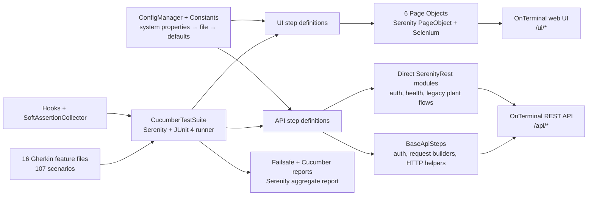

# OnTerminal Test Automation — Serenity BDD UI & API Suite

> Comprehensive case-study and codebase audit for the Group 50 OnTerminal
> automation repository. The condensed portfolio entry belongs in
> `src/data/projects/qa-automation.tsx`; this document is the source of truth.
>
> **Repository snapshot analysed:** `main` at
> `7dadb8a454b8dbd2e1473e6a6776ac1a98bfe0d5` (8 February 2026)<br>
> **Analysis performed:** 15 August 2026<br>
> **Scope boundary:** this repository contains the automated test suite, not the
> OnTerminal application under test.

**Repo:** https://github.com/T-Luxshan/ITFac_Batch21_Group50

---

## One-liner

A Java/Serenity BDD quality-assurance suite that exercises 107 browser and REST
scenarios across authentication, plant inventory, category management, sales,
role-based access, navigation, validation, and health checks for the OnTerminal
training application.

## Role & context

- **Role:** Team Lead / Group Lead and hands-on automation contributor in the
  Group 50 project.
- **Project type:** Group QA-training project; the build names the target
  “QA Training App - Group 50.”
- **Dates:** December 2025 – February 2026 in the portfolio project list. The
  repository's observable commit history runs from 19 January to 8 February
  2026.
- **Responsibility:** Built and refactored much of the shared automation
  foundation: Maven/dependency configuration, Serenity settings, the Cucumber
  runner, centralized configuration/constants, common API requests and
  authentication, scenario hooks, soft-assertion handling, shared UI steps,
  and a significant part of the sales, plants, categories, authentication,
  navigation, and security coverage.
- **Contribution evidence:** Git history records 29 commits by Ifham Mohamed;
  current-line blame attributes 2,426 lines—the largest share of the analysed
  snapshot—to `ifham.info@gmail.com`. Twenty scenarios are explicitly tagged
  `@IFHAM`.
- **Team evidence:** The history contains 104 commits and at least five
  identifiable contributors after consolidating obvious author aliases.
- **Deliverable boundary:** This is a test-only Maven project. It assumes a
  separately running OnTerminal UI/API at `http://localhost:8080` and does not
  contain the application, database, containers, seed scripts, or deployment
  configuration.

## Problem

OnTerminal combines stateful stock and sales operations with two privilege
levels. A regression can therefore do more than break a page: it can permit a
normal user to mutate admin-only resources, expose sensitive sales data, accept
invalid quantities, or leave inventory inconsistent after a sale. Manually
rechecking the same positive, negative, and access-control paths through both
the browser and REST API is slow and inconsistent.

The suite expresses those risks as executable Gherkin specifications. It checks
the UI and API surfaces independently, covers both `admin` and `testuser`
behaviour, creates or discovers prerequisite data where possible, and produces
Serenity plus Cucumber reports suitable for debugging and review.

_To confirm — the original manual regression duration, defect escape rate, and
the exact number/frequency of releases this suite supported._

## Approach / flow

The repository uses a layered BDD design:

1. Feature files describe user- and API-visible behaviour in business terms.
2. One Serenity-backed Cucumber/JUnit runner discovers feature files and glue.
3. UI step classes delegate browser interactions to six page objects.
4. API step classes either use a shared authenticated REST foundation or direct
   `SerenityRest` requests for legacy modules.
5. Shared configuration resolves base URLs, credentials, routes, timeouts, and
   status codes.
6. Hooks log scenarios, collect soft failures, capture failure screenshots, and
   are intended to reset UI/API state.
7. Maven Failsafe executes the integration suite, after which Serenity and the
   Cucumber plugins generate HTML, JSON, XML, screenshot, and aggregate reports.



## Tech stack

- **Language/runtime:** Java source and target level 17; developed/documented
  for JDK 21. The analysed code compiled successfully on Oracle JDK 21.0.9.
- **Test framework:** Serenity BDD 4.2.9 (`serenity-core`,
  `serenity-cucumber`, `serenity-rest-assured`).
- **BDD:** Cucumber Java/JUnit 7.18.1 with Gherkin feature files and tag-based
  selection.
- **UI automation:** Selenium/WebDriver through Serenity Page Objects;
  Chrome is the configured default with automatic driver download.
- **API automation:** REST Assured, JSON Path, and JSON Schema Validator 5.4.0.
- **Assertions:** JUnit 4.13.2, Serenity/Hamcrest response matchers, a custom
  thread-local soft-assertion collector, and Java `assert` statements in parts
  of the shared API layer. AssertJ 3.24.2 is declared but not used by the current
  sources.
- **JUnit compatibility:** JUnit 4 runner plus JUnit Vintage Engine 5.10.2 on
  the JUnit Platform.
- **Build:** Maven; Compiler Plugin 3.12.1, Surefire 3.2.5, Failsafe 3.2.5, and
  Serenity Maven Plugin 4.2.9.
- **Logging:** SLF4J API and Simple 2.0.9.
- **Reporting:** Serenity aggregate site plus Cucumber pretty, HTML, JSON, and
  JUnit XML outputs.

## Best practices followed

1. **Business-readable specifications** — 107 scenarios describe expected
   behaviour, invalid inputs, and permissions separately from implementation.
2. **Layered UI automation** — feature steps delegate selectors and browser
   actions to page objects instead of embedding WebDriver code throughout the
   Gherkin bindings.
3. **Reusable API foundation** — shared authentication, request construction,
   HTTP verbs, response logging, and token handling reduce duplication across
   newer API modules.
4. **Centralized configuration** — base URLs can be overridden with Maven/JVM
   system properties and otherwise fall back to `serenity.properties` and safe
   local defaults.
5. **Role-aware and adversarial coverage** — tests include admin/user paths,
   missing and malformed tokens, direct-URL guards, hidden controls, invalid
   quantities, duplicate categories, and sensitive-field leakage.
6. **Adaptive test data** — unique names and runtime category/plant discovery
   reduce collisions; selected flows create prerequisites when the environment
   is empty.
7. **Failure diagnostics** — request/response logs, scenario metadata,
   screenshots, Cucumber artifacts, and Serenity aggregation make failures
   traceable.
8. **Thread-local soft assertions** — the navigation-highlight scenario can
   collect several independent UI failures and report them together without
   sharing the failure list between threads.

## Challenges → resolution

- **UI markup varied between modules and evolved during the project.**
  **Fix:** Page objects use prioritized CSS/XPath fallback locators and tolerate
  Bootstrap tables, generic grids, modal dialogs, and native confirmation
  alerts.
- **Sales tests depend on mutable inventory.** **Fix:** The suite records a
  plant's stock before sale, selects that same plant in the form, then reopens
  the plant list and compares the post-sale quantity.
- **API tests require valid relational data.** **Fix:** Plant/sales steps
  discover usable categories and in-stock plants at runtime, generate unique
  names, and create fallback fixtures when no suitable record exists.
- **Two roles share most test mechanics but have different permissions.**
  **Fix:** Centralized role-to-credential mapping and reusable login/auth steps
  drive positive admin paths and negative user/unauthenticated paths.
- **Several navigation states need to be checked in one scenario.** **Fix:** A
  thread-local soft assertion collector accumulates menu-highlight failures;
  the global after hook turns the combined summary into one failed scenario.
- **Multiple contributors merged independently named feature and step modules.**
  **Fix:** One runner scans the complete feature directory and all UI/API glue
  packages. The remaining duplicate naming and shared-state issues are recorded
  in the audit below rather than hidden.

## Outcomes

- **107 executable specifications declared:** 52 API and 55 UI scenarios across
  16 feature files.
- **Complete step binding verified:** a full Cucumber dry run discovered all 107
  scenarios with no undefined or ambiguous steps.
- **Build health verified:** all 27 Java test sources compile on JDK 21 using the
  Maven configuration in the repository.
- **Coverage breadth:** 20 authentication, 27 category, 25 plant, 26 sales, 7
  dedicated security, 1 health, and 1 inventory-navigation scenario.
- **Automation structure:** 6 page objects, 8 API step classes, 7 UI step
  classes, common hooks/API support, and centralized configuration.
- **Repository scale:** 47 tracked files and 7,023 tracked lines in the analysed
  snapshot, including 5,696 Java and 877 Gherkin lines.
- **Reports:** Maven is configured to emit Cucumber HTML/JSON/XML and a Serenity
  aggregate site under `target/`.

These are codebase and dry-run results, not proof that all 107 scenarios pass
against a live OnTerminal deployment. The application was not included or
running during this audit, so no current end-to-end pass rate is claimed.

## Concepts & skills learnt

Behaviour-driven development (BDD) · Gherkin scenario design · Serenity BDD ·
Cucumber-JVM glue and tag filters · Page Object Model · Selenium WebDriver · REST
Assured request specifications · JWT bearer authentication · Role-based access
control testing · Positive, negative, and boundary testing · Dynamic fixture
discovery and unique test data · Stateful inventory verification · Maven
integration-test lifecycle · JUnit 4/Vintage interoperability · Hamcrest response
matching · Thread-local soft assertions · Failure screenshots and test reporting
· Configuration precedence · Test isolation and cleanup · Security and data-
leakage testing

## Links

- **Repository:** https://github.com/T-Luxshan/ITFac_Batch21_Group50
- **Serenity report:** generated locally at `target/site/serenity/index.html`
  after a test run; no hosted report is present in the repository.
- **Live OnTerminal environment:** _To confirm — no deployed URL is recorded._
- **Application-under-test repository:** _To confirm — not referenced by this
  repository._
- **Case-study source:** this document

## Still to confirm

1. Whether December 2025 is the planning/start month; observable repository
   work begins on 19 January 2026.
2. The course/module, institution, formal assignment brief, and final team
   roster.
3. The exact Team Lead responsibilities outside commits visible in this
   repository.
4. The OnTerminal application repository, version/commit, database engine,
   seed data, and startup procedure used during the original test campaign.
5. Historical live-run evidence: pass rate, execution duration, defects found,
   report screenshots, and whether the identified category/inventory/RBAC bugs
   were fixed.
6. A hosted demo or published Serenity report and a portfolio screenshot.

---

# Detailed codebase analysis

## Audit scope and method

The analysis covered every tracked file at the snapshot above: root build and
documentation files, Serenity configuration, 27 Java sources, and 16 Gherkin
feature files. Generated `target/` content was excluded from source metrics.

Validation performed during the audit:

- Inspected all source, configuration, feature, and portfolio-convention files.
- Compiled the test code with `mvn test-compile` on JDK 21.0.9 and Maven 3.9.12.
- Ran Maven Failsafe with Cucumber dry-run enabled and the runner tag overridden
  to `not @skip`; it discovered 107 tests with 0 undefined-step, compilation,
  failure, or error results in dry-run mode.
- Generated the local Serenity dry-run report to confirm report aggregation.
- Inspected Git history, contributors, branches, current-line attribution, and
  repository metadata.

No real browser/API assertions were executed because the separately hosted
OnTerminal system and its data store are outside this repository.

## Repository structure

```text
ITFac_Batch21_Group50/
├── .gitignore
├── README.md
├── pom.xml
└── src/test/
    ├── java/com/OnTerminal/
    │   ├── config/       # URL, credentials, constants, property resolution
    │   ├── pages/        # 6 Serenity/Selenium page objects
    │   ├── runners/      # CucumberTestSuite entry point
    │   ├── steps/
    │   │   ├── api/      # 8 API glue classes
    │   │   ├── ui/       # 7 UI glue classes
    │   │   ├── BaseApiSteps.java
    │   │   └── Hooks.java
    │   └── utils/        # Thread-local soft assertions
    └── resources/
        ├── features/
        │   ├── api/      # 8 files / 52 scenarios
        │   └── ui/       # 8 files / 55 scenarios
        └── serenity.properties
```

There is no `src/main`, application code, unit-test layer, CI workflow,
Dockerfile, Compose file, database migration, test-data fixture directory, or
Maven Wrapper in the tracked snapshot.

## Component-by-component inventory

### Root and runtime configuration

| File | Purpose and notable behaviour |
|---|---|
| `.gitignore` | Excludes Maven/Serenity/Cucumber output, IDE state, logs, and OS artifacts. |
| `README.md` | Introduces the suite, prerequisites, clone/build commands, test commands, and Serenity report path. Its versions/execution guidance have drifted from `pom.xml`; see findings. |
| `pom.xml` | Defines the test-only JAR, dependency versions, Java target, compiler, skipped Surefire phase, Failsafe integration execution, Serenity aggregation, system properties, and seven Maven profiles. |
| `src/test/resources/serenity.properties` | Selects Chrome/autodownload, local UI/API URLs, waits, failure screenshots, browser restart policy, report metadata, logging, batch strategy, and the `local` environment. |
| `ConfigManager.java` | Singleton property loader. Resolution order is JVM system property → loaded property → default. Normalizes trailing slashes and builds the principal UI routes. It also attempts to load a nonexistent `application.properties`. |
| `Constants.java` | Holds admin/user credentials, selected HTTP statuses, the two-second short wait, core UI/API paths, and a quantity validation message. |
| `CucumberTestSuite.java` | JUnit 4 `CucumberWithSerenity` runner. Scans all features and three glue packages, writes four Cucumber output formats, uses camel-case snippets, but hard-filters normal execution to `@plants_ui`. |
| `Hooks.java` | Global scenario logging and soft-assertion finalization; intended UI/API setup/cleanup, failure screenshots, and tag-specific smoke/security/admin handling. |
| `SoftAssertionCollector.java` | Static utility backed by `ThreadLocal<List<String>>`; collects boolean failures, formats a combined summary, and clears state around every scenario. |

### UI page objects

| File | Responsibility |
|---|---|
| `LoginPage.java` | Opens `/ui/login`, submits credentials, supports role-based login/logout, manipulates individual fields, reads validation messages, and checks Bootstrap/Tailwind-like red error styling. |
| `DashboardPage.java` | Finds logout and Inventory navigation through fallback locators and recognizes an inventory page from URL or page text. |
| `CategoriesPage.java` | The largest page object (1,054 lines): category navigation, list/pagination/search/filter, add/save/cancel, parent handling, direct add/edit access, ID discovery, sorting, empty/validation states, active-menu soft checks, and hidden edit/delete controls. |
| `PlantsPage.java` | Plant list/header/column checks, add/edit/delete navigation, modal or alert handling, search, pagination, direct URL/access-denied checks, stock snapshots, first/low-stock plant discovery, and table parsing. |
| `PlantFormPage.java` | Plant name/category/price/quantity fields, flexible category selection, save/cancel, add/edit form detection, validation-message inspection, and current-value retrieval. |
| `SalesPage.java` | Sales list/sell-form navigation, sorting, pagination, add/cancel/save/delete, plant selection, quantity entry, stock-sale helpers, validation/empty states, RBAC button checks, and dropdown inspection. |

### Shared and API step definitions

| File | Responsibility |
|---|---|
| `BaseApiSteps.java` | Shared role authentication, token extraction (`token`, `accessToken`, `jwt`, or `access_token`), authenticated/unauthenticated/custom-token requests, GET/POST/PUT/DELETE helpers, response checks, and request/response logging. |
| `CommonApiSteps.java` | Common role authentication, generic GET, and status glue for newer API features. |
| `AuthApiSteps.java` | Login POSTs, 200/401 checks, accepted JWT field variants, and shared token capture for health calls. |
| `HealthCheckApiSteps.java` | Authenticated health GET and exact JSON key/value assertion. |
| `CategoryApiSteps.java` | Category list/create/update/delete/pagination, unique deletion fixture, delete verification, and subcategory-list validation. |
| `PlantApiSteps.java` | Standalone legacy-style plant authentication and CRUD; discovers or creates a subcategory, generates unique plant names, remembers the created ID, and exercises no-token calls. |
| `PlantsApiSteps.java` | Shared-base plant validation, category lookup, negative-quantity update, unchanged-stock check, category filtering, summary fields, and fallback plant creation. |
| `SalesApiSteps.java` | In-stock plant discovery/setup, sell requests, error-message checks, CRUD/sort/pagination/list/data-leakage coverage, and unauthenticated requests. |
| `SecurityApiSteps.java` | Malformed/no-token requests and validation that the main-category response has no parent. |

### UI step definitions

| File | Responsibility |
|---|---|
| `CommonUiSteps.java` | Role login, logout/session clearing, shared categories/plants/sales navigation, valid category-ID discovery, direct-edit access, access-denied/login redirects, logout message, and soft menu-highlight checks. |
| `LoginUiSteps.java` | Positive login, username/password validation, red error styling, remaining-on-login checks, dashboard redirect, and an alternate dashboard logout flow. |
| `CategoryUiSteps.java` | Category list, pagination, search, parent filter, add/main-category/cancel, sorting, empty/duplicate states, access control, and hidden edit/delete glue. |
| `PlantUiSteps.java` | The main plant UI suite: role login, list columns, add/edit/delete/validation/search/access checks, unique names, success/redirect checks, and several additional reusable bindings not currently referenced by feature files. |
| `PlantsUiSteps.java` | Smaller shared-framework plant add-form cancel scenario with a not-created check. |
| `SalesUiSteps.java` | Sales data setup, stock snapshots, sorting/pagination, create/cancel/delete/validation, dropdown, permission, empty-state, and active-menu bindings. |
| `InventoryUiSteps.java` | Inventory menu click and destination check. |

## Application contract inferred from the tests

The following is the interface expected by the automation—not an application
implementation found in this repository.

### Roles and credentials

| Logical role | Username | Password | Expected capabilities |
|---|---|---|---|
| Admin | `admin` | `admin123` | Read and mutate categories/plants/sales; open admin forms and controls. |
| User | `testuser` | `test123` | Read permitted lists; cannot create/update/delete protected resources or open admin-only forms. |

Credentials are training defaults committed in source. They should be injected
from environment variables or a secret store in any non-training environment.

### UI routes

| Route | Expected purpose |
|---|---|
| `/ui/login` | Login form and validation/error messages. |
| `/ui/dashboard` | Post-login landing page. |
| `/ui/logout` | Ends the session and returns a success message/login redirect. |
| `/ui/categories` | Category table, search, parent filter, sort, pagination, and role-aware actions. |
| `/ui/categories/add` | Admin-only category creation. |
| `/ui/categories/edit/{id}` | Admin-only category editing; direct user access should be denied. |
| `/ui/plants` | Plant table, search, pagination, stock display, and role-aware actions. |
| `/ui/plants/add` | Admin-only plant creation. |
| `/ui/plants/edit/{id}` | Admin-only plant editing. |
| `/ui/sales` | Sales list, sorting, pagination, empty state, and role-aware controls. |
| `/ui/sales/new` | Admin sell-plant form with plant/stock dropdown and quantity validation. |
| Inventory link/route | A navigation target whose URL contains `inventory`, or whose page shows “Inventory List”/“Stock Management.” No exact route is centralized. |

### REST endpoints

| Method and path | Behaviour exercised |
|---|---|
| `POST /api/auth/login` | Admin/user login; accepts a JWT in `token`, `accessToken`, `jwt`, or—for the shared base—`access_token`; rejects missing/invalid credentials. |
| `GET /api/health` | Authenticated health check; expects `status: "UP"`. |
| `GET /api/categories` | Authenticated category list and fixture discovery. |
| `POST /api/categories` | Admin create; unique, short-name, subcategory, and deletion-fixture cases. |
| `GET /api/categories/{id}` | Existing and nonexistent category retrieval; deletion verification. |
| `PUT /api/categories/{id}` | Admin update, validation failure, and user-forbidden update. |
| `DELETE /api/categories/{id}` | Admin deletion and user-forbidden deletion. |
| `GET /api/categories/page` | Secured category pagination. |
| `GET /api/categories/sub-categories` | Returns a subcategory list. |
| `GET /api/categories/main` | Returns categories without a parent. |
| `GET /api/plants` | Admin/user list and fixture discovery. |
| `POST /api/plants` | Fallback fixture creation in `PlantsApiSteps`. |
| `GET /api/plants/{id}` | Reads plant details and verifies unchanged quantity. |
| `PUT /api/plants/{id}` | Admin update/negative quantity and user-forbidden update. |
| `DELETE /api/plants/{id}` | Admin delete and user-forbidden delete. |
| `GET /api/plants/category/{categoryId}` | Plants filtered by category. |
| `POST /api/plants/category/{categoryId}` | Primary plant creation route and unauthorized creation check. |
| `GET /api/plants/summary` | Expects `totalPlants` and `lowStockPlants`. |
| `GET /api/sales` | Sales list, sorting, and sensitive-field checks. |
| `GET /api/sales/page` | Page/size metadata and unauthenticated access. |
| `POST /api/sales/plant/{plantId}?quantity={n}` | Creates a sale/sells stock; covers valid, zero, negative, excessive, nonexistent-plant, user, and no-token cases. |
| `GET /api/sales/{id}` | Verifies a deleted sale returns 404. |
| `PUT /api/sales/{id}` | Attempts a user update. |
| `DELETE /api/sales/{id}` | Admin sale deletion. |

All authenticated calls use `Authorization: Bearer <token>` and JSON content
type. API test state is stored in static tokens/responses and, in some modules,
static created IDs.

## Coverage summary

| Domain | API | UI | Total | Principal coverage |
|---|---:|---:|---:|---|
| Authentication | 10 | 10 | 20 | Valid admin/user login, required fields, invalid combinations, JWT presence/absence, redirect and styling. |
| Categories | 12 | 15 | 27 | List/search/filter/sort/pagination, add/update/delete, parent/main categories, duplicate/length validation, RBAC and direct URL access. |
| Plants | 14 | 11 | 25 | List, CRUD, search, categories, stock, negative values, summary, active/deleted visibility, RBAC and unauthenticated calls. |
| Sales | 13 | 13 | 26 | Sale creation, stock reduction, insufficient/zero/negative quantity, CRUD, sorting, pagination, empty states, sensitive fields, permissions. |
| Dedicated security | 2 | 5 | 7 | Malformed/missing token, main-category parent rule, direct page guards, hidden sell control, logout, active navigation. |
| Health | 1 | 0 | 1 | Authenticated service health. |
| Inventory | 0 | 1 | 1 | Menu navigation only. |
| **Total** | **52** | **55** | **107** | 8 API and 8 UI feature files. |

“Dedicated security” means scenarios located in the security feature files.
Additional authorization tests also exist inside category, plant, and sales
features.

## Complete scenario inventory

### API — `auth.api.feature` (10)

1. `TC_AUTH_11` — valid admin credentials return 200 and a JWT.
2. `TC_AUTH_12` — valid user credentials return 200 and a JWT.
3. `TC_AUTH_13` — invalid username/password return 401 and no JWT.
4. `TC_AUTH_14` — missing username returns 401 and no JWT.
5. `TC_AUTH_15` — invalid username with empty password returns 401.
6. `TC_AUTH_16` — admin username with missing password returns 401.
7. `TC_AUTH_17` — user username with missing password returns 401.
8. `TC_AUTH_18` — admin username with wrong password returns 401.
9. `TC_AUTH_19` — user username with wrong password returns 401.
10. `TC_AUTH_20` — missing username and password return 401.

### API — `categories_api.feature` (12)

1. `TC_API_CAT_001` — authenticated category list returns 200.
2. `TC_API_CAT_002` — admin creates a unique category and receives 201.
3. `TC_API_CAT_003` — two-character category name returns 400.
4. `TC_API_CAT_004` — user category update returns 403.
5. `TC_API_CAT_005` — user category delete returns 403.
6. `TC_API_CAT_006` — existing category lookup returns 200.
7. `TC_API_CAT_007` — nonexistent category lookup returns 404.
8. `TC_API_CAT_008` — admin category update returns 200.
9. `TC_API_CAT_009` — one-character update currently expects 500.
10. `TC_API_CAT_010` — page 0, size 10, name ascending request returns 200.
11. `TC_CAT_ADM_API_003` — subcategories endpoint returns a list.
12. `TC_CAT_ADM_API_004` — admin creates, deletes, then confirms a category is gone.

### API — `health_check.feature` (1)

1. `TC_HEALTH_01` — login, call health, expect 200 and `status=UP`.

### API — `plant_api.feature` (11)

1. `TC_API_PLANT_ADMIN_01` — admin retrieves the plant list.
2. `TC_API_PLANT_ADMIN_02` — admin creates a plant.
3. `TC_API_PLANT_ADMIN_03` — missing plant name returns 400.
4. `TC_API_PLANT_ADMIN_04` — admin creates then updates a plant.
5. `TC_API_PLANT_ADMIN_05` — admin creates then deletes a plant.
6. `TC_API_PLANT_USER_01` — user retrieves the plant list.
7. `TC_API_PLANT_USER_02` — user plant creation returns 403.
8. `TC_API_PLANT_USER_03` — user plant update returns 403.
9. `TC_API_PLANT_USER_04` — user plant delete returns 403.
10. `TC_API_PLANT_UNAUTHORIZED_01` — plant list without a token returns 401.
11. `TC_API_PLANT_UNAUTHORIZED_02` — plant creation without a token returns 401.

### API — `plants_api.feature` (3)

1. `TC_PLANT_ADM_API_002` — negative quantity update returns 400 and preserves stock.
2. `TC_PLANT_USR_API_006` — user retrieves plants by category ID.
3. `TC_PLANT_USR_API_009` — user retrieves summary fields for total and low stock.

### API — `sales_api.feature` (3)

1. `TC_SALES_ADM_API_006` — a zero-quantity sale returns an error and message.
2. `TC_SEC_USR_API_007` — category pagination without a token returns 401.
3. `TC_SALES_USR_API_010` — a user sale request only asserts that some HTTP response arrives and logs the authorization finding.

### API — `sales.api.feature` (10)

1. `API-SALE-001` — create/delete a sale, then confirm GET returns 404.
2. `API-SALE-002` — negative sale quantity returns 400.
3. `API-SALE-003` — nonexistent plant ID returns 404.
4. `API-SALE-004` — quantity-descending sort returns 200 and is checked.
5. `API-SALE-005` — page 0/size 5 returns pagination metadata.
6. `API-SALE-006` — user can retrieve a sales list.
7. `API-SALE-007` — user update of the remembered sale ID currently expects 500.
8. `API-SALE-008` — user sales payload must not expose `costPrice`.
9. `API-SALE-009` — user sale creation returns 403.
10. `API-SALE-010` — sales pagination without a token returns 401.

### API — `security_api.feature` (2)

1. `TC_SEC_ADM_API_005` — malformed bearer token returns 401.
2. `TC_SEC_USR_API_008` — `/api/categories/main` returns only parentless categories.

### UI — `auth.ui.feature` (10)

1. `TC_AUTH_01` — admin logs in and reaches the dashboard.
2. `TC_AUTH_02` — user logs in and reaches the dashboard.
3. `TC_AUTH_03` — missing username shows a red required message.
4. `TC_AUTH_04` — random username/missing password shows a red required message.
5. `TC_AUTH_05` — admin username/missing password shows a red required message.
6. `TC_AUTH_06` — user username/missing password shows a red required message.
7. `TC_AUTH_07` — both empty fields show both required messages.
8. `TC_AUTH_08` — admin plus wrong password shows a red invalid-login message.
9. `TC_AUTH_09` — user plus wrong password shows a red invalid-login message.
10. `TC_AUTH_10` — invalid username/password show a red invalid-login message.

### UI — `categories_ui.feature` (15)

1. `TC_CAT_001` — category table and pagination are visible.
2. `TC_CAT_002` — name search finds “Rose.”
3. `TC_CAT_003` — parent “Flowers” filter returns only children.
4. `TC_CAT_004` — admin adds “Lilies.”
5. `TC_CAT_005` — user cannot see add control or open add URL.
6. `TC_CAT_006` — categories sort by ID.
7. `TC_CAT_007` — categories sort by name.
8. `TC_CAT_008` — categories group/sort by parent.
9. `TC_CAT_009` — admin adds a main category without a parent.
10. `TC_CAT_010` — Cancel returns to the category list.
11. `TC_CAT_USR_UI_008` — nonexistent search shows “No category found.”
12. `TC_CAT_011` — duplicate category name triggers validation.
13. `TC_CAT_SEC_001` — user cannot see Edit controls.
14. `TC_CAT_SEC_002` — user cannot see Delete controls.
15. `TC_CAT_SEC_003` — user cannot directly open the first category's edit page.

### UI — `inventory.ui.feature` (1)

1. `TC_INV_001` — Inventory navigation is clickable and reaches an inventory page.

### UI — `plant_ui.feature` (10)

1. `TC_PLANT_ADMIN_UI_001` — admin sees the plant list and expected columns.
2. `TC_PLANT_ADMIN_UI_002` — admin adds a valid plant and finds it in the list.
3. `TC_PLANT_ADMIN_UI_003` — admin edits plant name/price.
4. `TC_PLANT_ADMIN_UI_004` — admin confirms plant deletion.
5. `TC_PLANT_ADMIN_UI_005` — negative price shows validation and remains unsaved.
6. `TC_PLANT_USER_UI_001` — user views active plants without admin actions.
7. `TC_PLANT_USER_UI_002` — user searches by plant name.
8. `TC_PLANT_USER_UI_003` — user cannot see Add Plant.
9. `TC_PLANT_USER_UI_004` — direct add URL shows access denied.
10. `TC_PLANT_USER_UI_005` — deleted plants are not shown to users.

### UI — `plants_ui.feature` (1)

1. `TC_CAT_ADM_UI_003` — Cancel on a partially filled plant form returns to the list and does not create the plant.

### UI — `sales_ui.feature` (3)

1. `TC_SALES_ADM_UI_001` — successful sale redirects and reduces selected plant stock by one.
2. `TC_SALES_ADM_UI_002` — quantity above available stock shows an error on the form.
3. `TC_SALES_ADM_UI_004` — sell dropdown lists selectable plants with stock.

### UI — `sales.ui.feature` (10)

1. `UI-SALE-001` — sort sales by total price.
2. `UI-SALE-002` — ensure 11 records and navigate to the next page.
3. `UI-SALE-003` — Cancel returns to the sales list without a new sale.
4. `UI-SALE-004` — Delete opens a confirmation UI.
5. `UI-SALE-005` — an empty plant selection shows validation.
6. `UI-SALE-006` — user cannot see a delete button.
7. `UI-SALE-007` — user sorts by sold date.
8. `UI-SALE-008` — user paginates after admin prepares 11 records.
9. `UI-SALE-009` — show “No sales found” when the list is empty.
10. `UI-SALE-010` — Sales navigation is visible and active.

### UI — `security_ui.feature` (5)

1. `TC_SEC_ADM_UI_005` — unauthenticated category URL redirects to login.
2. `TC_SEC_USR_UI_006` — user cannot see Sell Plant.
3. `TC_SEC_USR_UI_007` — user cannot directly open an admin category edit page.
4. `TC_AUTH_USR_UI_010` — logout shows success and redirects to login.
5. `TC_NAV_USR_UI_009` — categories, plants, and sales links show active state.

## Test data and state lifecycle

- Two fixed accounts are assumed: `admin/admin123` and
  `testuser/test123`.
- Category creation adds a random three-digit suffix or a millisecond-derived
  deletion name constrained to ten characters.
- The legacy plant API module searches for a subcategory, attempts to create
  one if missing, generates a unique plant name, and stores the new ID in a
  static field.
- Newer plant/sales modules discover the first usable records and create
  fallback fixtures if necessary.
- UI plant names use the current epoch milliseconds; stock comparisons are
  kept in an in-memory map keyed by plant name.
- Sales pagination setup mutates the environment until at least 11 visible
  records exist.
- Cleanup is incomplete: targeted delete tests remove their own category,
  plant, or sale, but general add/pagination setup does not. The admin after
  hook is a placeholder.
- `BaseApiSteps`, `AuthApiSteps`, `PlantApiSteps`, and `SalesApiSteps` contain
  separate static tokens/IDs/responses. This makes some scenarios order- and
  process-state-sensitive and would be unsafe under parallel execution.

## Build, execution, and reporting behaviour

### Configuration precedence

For shared modules, UI/API base URLs resolve as:

1. `-Dwebdriver.base.url=...` or `-Dapi.base.url=...`
2. `src/test/resources/serenity.properties`
3. `http://localhost:8080`

`AuthApiSteps` and `PlantApiSteps` independently read the `api.base.url` system
property and use the same localhost default. This bypasses the shared
`ConfigManager` file lookup but respects command-line overrides.

### What the Maven phases actually do

- `mvn test-compile` compiles all 27 Java test sources.
- Surefire has `<skip>true>`, so `mvn test` does not execute the runner—even if
  `-Dtest=CucumberTestSuite` is supplied as shown in the README.
- Failsafe runs `CucumberTestSuite` during `integration-test`/`verify`.
- The runner currently declares `tags = "@plants_ui"`; therefore an unmodified
  `mvn clean verify` selects the two plant UI feature files and their 11
  scenarios, not the complete 107-scenario suite.
- A JVM Cucumber property can override that annotation. For example, with the
  application running:

```powershell
# All scenarios except explicitly skipped work
mvn clean verify "-Dcucumber.filter.tags=not @skip"

# One case
mvn clean verify "-Dcucumber.filter.tags=@TC_AUTH_01"

# A feature group
mvn clean verify "-Dcucumber.filter.tags=@categories_api"

# Override target hosts
mvn clean verify `
  "-Dcucumber.filter.tags=not @skip" `
  "-Dwebdriver.base.url=https://example.test" `
  "-Dapi.base.url=https://example.test"
```

- After execution, the primary report is
  `target/site/serenity/index.html`; raw Cucumber artifacts are written under
  `target/cucumber-reports/`.

### Browser and reporting settings

- Chrome, automatic driver download, 5-second implicit wait, 30-second page
  wait, and 10-second Serenity element timeout.
- Failure-only Serenity screenshots resized to 1280px.
- Browser restart requested for each scenario; unique-browser mode disabled.
- `DIVIDE_EQUALLY` batch strategy and a single configured parallel-test value.
- Verbose Serenity logging, manual/release reports hidden, and report tag types
  for capability/feature/story/component.
- Local environment configured; a staging example exists only in comments.

## Execution-integrity and maintainability findings

### Priority 0 — can produce false confidence

1. **Several UI assertions are tautologies or placeholders.** Examples include
   `Assert.assertTrue(true)` for dashboard load; multiple `rowCount >= 0`
   checks; an empty “no new sale” step; “sorted by date” meaning only that rows
   exist; user plant search/deleted/active checks that do not inspect values;
   and an empty-state sales step that simply skips when records exist. These
   scenarios are bound but do not yet prove their stated outcomes.

### Priority 1 — prevents predictable suite execution

1. **Default execution is silently restricted.** The hard-coded
   `@plants_ui` runner filter means `mvn clean verify` runs 11 scenarios while
   the README calls it “Run all tests.” Remove the annotation filter or make it
   an opt-in system property.
2. **The README's individual-test command cannot run tests.** Surefire is
   skipped and the suite belongs to Failsafe. Documentation should use
   `mvn verify -Dcucumber.filter.tags=...`.
3. **Specialized hooks do not match the feature taxonomy.** UI/API hooks listen
   for literal `@ui` and `@api`, but no feature carries those tags. Feature tags
   are `@auth_UI`, `@categories_ui`, `@plants_ui`, `@sales_ui`,
   `@inventory_ui`, `@security_ui`, and API equivalents. Consequently the
   specialized token reset, cookie cleanup, and setup logging do not run.
4. **Maven profiles and feature tags are misaligned.** The `ui-tests` and
   `api-tests` profiles set `@ui`/`@api`, which do not exist in the features;
   the profile property is configured on the reporting plugin rather than
   clearly passed to Cucumber execution.
5. **Test data is not isolated or comprehensively cleaned.** Category/plant/sale
   creation accumulates data, pagination tests create up to 11 sales, and
   static IDs leak between scenarios. Failures can alter later test outcomes.
6. **Some expected server errors encode defects as success.** A one-character
   category update and a forbidden user sale update expect HTTP 500. Validation
   should normally be a 4xx contract such as 400/403/405; expecting 500 can
   normalize a backend bug.

### Priority 2 — weak or brittle verification

1. **Sales state is order-sensitive.** `internalSaleId` is static;
   `API-SALE-007` authenticates first as admin and then as user without creating
   a sale in that scenario. It can target `0` or a stale/deleted ID.
2. **Category Add-button security check misses the known anchor.** The page
   object's add action explicitly targets an `<a>` element, while
   `isAddCategoryButtonNotVisible()` searches only `<button>` elements. A
   visible add link could pass the negative check.
3. **Delete confirmation can false-pass.** `SalesPage` dismisses a native alert
   while checking visibility and returns `true` for a generic exception.
4. **Sorting checks accept inadequate data.** Category and sales comparisons
   pass for zero/one parseable value and accept either ascending or descending
   order; category sort clicks twice, which can obscure the requested direction.
5. **Broad locator fallbacks can select unrelated controls.** Examples include
   any `.btn-primary`, any `button`, any `select`, and text appearing anywhere
   on the page. This improves short-term tolerance but can interact with the
   wrong element after UI changes.
6. **Fixed sleeps dominate synchronization.** One- to three-second waits are
   common and compound across fallback locators. Prefer explicit waits for a
   URL, response-driven DOM state, staleness, or a specific element condition.
7. **Feature modules are duplicated by naming convention.** Both `plant_*` and
   `plants_*`, and both `sales.api`/`sales_api` and `sales.ui`/`sales_ui`, hold
   related tests implemented through different state/auth abstractions. This
   makes ownership and lifecycle behaviour harder to reason about.
8. **Core API checks depend on JVM assertion behaviour.**
   `BaseApiSteps.verifyStatusCode`, `verifyResponseIsList`, and
   `verifyErrorStatus`, plus the sales sorting loop, use Java `assert` instead
   of the assertion libraries used elsewhere. Maven Failsafe 3.2.5 enables JVM
   assertions by default, so the configured `verify` path executes them; a
   different launcher can disable them. Standardizing on JUnit/AssertJ/Hamcrest
   would make the oracle explicit and launcher-independent.

### Priority 3 — documentation and engineering hygiene

1. **Version documentation is inconsistent.** README says Java 21 and Serenity
   5.x; `pom.xml` compiles for Java 17 and pins Serenity 4.2.9.
2. **The output artifact is intentionally empty.** There is no `src/main`, so
   Maven warns that the JAR contains no application content. Packaging should
   be reconsidered if publishing is not required.
3. **No CI pipeline is tracked.** Test compilation, dry run, smoke execution,
   report publication, browser matrix, and secret injection are not automated
   in this snapshot.
4. **Hard-coded credentials and observed fallback IDs remain in source.**
   Training defaults are understandable locally but unsuitable for shared or
   production-like environments.
5. **`application.properties` is always attempted but absent.** The load is
   swallowed and logs “Could not load application.properties”; remove the
   lookup or add the intended file.
6. **Declared but unused elements add noise.** AssertJ, JSON Schema Validator,
   some constants/fields/locators, and several unreferenced step bindings are
   present without current usage.

## Recommended remediation roadmap

### Phase 1 — make results trustworthy

1. Replace every Java `assert` and placeholder/tautological check with a test
   assertion against observable behaviour.
2. Remove the runner's hard-coded tag; make “all” the default and tags explicit
   in each command/profile.
3. Add consistent `@ui` and `@api` parent tags (or change hook expressions) so
   setup and cleanup actually run.
4. Correct 500 expectations to the intended API contract and create test data
   inside every scenario that consumes an ID.
5. Run the full suite against a pinned OnTerminal version and preserve the
   generated report as baseline evidence.

### Phase 2 — isolate and stabilize

1. Introduce scenario-scoped context objects instead of static tokens, IDs, and
   responses.
2. Create fixtures through API helpers, record every created resource, and
   delete it in reliable after hooks.
3. Replace fixed sleeps and broad fallbacks with stable `data-testid`
   attributes and condition-based waits.
4. Consolidate duplicate plant/sales features and step classes around one auth,
   request, and state model.
5. Add response-schema assertions and business-field checks, not only status
   codes and list presence.

### Phase 3 — operationalize

1. Add Maven Wrapper and CI jobs for compile/dry-run on every change, API/UI
   smoke tests on deployable environments, and scheduled full regression.
2. Inject URLs and credentials from CI secrets; publish Serenity and JUnit
   artifacts even when tests fail.
3. Add retry/quarantine policy only for diagnosed infrastructure flakiness,
   plus trend reporting by tag and feature.
4. Document the application startup/seed contract and provide a reproducible
   local environment, ideally with containers.

## Final assessment

The repository demonstrates broad BDD modelling, substantial UI/API automation
work, reusable framework design, and unusually strong attention to negative and
role-based cases for a training project. Its 107 scenarios are structurally
complete and all bind to Java implementations. The highest-value next step is
not adding more scenarios; it is strengthening the execution contract and test
oracles so a green report reliably means the application behaviour was proved.
