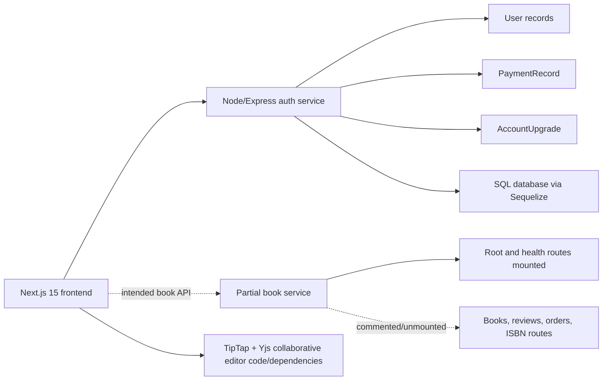
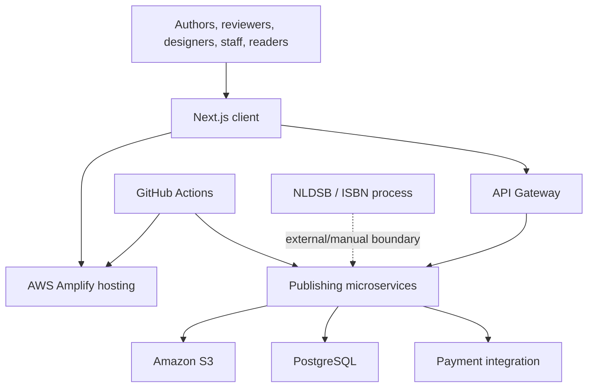
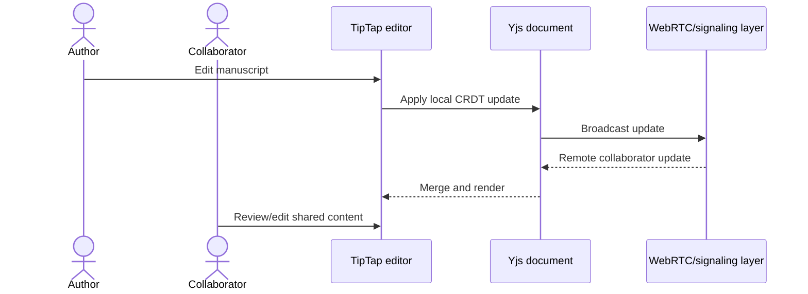

# RAG Release - Digital Publishing Capstone

> Evidence-based analysis of `C:\projects\reg-release`, including its three Git repositories and
> the 16-page proposal plus 80-page IEEE-style Software Requirements Specification. The directory
> name is `reg-release`, while the reports and product use “Rag Release.” Planned SRS architecture
> is kept separate from implemented code.

- **Project type:** University of Moratuwa final-year individual project
- **Project period recorded in the portfolio:** September 2024 - September 2025
- **Student:** Mohamed Ifham Mohamed, registration 215075J
- **Repositories:** Next.js frontend, authentication service, and partial book service

---

## One-liner

An ambitious digital-publishing capstone that prototypes a role-oriented manuscript workspace and
authentication/account foundation for authors, reviewers, designers, publication staff, and
readers, while documenting a larger marketplace and publishing architecture that remains only
partially implemented.

## Role and provenance

The proposal and SRS identify this as an individual academic project, and all observed commits
across the three repositories are attributable to Ifham aliases:

| Repository | Commits | Tracked files | Scope |
|---|---:|---:|---|
| `Rag-Release-FE` | 75 | 102 | Next.js role-oriented UI and collaborative editor dependencies |
| `user-auth-service` | 105 | 54 | Authentication, users, account upgrades, and payment records |
| `book-service` | 16 | 18 | Partial book-service controller/code skeleton; domain routes not mounted |

This evidence supports solo ownership of the academic prototype. It does not support claims that
every SRS feature, cloud service, or deployment target was completed.

## Problem and envisioned product

The reports describe a fragmented publishing process: authors draft and submit manuscripts,
reviewers provide feedback, designers prepare covers, publication staff manage ISBN/publication,
and readers discover or purchase books using disconnected tools. Rag Release aims to coordinate
those actors in one platform.

The SRS defines five principal roles:

- Author
- Reviewer
- Graphic Designer
- Publication Management User
- Reader

Its intended scope includes manuscript writing/editing, review cycles, cover work, ISBN processing,
publication choices, catalogue discovery, purchasing, ratings, and administrative/account flows.
Those requirements are valuable design evidence, but they are not proof of implementation.

## Implemented repository architecture

### Frontend

The frontend has 102 tracked files, including 67 TSX files and 28 `page.tsx` route modules. It uses
Next.js 15, Redux Toolkit, Axios, TipTap, Yjs, and `y-webrtc`-related collaboration dependencies.
The route and component surface shows substantial effort across role-aware dashboards and publishing
UI.

The presence of Yjs/WebRTC code supports describing a collaborative-editing prototype. It does not
prove a production signaling service, persistence strategy, conflict-recovery process, or stable
multi-user deployment; one signaling reference still points at localhost.

### Authentication service

The auth repository contains active routes and logic for authentication, users, and account-upgrade
flows. Its Sequelize domain includes:

- `User`
- `PaymentRecord`
- `AccountUpgrade`

The service uses JWT/bcrypt-oriented authentication patterns and has versioned migrations. This is
the most complete backend component in the supplied implementation.

### Book service

The book-service repository is only 18 tracked files. Its main router mounts root and health
behavior, but route mounts for books, reviews, orders, and ISBN are commented out. Controller code
exists, but no active model/migration layer was established in the audit.

It must therefore be described as an incomplete service skeleton. Statements such as “30+ live
endpoints,” “complete marketplace,” or “fully implemented book microservice” are unsupported.

## Planned SRS architecture

The 80-page SRS proposes a much larger cloud-native system:

This diagram reflects the design document, not the checked-out deployment. No Dockerfile, GitHub
Actions workflow, or source evidence of the complete AWS topology was found in the three repos.
Performance targets in the SRS, including response-time goals, are requirements rather than measured
results.

## Representative workflows

### Account and role upgrade foundation

The auth service models users separately from payment records and account-upgrade requests. That
supports a workflow where a user begins with a basic account and requests/records a change associated
with a paid or reviewed role. Exact authorization and payment-provider completion should be validated
before deployment.

### Collaborative manuscript editing

CRDT dependencies and editor integration show the chosen approach to concurrent changes. Durable
storage, access control, audit/version history, hosted signaling, and production recovery remain
necessary for a complete publishing editor.

### Intended publication lifecycle

The proposal/SRS describes a progression from authoring and submission through review, cover design,
publication-management approval, ISBN handling, release, discovery, sale, and rating. In the supplied
source, the frontend represents much of this product narrative, but the backend implementation does
not complete the full lifecycle.

## Technology stack

| Area | Implemented or present in source |
|---|---|
| Frontend | Next.js 15, React, TypeScript, Redux Toolkit, Axios |
| Editor/collaboration | TipTap, Yjs, `y-webrtc` ecosystem |
| Backend | Node.js, Express, JavaScript |
| Persistence | Sequelize migrations/models in the auth service |
| Security primitives | JWT and bcrypt-related authentication |
| Documentation | Proposal and IEEE 830-style SRS PDFs |
| Planned cloud | AWS Amplify, API Gateway, microservices, S3, PostgreSQL, CI/CD |

Items in the planned-cloud row are documented design decisions, not an audited deployment.

## Engineering strengths

- The capstone includes unusually detailed problem, stakeholder, requirement, and architecture
  documentation.
- Five publishing roles create a concrete workflow model rather than a generic editor.
- The frontend is substantial, with 28 page routes and collaborative-editor technology.
- The authentication service has a clear data model and migration history.
- Account upgrades and their payment records are modeled explicitly.
- Separating auth and book domains anticipates service boundaries needed by a broader marketplace.
- CRDT-based collaboration is a technically appropriate direction for concurrent document editing.

## Challenges and design responses

### Concurrent editing

The design adopts TipTap and Yjs so independently produced edits can be merged through CRDT rules.
The remaining challenge is operational: production signaling, document persistence, authorization,
awareness, history, and failure recovery.

### Multi-role workflow complexity

The SRS formalizes distinct actors and routes the user experience accordingly. Completion requires
the same role and resource rules on backend APIs; role-aware frontend navigation is not sufficient.

### Integrating institutional ISBN processing

The reports identify NLDSB/ISBN handling as an external or partly manual dependency. Modelling that
boundary is realistic, but service-level agreements, staff actions, and failure states need to be
validated with the institution.

### Keeping an ambitious capstone deliverable

The implemented code prioritizes a substantial frontend and auth foundation while the book service
remains skeletal. This is a defensible prototype boundary when documented honestly; it should not be
retrospectively presented as a fully deployed marketplace.

## Outcomes

- A 28-route Next.js publishing interface and collaborative-editor foundation were built.
- A functioning authentication/account-upgrade service with Sequelize models and migrations was
  created.
- The project produced a detailed proposal and 80-page SRS covering stakeholders, requirements,
  external systems, quality targets, and planned architecture.
- A book-service boundary and controller skeleton were started.

No verified public deployment, Docker/CI pipeline, completed book-service route surface, automated
test suite, user study, sales transaction, performance benchmark, or production adoption metric was
found. These absences are more informative than the former “shipped” claims.

## Current limitations and risks

- Book, review, order, and ISBN route mounts are commented out in the book service.
- No book-service model/migration implementation was established.
- No Dockerfiles or CI workflows were found despite the former documentation claiming both.
- No meaningful automated tests were found across the three repositories.
- Collaborative signaling includes a localhost dependency and lacks proven hosted operations.
- SRS cloud services, storage, payments, and performance targets are not source-verified outcomes.
- Cross-service authentication/authorization, ownership, and data consistency need end-to-end tests.
- Payment and institutional integration require security, reconciliation, and failure-path design.
- The repository folder name and product name differ, which can confuse links and automation.

## Recommended next steps

1. Decide and document the prototype boundary versus the still-planned SRS scope.
2. Implement and mount the book domain behind tested authentication and role/resource policies.
3. Add versioned data models/migrations for manuscripts, reviews, books, orders, ISBN state, and
   collaboration persistence.
4. Host and secure collaboration signaling; test reconnects, conflicts, authorization, and recovery.
5. Add unit, API integration, and end-to-end tests for account, manuscript, review, and publication
   workflows.
6. Introduce CI and reproducible deployment only after documenting real infrastructure choices.
7. Label every portfolio claim as implemented, prototyped, planned, or externally dependent.

## Key concepts demonstrated

- Requirements engineering and IEEE-style SRS documentation
- Multi-role publishing workflows
- Next.js application architecture
- TipTap rich-text editing
- Yjs CRDT collaboration
- JWT authentication and Sequelize migrations
- Microservice boundary design
- Distinguishing planned architecture from delivered code

## Evidence map

| Evidence | What it establishes |
|---|---|
| `215075J - Mohamed MRI - Rag Release Proposal.pdf` (16 pages) | Problem framing, individual-project context, goals, and initial plan |
| `215075J - Rag Release.pdf` (80 pages) | IEEE-style SRS, stakeholders, requirements, and planned architecture |
| Frontend route tree/package manifest | 28 pages and collaboration/UI technology |
| Auth routes/models/migrations | Active identity, payment-record, and account-upgrade foundation |
| Book-service router | Root/health mounted; domain route mounts commented out |
| Repository scans | No Dockerfiles, workflows, or meaningful automated tests found |
| Three Git histories | Solo academic authorship across the supplied repositories |

## Links

- **Local project root:** `C:\projects\reg-release`
- **Local reports:** proposal and SRS PDFs inside the project root
- **Git remotes:** [frontend](https://github.com/Rag-Release/Rag-Release-FE),
  [authentication service](https://github.com/Rag-Release/user-auth-service), and
  [book service](https://github.com/Rag-Release/book-service)
- **Remote visibility and deployed demo:** not verified in the supplied material.
