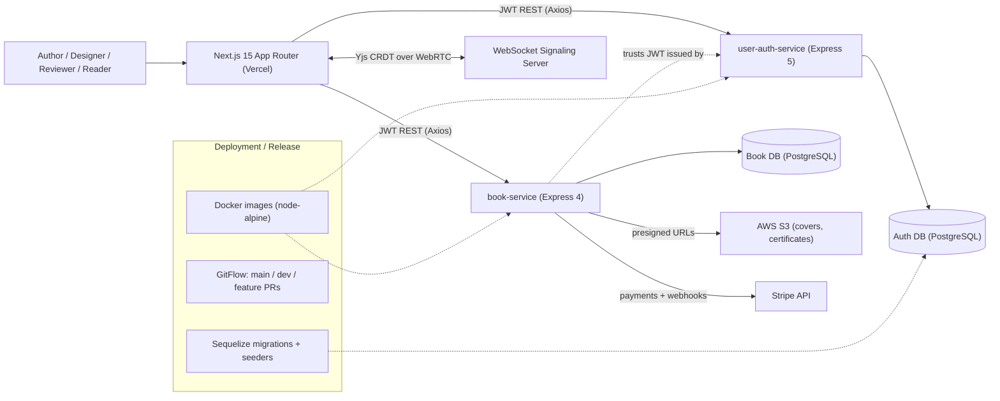

# Rag Release — Collaborative Book Publishing Platform

> Case-study doc. Condensed in `src/data/projects.data.tsx` (id `rag-release`), site at
> `/projects/rag-release`. **Individual Level 3 (final-year) capstone** (student 215075J),
> Sept 2024 – Sept 2025. Org: `Rag-Release` (frontend + two backend services).
>
> Truthfulness: facts from the three repos + the IEEE 830 SRS. Design-intent items not yet in
> the repos (serverless, Kubernetes, GitHub Actions, CloudWatch/Grafana/Prometheus, PM2) are
> **[SRS-planned]**, not claimed as shipped. "Rag" is a brand name — no RAG/LLM component.

## One-liner
A real-time collaborative book-writing and self-publishing platform for Sri Lankan authors that
carries a manuscript from co-written draft through cover design, editorial review, ISBN handling,
and Stripe-powered sales — a Next.js frontend backed by two Dockerized Node.js microservices.

## Role & context
Sole developer / full-stack engineer — authored the IEEE 830-1998 SRS, the architecture, all
three services, and end-to-end deployment & release management. Individual final-year capstone,
supervised. Polyrepo of three services under the `Rag-Release` org (Next.js frontend,
`user-auth-service`, `book-service`) with a shared JWT auth boundary. _To confirm — awarding
institution + grade._

## Problem
Sri Lanka's publishing industry leaves aspiring authors with limited access to professional
publishers, weak distribution, financial barriers (e.g. VAT), and little guidance (ISBN
acquisition, publishing-method choice). Authors stitch together disconnected tools for writing,
cover design, ISBN handling, review, publishing and sales — with no single platform connecting the
parties and no way to co-write in real time. _To confirm — a baseline metric for the gap._

## Approach / flow
A Next.js 15 frontend (role-aware UI, TipTap editor, Redux Toolkit, Axios+JWT, on Vercel) binds a
**Yjs CRDT** document shared peer-to-peer over **WebRTC** with a **WebSocket signaling** server for
presence/live cursors. `user-auth-service` (Express 5, Sequelize) issues **JWT access (15 min) +
refresh** tokens the other services trust. `book-service` (Express 4, Sequelize) handles book CRUD,
cover/ISBN uploads, the publish workflow, reviews, and Stripe purchases — validating the auth
service's JWTs and enforcing RBAC per route. AWS S3 stores covers/certificates behind presigned
URLs; Stripe handles payments + webhooks.

## Tech stack
Next.js 15, React 18, TypeScript, Redux Toolkit + redux-persist, Tailwind, Radix/shadcn-ui, TipTap,
react-hook-form + Zod, Axios; Yjs + y-webrtc + WebSocket signaling; Express (5 auth / 4 book),
Sequelize, Joi, JWT, bcryptjs, Helmet, CORS, express-rate-limit, Winston (+daily-rotate), Multer;
PostgreSQL (auth also wired for MySQL); AWS S3, Stripe, Vercel; Docker, GitFlow, Sequelize CLI,
Jest+Supertest (configured). **[SRS-planned]:** AWS EC2/LightSail, RDS, Lambda, API Gateway,
Kubernetes, GitHub Actions, CloudWatch/Grafana/Prometheus, PM2.

## Best practices followed
1. **Clean Architecture** (ports & adapters) — business logic independent of Express/Sequelize/JWT.
2. **Defense-in-depth security** — Helmet, env-aware CORS allowlist, IP rate limiting (100/15 min
   prod), Joi validation, body-size limits, bcrypt on every service.
3. **Stateless JWT** — short-lived access + refresh rotation; one auth service is the trust boundary.
4. **RBAC** — five roles (author/reviewer/designer/publisher/reader) enforced by route middleware.
5. **Reproducible DB releases** — versioned Sequelize migrations + seeders (up/undo).
6. **Operability** — Winston structured logging w/ daily rotation + `/health` probes; GitFlow PRs.

## Challenges → resolution
- **GraphQL → REST pivot.** The book-service was first GraphQL (Apollo + TypeGraphQL), diverging
  from the auth service's REST+JWT model and making cross-service RBAC/validation inconsistent.
  **Fix:** re-implemented as Express + Sequelize REST under the same Clean Architecture, unifying
  the middleware stack and simplifying role enforcement + deployment.
- **Concurrent co-writing without a central lock.** **Fix:** a Yjs CRDT bound to TipTap, synced
  peer-to-peer over WebRTC with a WebSocket signaling server for presence/cursors. _Known gap: the
  signaling endpoint still points at localhost; a hosted signaling URL is needed for production._

## Outcomes
- A 3-tier, 3-repo microservices platform with a shared JWT trust boundary.
- ~30+ REST endpoints across auth and book domains; 5-role RBAC publishing workflow.
- Real-time collaborative editor (Yjs CRDT, live cursors); Stripe e-commerce + webhooks; S3
  presigned-URL assets.
- Release deliverables: Dockerized services, Vercel CD, 5 versioned auth migrations, GitFlow
  (24+ merged PRs on the auth service). Academic: Proposal (Sep 2024) → SRS+interim (Feb 2025) →
  final + video (Sep 2025).
- _SRS performance targets (<200 ms ops, <500 ms uploads, 1000+ concurrent) are design goals, not
  benchmarked._ _To confirm — grade, real usage, whether a committed test suite shipped._

## Concepts & skills learnt
Microservices (polyrepo) · Clean Architecture · RESTful API design · JWT access+refresh rotation ·
RBAC · CRDT collaboration (Yjs) · WebRTC P2P + WebSocket signaling · Docker · GitFlow · Sequelize
migrations & seeding · AWS S3 presigned URLs · Stripe payments & webhooks · defense-in-depth API
security · observability (Winston, health checks). _Planned/SRS: GitHub Actions CI/CD, AWS
serverless, Kubernetes, CloudWatch/Grafana/Prometheus._

## Links
- **Repos (org `Rag-Release`):** Rag-Release-FE · book-service · user-auth-service. _Confirm public._
- **Live demo:** _To confirm — Vercel URL._ · **Report:** IEEE 830 SRS + final video _(local; add a shareable link)._
