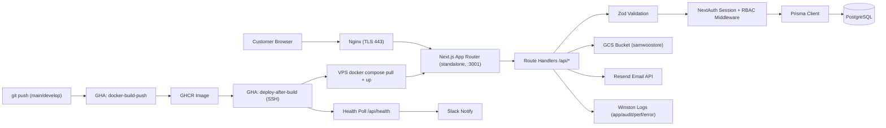

# Samwoostore (Samwoohub) — E-Commerce Platform

> Case-study documentation. The condensed version lives in
> `src/data/projects.data.tsx` (project id `samwoostore`) and on the site at
> `/projects/samwoostore`; the CV carries a one-line entry + a deep-link.
> Repo: `Darts-Ecommerce/samwoostore` · Live: samwoohub.lk

---

## One-liner
A full-stack Next.js 15 e-commerce platform for Samwoo with a role-based admin dashboard,
Google Cloud Storage-backed media, and a Dockerised CI/CD pipeline designed to release through a
self-managed Nginx VPS.

## Role & context
- **Role:** major full-stack contributor in a multi-author project. The repository has 440
  commits from several contributors; Ifham's aliases form the largest combined share, but the
  history does not support the former “solo developer” claim.
- **Client / scope:** built for Samwoo (org `Darts-Ecommerce`) as a storefront and back-office.
  Ifham contributed across the full-stack codebase; exact ownership of product scoping, schema,
  UI, API, infrastructure, and operations should be stated only after a commit-level/team review.
- **Audited scale:** 468 tracked files, 35 API route files, 13 Prisma models, five migrations,
  and two active GitHub Actions workflow files, with Jenkins pipeline files also present.
- **Customer base modelled:** six segments — `END_USER`, `WHOLESALER`, `RESELLER`, `INSTALLER`,
  `PROJECTS`, `COMPANY` (`CustomerType` enum).

## Problem
Samwoo needed a single owned storefront + operations console to replace ad-hoc order taking,
with: a catalogue large enough to need search/filter/pagination and stock states
(`ACTIVE`/`INACTIVE`/`OUT_OF_STOCK`); multiple customer segments with different
pricing/relationship needs (a generic Shopify-style template didn't model this); non-piece units
of sale (`PIECES`/`METER`/`BOX`/`DRUM`) for industrial SKUs; and a repeatable deploy story so the
owner could push changes without manual SSH steps.
_To confirm — a pre-project baseline (orders previously by phone/WhatsApp, hours/week on manual
stock reconciliation)._

## Approach / flow
**Components:** a Next.js 15 App Router frontend (route groups `(site)` / `(auth)` / `admin/`,
RSC for catalogue + Client Components for cart/checkout/admin); Redux Toolkit + RTK Query (cart /
wishlist / quick-view, debounced `localStorage` persistence + server cache); Next.js Route
Handlers (`products`, `categories`, `cart`, `orders`, `upload`, `dashboard`, `reports`, `health`)
with Zod validation; NextAuth v4 (Credentials/bcrypt + optional Google, 30-day JWT carrying
`role`/`customerType`); middleware RBAC on `/admin`, `/checkout`, `/my-account`; Prisma +
PostgreSQL (5 migrations, hierarchical categories via self-referencing `parentId`); Google Cloud
Storage (1-year immutable cache); a Resend email service (Nodemailer/SMTP fallback, single-use
reset tokens); Winston logging (app/audit/performance/error sinks with rotation); a multi-stage
Docker build → GHCR; GitHub Actions (`docker-build-push` + `deploy-after-build`); and Nginx +
Let's Encrypt terminating TLS to the app container on `127.0.0.1:3001`.

## Tech stack
- **Languages:** TypeScript 5.2, SQL (PostgreSQL).
- **Framework:** Next.js 15 (App Router, `output: "standalone"`), React 19.
- **State/data:** Redux Toolkit 2.6 + RTK Query, React Hook Form 7, Zod 4.
- **UI:** Tailwind CSS 3.3 + `tailwind-merge`, shadcn/ui on Radix, Framer Motion 12, Swiper,
  Lucide.
- **Auth:** NextAuth.js 4.24 (JWT) + Prisma adapter, bcryptjs.
- **DB:** PostgreSQL via Prisma 5.20.
- **Storage:** `@google-cloud/storage` 7.18 (service-account auth).
- **Email:** Resend 4.8 (prod) + Nodemailer 7 (SMTP fallback).
- **Reporting:** jsPDF + autotable (receipts), ExcelJS (exports), react-to-print.
- **Observability:** Winston 3.19 (file rotation).
- **Container/CI:** Docker (multi-stage, `node:20-alpine`), Docker Compose, GitHub Actions,
  GHCR, Nginx, Let's Encrypt/Certbot (Jenkinsfiles present as an alternative pipeline).
- **Tooling:** ESLint, Prettier, Prisma Studio, Postman collection, `scripts/healthcheck.js`.

## Best practices followed
1. **Feature-modular architecture** — `src/features/<domain>/{api,components,hooks,services,
   validators,types}` keeps domains self-contained instead of a flat sprawl.
2. **RBAC at the edge** — `middleware.ts` checks the NextAuth JWT `role` before the route
   renders, not after.
3. **Schema-validated boundaries** — Zod on every API input, React Hook Form on every UI form,
   with shared type inference.
4. **Indexed for the queries actually used** — a dedicated `add_performance_indexes` migration on
   `Product.status/slug/categoryId/subcategoryId` to avoid sequential scans on catalogue pages.
5. **Immutable, cacheable media** — GCS objects served with `Cache-Control: max-age=31536000` +
   `next/image` `remotePatterns`; AVIF/WebP automatic.
6. **Reproducible, slim image** — multi-stage Dockerfile + Next.js `output: "standalone"`.
7. **Deploy with verification, not hope** — `deploy-after-build.yml` polls `/api/health` 15× at
   5 s before reporting success and Slack-notifies, so a failed `up` doesn't look green.
8. **Audited operations** — every API request logged through Winston with response-time + audit
   sinks separated from app/error logs.

## Challenges → resolution
- **Non-piece units (meter, box, drum) without forking quantity-as-integer templates.** **Fix:**
  a `ProductUnit` enum (`PIECES|METER|BOX|DRUM`) via a dedicated migration, threaded through
  product display, cart line items, and the jsPDF receipt so the unit travels with the price.
- **String IDs made joins/indexing/admin filtering slow as the catalogue grew.** **Fix:**
  migrated PKs to `Int`, then added performance indexes on the hot paths and composite uniques
  `(userId, productId)` on Cart/Wishlist for idempotent add-to-cart.
- **VPS deploys intermittently failed (GHCR pull timeouts, no step visibility).** **Fix:**
  hardened `deploy-after-build.yml` with a 5× pull retry, a 15× 5 s `/api/health` poll, and a
  Slack notify on both success and failure — bad deploys fail loudly instead of leaving stale
  containers.

## Outcomes (verifiable from the codebase)
- A team-built single-codebase storefront + admin + API + observability + CI/CD pipeline.
- Image pipeline: `next/image` + GCS with 1-year immutable caching and responsive widths to
  3840 px (AVIF/WebP automatic).
- Deployment workflow encoded in source: push → image built/tagged (branch + SHA + `latest`) →
  GHCR → SSH rollout → health poll (up to 15 attempts) → Slack notification. This verifies the
  automation design, not that every external deployment completed successfully.
- Schema maturity: 13 Prisma models and 5 migrations including a performance-index pass and a hot-path ID type
  conversion; RBAC of 3 roles × 6 customer segments enforced in middleware.
- Hardened auth (bcrypt, 30-day JWT, single-use 32-byte 1-hour reset tokens) and 4 Winston log
  streams with rotation + per-request audit timing.
- _To confirm — production URL + go-live date, Lighthouse scores, median deploy duration,
  catalogue size, orders/GMV, manual-handling time saved._

## Audit qualifications and current gaps
- No automated unit, integration, or end-to-end test files were found. Authentication, pricing,
  checkout, order transitions, storage, email, and deployment rollback need executable coverage.
- GitHub Actions/Docker/nginx files prove a delivery design; current VPS health and past deployment
  success require external run evidence.
- Middleware RBAC should be paired with authorization inside every privileged route handler.
- The multi-contributor history requires contribution-specific wording rather than solo ownership.
- Business, catalogue, conversion, reliability, and performance metrics remain unverified.

## Concepts & skills learnt
Next.js 15 App Router (Server/Client split) · standalone Next.js output for minimal Docker images
· Prisma schema design + performance-index migrations · NextAuth JWT sessions with RBAC · Redux
Toolkit + RTK Query cache invalidation · Zod validation at API boundaries · GCS with long-lived
CDN-style caching · multi-stage Docker builds · GitHub Actions CI/CD with GHCR · SSH rollout with
health-poll verification · Nginx reverse proxy + Let's Encrypt TLS · structured logging & audit
trails with Winston · bcrypt + one-time cryptographic reset tokens · feature-modular frontend
architecture.

## Links
- **Recorded live URL:** https://samwoohub.lk _(current ownership and production health unverified)._
- **Git remote:** [github.com/Darts-Ecommerce/samwoostore](https://github.com/Darts-Ecommerce/samwoostore)
  _(remote is verified locally; public visibility is not)._
- **Deployment write-up (in-repo):** `docs/deploy/SAMWOOSTORE_DEPLOYMENT_GUIDE.md` (+ quick-start
  and env/nginx guides) — a strong portfolio artefact; consider publishing a sanitised version.

---

## Still to confirm (fills the remaining TODOs in `projects.data.tsx`)
1. A pre-project baseline metric (manual order handling / stock reconciliation).
2. Production URL + go-live date, Lighthouse scores, median deploy duration, catalogue size,
   orders/GMV.
3. Repo visibility (public vs sanitised mirror), and exact project end date.
4. `public/images/projects/samwoostore.png`.
5. Ifham's exact feature/infrastructure contribution, verified against the multi-author commit
   history; do not restore a solo-ownership claim without evidence.
