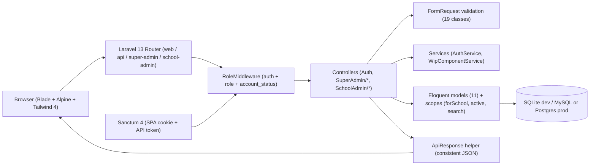

# School Management System — Multi-Tenant Laravel Platform

> Case-study doc. Condensed in `src/data/projects/school-management.tsx` (id
> `school-management`), site at `/projects/school-management`. Laravel 13 + Blade/Alpine/Tailwind.
> Repo local-only (branch `dev`); deploy/links to confirm.

## One-liner
A multi-tenant school-administration platform that lets a platform operator onboard schools and
assign admins, while each School Admin manages their own teachers, grades, academic years, and
student enrollments under role-based access control.

## Role & context
- **Role:** Full-Stack Developer. _To confirm — solo / team / course / client, your exact slice,
  and the timeline._
- **Scope:** six capabilities — Auth + RBAC, Super Admin user management, school onboarding +
  admin assignment, teacher management, grade/grade-section management, and student management +
  enrollment into academic-year grade sections. Strict multi-tenant isolation is a non-negotiable
  design constraint.

## Problem
Small-to-mid schools juggle student records, teacher rosters, grade structures, and yearly
enrollments across spreadsheets and ad-hoc tools, with no shared platform that enforces
school-level data isolation when one operator runs multiple schools. Two administrative tiers
(Super Admin for the operator, School Admin per school) make onboarding a guarded workflow rather
than a manual DB edit, and ensure a School Admin cannot read or mutate another school's data.
_To confirm — a "before" number (manual onboarding hours, schools on spreadsheets, error rate)._

## Approach / flow
Server-rendered Blade + Alpine + Tailwind 4 UI (Vite build). Laravel 13 splits routes by audience
(`web`, `api`, `super-admin`, `school-admin`). `RoleMiddleware` authenticates and checks
`User.role` + `account_status` before any controller. 12 thin controllers orchestrate; 19 Form
Requests validate; a small service layer (`AuthService`, `WipComponentService`) holds reused
behavior; an `ApiResponse` helper standardizes JSON. 11 Eloquent models enforce tenancy via
`school_id` + `scopeForSchool()/scopeActive()/scopeSearch()`; `AdmissionNumberGenerator` issues
admission numbers; UUIDs on `User`/`School`. Sanctum 4 runs SPA-cookie mode for Blade and token
mode for API. 16 migrations, soft deletes on `Student`/`Teacher`, DB-backed sessions/cache/queue.

## Tech stack
PHP 8.3+, Laravel 13, Laravel Sanctum 4 (+ custom RoleMiddleware), Eloquent over SQLite (dev) /
MySQL/PostgreSQL (configurable), Blade + Alpine.js + Tailwind CSS 4 + Sheaf UI + DaisyUI + Flowbite
+ Heroicons, Vite 8, Laravel Form Requests, PHPUnit 12 + Mockery + Faker, Composer/npm, Laravel
Pint/Pail, `concurrently`.

## Best practices followed
1. **Strict multi-tenant isolation by construction** — tenant-scoped queries go through
   `scopeForSchool($schoolId)`, so a forgotten `WHERE` can't leak cross-tenant rows.
2. **RBAC with defense in depth** — `RoleMiddleware` guards the route, the controller re-derives
   `school_id` from the authenticated user (not request input), and the UI hides per-role actions.
3. **Centralized API response shape** — one `ApiResponse` helper for consistent payloads + codes.
4. **Form Request validation per endpoint** — 19 dedicated classes keep controllers thin.
5. **Reversible, ordered migrations** with `down()`; soft deletes on Student/Teacher; UUIDs in
   model `boot()`.
6. **Reproducible setup** — `composer setup` + `composer dev` (server + queue + logs + Vite).

## Challenges → resolution
- **Cross-tenant leak risk** with one User model serving both tiers against shared global tables
  linked via pivots. **Fix:** isolation at the model layer (`scopeForSchool`, `scopeActive`) and
  `school_id` resolved from the authenticated user, never from client input.
- **Academic-year lifecycle** (pending → active → completed) so enrollments attach to the right
  year. **Fix:** academic years + academic-grade-sections as first-class entities with explicit
  status, enrollments scoped to the active year. _To confirm — swap for your real 2nd blocker
  (mid-year transfers / Sanctum SPA+token coexistence / Sheaf UI + Tailwind 4) if different._

## Outcomes
- Shipped: Auth + RBAC, Super Admin management, school onboarding + admin assignment, teacher /
  student / grade / grade-section management, academic-year lifecycle, and enrollment with
  transfer/completed/dropped states.
- 11 Eloquent models, 16 migrations, 12 controllers, 19 Form Request validators, 4 route files,
  15+ Blade components.
- _To confirm — deployed URL / real users / metrics._

> **Honest gaps (surface on your terms, with the fix you'd ship next):** tests are placeholder
> only (no domain/RBAC/enrollment tests); no CI/CD or Dockerfile; no rate limiting / audit logging
> / 2FA / background jobs yet (`MAIL_MAILER=log`). Good "next steps" to mention in an interview.

## Concepts & skills learnt
Multi-tenant SaaS architecture · RBAC with middleware · Eloquent query scopes for tenant isolation
· Laravel Sanctum (SPA cookie + API token) · Form Request validation · REST API with consistent
envelopes · TALL-stack frontend · migrations with reversible `down()` + soft deletes · UUID PKs ·
service-layer pattern · Vite + Tailwind 4 · reproducible dev env with `concurrently`.

## Links
- **Repo / demo / report:** _To confirm._

## Still to confirm (fills the TODOs in the data file)
1. Your role + team/course/client setting + timeline.
2. The motivating problem's "before" number.
3. The real 2nd challenge you hit + the fix.
4. Deployment / users / metrics.
5. Repo, demo, and report links; `public/images/projects/school-management.png`.
