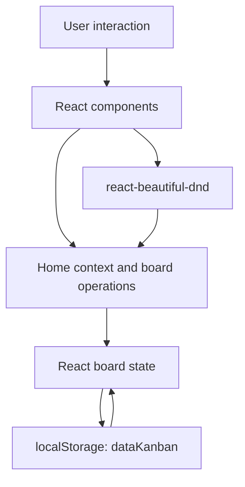
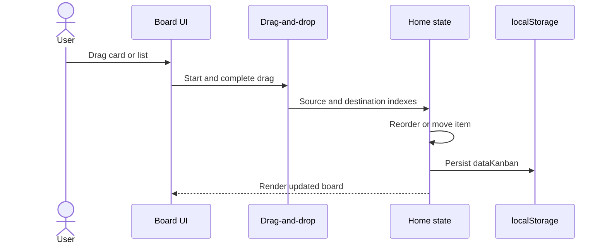

# TODO-APP - Browser-Persisted Kanban Board

> Source-verified case study based on `C:\projects\TODO-APP` at commit `1331288`. This project is
> distinct from the Firebase-backed “Master TODO” entry in the portfolio data and should not be
> merged with it without explicit evidence.

- **Project type:** Client-side Kanban task board
- **Primary stack:** React 17, Create React App 4, Material-UI 4, Sass
- **Ownership evidence:** Five commits, all attributable to Mohamed MRI / Ifham Mohamed
- **Persistence:** Browser `localStorage`; no backend or account system

---

## One-liner

A compact React Kanban board with editable lists and cards, cross-column drag-and-drop, and instant
browser persistence for lightweight personal task organization.

## Role and context

TODO-APP is a small solo frontend project. It explores direct manipulation of a Kanban board rather
than a multi-user task-management backend. The entire functional state lives in the browser, making
the project simple to deploy and use but intentionally limited to one browser profile.

## Problem and scope

Simple tasks are easier to manage when their status is visible spatially. A conventional checklist
does not show work moving from planned to active to complete, while a full project-management service
adds accounts, network dependencies, and administration.

The implemented scope is deliberately focused:

- three useful initial lists: To do, In Progress, and Completed;
- create, edit, and delete cards;
- create, edit, and delete lists;
- reorder lists;
- reorder cards within a list or move them between lists;
- restore the last board state from local browser storage.

There is no implemented authentication, server, database, collaboration, due-date model, notification
system, or synchronization layer.

## Architecture

The `Home` component owns the board state and exposes operations through React Context. Presentational
components render lists and cards, while `react-beautiful-dnd` provides drag lifecycle data. Every
successful mutation updates state and persists the new board under the `dataKanban` key.

## User workflows

### Start and restore

At module initialization, the application reads `dataKanban` from `window.localStorage`. If no saved
board exists, it uses the default three-column structure. The resulting state becomes the source of
truth for all rendered lists and cards.

### Add and edit

- Users add a list to extend the workflow.
- Users add a card inside a selected list.
- List and card labels can be edited in place.
- `uuid` supplies client-generated identities so persisted objects remain addressable across reloads.
- Click-outside handling closes active edit controls.

### Move work

A card can be reordered inside its current list or removed from one list and inserted into another.
Lists can also be reordered horizontally. Dropping outside a valid destination leaves the board
unchanged.

## Technology stack

| Area | Technology |
|---|---|
| UI | React 17 |
| Scaffolding/build | Create React App 4 and `react-scripts` |
| Component library | Material-UI 4 |
| Styling | Sass |
| Drag-and-drop | `react-beautiful-dnd` |
| Interaction helper | `react-onclickout` |
| Identity | `uuid` |
| Persistence | Web Storage API / `localStorage` |

## Data and persistence model

The board is serialized as JSON. Lists contain their own card collections, and list/card identifiers
allow edit, delete, reorder, and cross-list movement. Persistence after each mutation provides a
useful no-backend experience for one device.

This storage approach has important boundaries:

- it is scoped to a browser origin and profile;
- clearing site data removes the board;
- there is no cross-device synchronization or account recovery;
- the saved JSON has no schema version or migration process;
- storage values are not encrypted application data.

## Engineering strengths

- The app solves a complete, understandable workflow with a small dependency surface.
- React Context centralizes the board operations used by nested list/card components.
- Stable UUIDs avoid using display text as object identity.
- Drag operations distinguish same-list reorder from cross-list movement.
- Local persistence makes reload behavior useful without backend infrastructure.
- The project is statically deployable and inexpensive to operate.

## Outcomes

- Users can manage a multi-column task board entirely in the browser.
- List order, card order, and cross-list status changes survive page reloads.
- The project demonstrates React state composition, Context, controlled editing, nested collection
  operations, Web Storage, and drag-and-drop integration.

No user analytics, test results, performance benchmarks, or adoption metrics were found in the
repository. The outcome is therefore stated in functional rather than numeric terms.

## Current limitations and technical debt

### State correctness

Several operations mutate nested arrays or objects before creating a shallow outer copy. This can
make change detection and debugging fragile. Immutable update helpers or carefully cloned list/card
structures would make mutations safer.

### Storage resilience

`JSON.parse` is performed against `window.localStorage` during module loading. Malformed saved JSON
can prevent the application from starting, and direct `window` access makes the module unsuitable
for server rendering. The app should load in an effect or guarded initializer, validate a versioned
schema, and fall back safely when data is invalid.

### Product safety and validation

- Destructive actions have no documented confirmation, undo, or trash flow.
- Edit flows do not consistently protect against blank titles.
- There is no import/export or backup path.
- There is no concurrency or synchronization model.

### Maintenance and accessibility

- React 17, Create React App 4, Material-UI 4, and `react-beautiful-dnd` are legacy choices that make
  dependency maintenance harder.
- No project-specific automated tests were found; the test command comes from the CRA scaffold.
- Some edit interactions rely on clickable non-form elements, and accessible labels/focus behavior
  are not comprehensively documented.
- No error boundary or storage-failure feedback was found.

## Recommended next steps

1. Replace in-place nested mutations with immutable update functions and focused reducer tests.
2. Add a versioned board schema, guarded JSON parsing, validation, and migration handling.
3. Add undo or confirmation for destructive operations and validate non-empty titles.
4. Add accessible keyboard, focus, and screen-reader tests for drag, edit, add, and delete flows.
5. Migrate from Create React App and deprecated UI/drag packages to maintained equivalents.
6. Add export/import so users can back up browser-local data.
7. If collaboration is desired, design an explicit backend/conflict model rather than treating
   `localStorage` as a sync cache.

## Key concepts demonstrated

- React component composition and Context
- Nested collection state updates
- Kanban interaction design
- Drag-and-drop lifecycle handling
- Browser-local JSON persistence
- Client-generated UUIDs
- Static frontend deployment

## Evidence map

| Evidence | What it establishes |
|---|---|
| `package.json` | React 17, CRA, Material-UI, drag-and-drop, Sass, and test-script baseline |
| `src/components/Home` and context usage | Central state ownership and board operations |
| List/card components | Add, edit, delete, render, and drag behavior |
| `localStorage` calls | `dataKanban` persistence and restore behavior |
| Git history | Small solo implementation across five commits |
| README | Demo and project description |

## Links

- **Repository:** [github.com/ifham-mohamed/TODO-APP](https://github.com/ifham-mohamed/TODO-APP)
- **Demo recorded in the README:** [to-do-app-gold.vercel.app](https://to-do-app-gold.vercel.app/)
- **Local source:** `C:\projects\TODO-APP`
