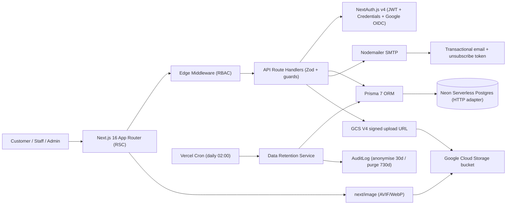

# Total Supply — Multi-Role Supply-Chain Platform

> Case-study documentation. The condensed version lives in
> `src/data/projects.data.tsx` (project id `total-supply`) and on the site at
> `/projects/total-supply`; the CV carries a one-line entry + a deep-link.
> Repo: `total-supply-web` (Next.js 16 + Prisma 7 + Neon).

---

## One-liner
A multi-role supply-chain platform that lets Sri Lankan customers order food and request
cleaning or IT-support services, while six coordinated staff roles (admin, salesman, driver,
cleaner, IT staff, plus customer) fulfil and track every job end-to-end through dedicated
dashboards.

## Role & context
- **Role:** sole full-stack engineer on a freelance engagement for an external client (a Sri
  Lanka–based supply-chain business).
- **Scope owned end-to-end:** requirements decomposition (171 features / 100+ user stories /
  8-week roadmap), the 14-model Prisma data layer, all 83 API route handlers, six role-specific
  dashboards, NextAuth-based auth with an admin-approval gate, the Nodemailer transactional
  pipeline (25+ templates), the GCS file-upload path, the GDPR data-retention cron, the
  landing-page performance pass, and Vercel deployment.

## Problem
The client had no unified system: food orders were taken informally, cleaning and IT-support
jobs were tracked off-platform, new-customer approvals and staff assignments were manual, and
there was no audit trail or GDPR posture. The pre-optimisation landing page also shipped with
a **3.2 s Total Blocking Time** on mobile Lighthouse — unacceptable for a public storefront
targeting Sri Lankan mobile users on mid-tier devices.

## Approach / flow
- **Next.js 16 App Router (React 19, Server Components)** — public surface, auth flows, and six
  role-specific dashboards.
- **Edge middleware** — reads the NextAuth JWT, enforces strict path-prefix RBAC
  (`/dashboard/admin`, `/driver`, `/salesman`, `/cleaner`, `/it`), redirects role mismatches.
- **NextAuth.js v4** — JWT session strategy, Credentials (bcrypt) + Google OAuth 2.0 / OIDC, a
  custom `Session` model for server-side revocation, and a 90-day "Remember Me" cookie.
- **API route handlers (83 endpoints)** — Zod validation, `requireAuth` / `requireAdmin` /
  `requireRole` guards, a uniform `ApiResponse.success(...)` envelope, per-IP rate limiting on
  auth routes.
- **Prisma 7 + Neon serverless Postgres** via the HTTP adapter `@prisma/adapter-neon` — 14
  models including `OrderStatusHistory` and `AuditLog`.
- **Nodemailer SMTP pipeline** — 25+ transactional templates (auth, order lifecycle, service
  lifecycle, GDPR), a `sendWithRetry` helper, and an unsubscribe-token footer on
  marketing-eligible mail.
- **Google Cloud Storage** — V4 signed upload URLs (15-min TTL) so avatars, product images,
  delivery proofs, and service before/progress/after photos upload direct from browser to
  bucket; public read via `next.config.ts` `remotePatterns` with AVIF/WebP.
- **Vercel Cron** — a daily 02:00 job that anonymises soft-deleted accounts at 30 days and
  hard-purges at 730 days.
- **Redux Toolkit** — client cart state only; everything else stays server-side via RSC +
  route handlers.

**Typical request:** browser → Next.js RSC → middleware (RBAC) → API route handler → Zod
validate → Prisma → Neon Postgres → JSON envelope. Side-effects fan out to Nodemailer and to
GCS signed-URL minting; uploads bypass the serverless function and go browser→GCS directly.

## Tech stack
- **Languages:** TypeScript, SQL (PostgreSQL).
- **Framework:** Next.js 16 (App Router, RSC), React 19.
- **Auth:** NextAuth.js v4 — JWT, Credentials + Google OAuth 2.0 / OIDC, bcryptjs.
- **Data layer:** Prisma 7 + `@prisma/adapter-neon`, Neon serverless PostgreSQL (HTTP driver).
- **Validation:** Zod.
- **UI:** Chakra UI v3, Tailwind CSS v4, Radix UI, shadcn/ui patterns, Lucide / react-icons,
  Framer Motion, next-themes.
- **Client state:** Redux Toolkit (cart only).
- **File storage:** Google Cloud Storage (`@google-cloud/storage`), V4 signed URLs.
- **Email:** Nodemailer (SMTP).
- **API docs:** `next-openapi-gen` + Scalar API Reference.
- **Testing:** Vitest. **Tooling:** ESLint 9, Prettier, pnpm. **Deploy:** Vercel (functions +
  Cron); Docker Compose for local Postgres.

## Best practices followed
1. **Defence-in-depth RBAC at three layers** — role + status in the NextAuth JWT, enforced at
   the edge via middleware (strict path-prefix routing), then re-checked inside each route
   handler with `requireAdmin` / `requireRole`.
2. **Audit logging on every privileged action** — `AuditLog` records
   CREATE/UPDATE/DELETE/STATUS_CHANGE/LOGIN/LOGOUT with actor, IP, user agent, and JSON
   details; composite indexes keep the admin viewer fast. `OrderStatusHistory` gives the same
   trail at the order level.
3. **Compliance-by-design** — GDPR export, soft-delete grace window, anonymisation at 30 days,
   hard purge at 730 days, and an unsubscribe-token footer on every marketing-eligible email.
4. **Database-conscious queries** — explicit `select` on every read (no `SELECT *`),
   `$transaction` for multi-row mutations, capped pagination on every list endpoint, indexes on
   every foreign key and filter column.
5. **Direct-to-storage uploads via 15-minute V4 signed URLs** — binary traffic never touches
   the serverless functions; the browser PUTs straight to GCS.
6. **Performance budget enforced in `next.config.ts`** — `optimizePackageImports` tree-shakes
   Chakra/Framer/Radix/Lucide/react-icons; below-the-fold landing sections and rarely-used
   drawers are `next/dynamic`; the 200 KB Swagger stylesheet is scoped to `/api-docs`.

## Challenges → resolution
- **Landing-page Lighthouse TBT of 3.2 s on mobile.** Root causes: a 200 KB
  `swagger-ui-react` stylesheet imported in the root layout (loaded on every route), eagerly
  bundled Chakra/Radix/icon libraries, and synchronously mounted cart and mobile-nav drawers.
  **Fix:** localised the Swagger CSS to `/api-docs`, added five more packages to
  `optimizePackageImports`, converted the cart and mobile-nav drawers to `dynamic(..., { ssr:
  false })`, and code-split below-the-fold landing sections. Production build passes with
  100/100 static pages. _To confirm — paste the measured "after" TBT; the plan targeted <500 ms._
- **Coordinating six roles through one codebase** without leaking admin endpoints, letting
  staff see each other's queues, or letting unapproved customers in — plus a chicken-and-egg
  first-admin bootstrap. **Fix:** `role` + `status` as JWT claims; middleware enforces strict
  path-prefix RBAC; every protected handler re-checks via `requireAdmin` / `requireRole`; the
  first registrant auto-promotes to `ADMIN` + `ACTIVE`, all later signups enter
  `PENDING_APPROVAL` until an admin approves (single, bulk, or reject — each emails the
  customer).

## Outcomes
- Shipped on Vercel as a demo-ready deployment (production build green, 100/100 static pages,
  daily GDPR cron live).
- End-to-end multi-role pipeline: order lifecycle `PENDING → ACCEPTED → PREPARING →
  OUT_FOR_DELIVERY → DELIVERED` with photo proof of delivery, plus a parallel `CLEANING /
  IT_SUPPORT` service pipeline with before/progress/after photos and 1–5 star ratings.
- Landing Lighthouse TBT cut from **3.2 s** _(to confirm — paste the measured "after" value;
  target <500 ms)_ via route-scoped Swagger CSS, expanded `optimizePackageImports`, and
  `next/dynamic` code-splitting.
- 14 Prisma models, 83 API route handlers, 25+ transactional email templates, and 6
  role-specific dashboards in one Next.js 16 codebase.
- Compliance posture from day one: immutable audit log, GDPR export, soft-delete grace window,
  30-day anonymisation, 730-day hard purge, per-user unsubscribe tokens.

## Concepts & skills learnt
Role-Based Access Control (RBAC) with JWT claims · OAuth 2.0 / OpenID Connect (Google via
NextAuth) · React Server Components & the Next.js App Router · serverless PostgreSQL with an
HTTP driver (Neon adapter for Prisma) · presigned URLs (V4 signing) for direct-to-bucket
uploads · N+1 avoidance via Prisma `select` + `$transaction` · tree-shaking &
`optimizePackageImports` · code-splitting via `next/dynamic`; Total Blocking Time / LCP
optimisation · GDPR data lifecycle (export, soft delete, anonymisation, hard purge) · immutable
audit logging · transactional email with unsubscribe tokens and retry-with-backoff · Vercel
Cron Jobs for scheduled compliance work.

## Links
- **Repo:** _To confirm — likely `https://github.com/Total-Supply/total-supply-web`._
- **Live demo:** https://total-supply.vercel.app _(confirm this is the current deployment)._
- **Report / case study:** an internal `docs/6.Executive-Summary.md` exists — _to confirm
  whether to link it publicly._

---

## Still to confirm (fills the remaining TODOs in `projects.data.tsx`)
1. The measured "after" Lighthouse TBT (used in both the challenge and the outcome).
2. The public GitHub repo URL.
3. That `total-supply.vercel.app` is the current live demo.
4. Whether to link the internal executive summary, and `public/images/projects/total-supply.png`.
