# Unifixz — CI/CD & Zero-Downtime Deployment

> Case-study documentation. The condensed version lives in
> `src/data/projects.data.tsx` (project id `unifixz`) and on the site at
> `/projects/unifixz`; the CV carries a one-line entry + a deep-link.
>
> Scope note: I owned the **deployment side only** — the Unifixz application (a Next.js 15
> multimedia-studio commerce platform) was built by teammates. This documents the CI/CD
> pipeline, Docker packaging, environment-aware configuration, and zero-downtime self-hosted
> release process I designed and operate. Repo: `github.com/Darts-Ecommerce/unifixz` (private).

---

## One-liner
Designed and operated a SHA-pinned GitHub Actions → GHCR → self-hosted-VPS CI/CD pipeline that
ships zero-downtime blue-green Docker deploys of Unifixz, a Next.js multimedia-studio commerce
platform serving design-studio customers and admins.

## Role & context
- **Role:** DevOps / Deployment Engineer — scope strictly limited to CI/CD, Docker, secret
  management, environment configuration, and release orchestration (not application
  development).
- **Project:** Unifixz, a multimedia design studio (live at `unifixz.lk`; dev at
  `dev.unifixz.lk`). App code authored by teammates.
- **Scope owned end-to-end:** the 4-workflow GitHub Actions pipeline, the multi-stage Docker
  build and per-env compose files, GitHub Environments (development/production) with secrets +
  approval gates + Slack webhooks, per-env `.env` assembly and SSH delivery, Prisma migration
  orchestration, and the zero-downtime container swap with rollback + image hygiene.

## Problem
The app needed reliable, environment-aware releases on a self-hosted Linux VPS (cost /
data-residency; PaaS rejected). Four concrete problems:
1. A single Docker image must serve both `dev.unifixz.lk` and `unifixz.lk`, even though Next.js
   inlines `NEXT_PUBLIC_*` at **build time** — the wrong domain leaked into prod password-reset
   emails and PayHere return URLs.
2. 13 accumulated Prisma migrations had to apply in front of live traffic without
   race-conditioning the app container.
3. SMTP-from-VPS had a deliverability gap (transactional email rate-limited / flagged).
4. PayHere is a live payment integration — every prod release had to be approval-gated and
   instantly rollback-able.

## Approach / flow
**Pipeline — 4 stages, 2 environments, 1 image:**
1. **CI** — `push` to `develop`/`main` runs `npm ci` → `prisma generate` → `tsc --noEmit` →
   ESLint → tests → `next build` with `SKIP_ENV_VALIDATION=1` and dev DB secrets as build args
   (so ISR prerendering can hit the DB).
2. **Image build** — on CI success, a multi-stage build (deps → builder → runner, Next.js
   `output: "standalone"`) pushes to GHCR tagged with branch, full SHA, `develop-<sha>` /
   `prod-<sha>`, and `latest` (main only).
3. **Deploy gate** — prod deploy is gated by `environment: production` (manual approval); dev is
   automatic on `develop`.
4. **Deploy execution** — poll GHCR for the SHA-pinned image; assemble `.env` via a
   single-quoted heredoc, `scp` to the VPS, `chmod 600`; run `prisma migrate deploy` in a
   one-shot container (prod); **blue-green swap** (rename live → `-old`, `up` new, poll
   `/api/health` up to 2 min); on healthy kill `-old`, prune images >72 h, stamp
   `.last_known_good_sha`; on unhealthy stop new, rename `-old` back, exit non-zero.
5. **Notify** — Slack success/failure via two webhooks.

```mermaid
flowchart LR
  Push["Push to develop / main"] --> CI["nextjs-ci: lint, typecheck, prisma generate, next build"]
  CI -->|"on success"| Image["docker-build-push: multi-stage build, push to GHCR (SHA tag)"]
  Image --> Branch{"Branch?"}
  Branch -->|"develop"| DevDeploy["deploy-dev (auto)"]
  Branch -->|"main"| Gate["GitHub environment: production (manual approval)"]
  Gate --> ProdDeploy["deploy-prod"]
  DevDeploy --> Wait["Poll GHCR for SHA-pinned image"]
  ProdDeploy --> Wait
  Wait --> Env["Assemble .env via single-quoted heredoc, scp to VPS, chmod 600"]
  Env --> Migrate["docker compose run prisma migrate deploy"]
  Migrate --> Swap["Blue-green: rename old, up new, poll /api/health up to 2 min"]
  Swap --> Healthy{"Healthy?"}
  Healthy -->|"Yes"| Cleanup["Kill old, prune images >72h, stamp last-known-good SHA"]
  Healthy -->|"No"| Rollback["Stop new, rename old back, exit 1"]
  Cleanup --> SlackOK["Slack success"]
  Rollback --> SlackBad["Slack failure"]
```

## Tech stack
- **CI/CD:** GitHub Actions, GitHub Environments (approval gates), GitHub Secrets.
- **Containers:** Docker, Docker Compose, multi-stage Dockerfile, Next.js `output: "standalone"`.
- **Registry:** GHCR (`ghcr.io/darts-ecommerce/unifixz`).
- **Host:** self-hosted Linux VPS; Nginx reverse proxy on a shared external Docker network;
  containers bound to `127.0.0.1:3020` (dev) / `127.0.0.1:3021` (prod).
- **Delivery:** SSH (ed25519), `scp`, bash heredocs.
- **DB tooling:** Prisma CLI 5.22.0 (pinned) against PostgreSQL (Neon), pooled `DATABASE_URL` +
  non-pooled `DIRECT_URL` for migrations.
- **Runtime validation:** Zod `config/env.ts` (`SKIP_ENV_VALIDATION=1` only for the build step).
- **Email:** Resend (migrated off SMTP/nodemailer).
- **Observability:** Slack webhooks, Docker `HEALTHCHECK`, JSON-file log rotation.

## Best practices followed
1. **SHA-pinned image promotion** — never a floating `latest`; reproducible, bisectable.
2. **Build-time vs runtime env separation** — one image, two environments, correct links in
   every email and payment redirect.
3. **Secrets never in plaintext outside the VPS** — single-quoted heredoc `.env`, `scp`,
   `chmod 600`; never logged or committed.
4. **Manual approval gate on production** — `environment: production`, critical because PayHere
   is live.
5. **Atomic blue-green swap with automatic rollback** — old container renamed (not killed)
   until the new one passes `/api/health`; rollback is a single rename + start.
6. **Pinned Prisma CLI for migrations** — prevents a transitive CLI upgrade from changing
   migration semantics on a live DB.
7. **Zod-validated runtime config** — re-validates required keys at boot; CI bypasses only for
   `next build` (ISR needs build-time DB access).

## Challenges → resolution
- **Wrong-environment URLs leaking into prod emails and PayHere callbacks.** `NEXT_PUBLIC_APP_URL`
  is inlined at build time and the same image is promoted dev → prod, so prod emails/receipts/SEO
  and PayHere return/cancel/notify URLs pointed at `dev.unifixz.lk`. **Fix:** refactored the
  URL-reading sites (`email.ts`, `payhere.ts`, `seo.ts`) to read the runtime `NEXTAUTH_URL`
  (injected per-env) ahead of the build-time `NEXT_PUBLIC_*`. One image, two environments,
  correct URLs everywhere.
- **SMTP deliverability gap from the VPS broke transactional email.** Outbound SMTP from the VPS
  IP was rate-limited/flagged, so password resets and order confirmations were silently
  undelivered. **Fix:** migrated the email path to the Resend API — removed `SMTP_*` from both
  deploy workflows, threaded `RESEND_API_KEY` / `RESEND_FROM` through both GitHub Environments
  and the `.env` heredoc, and kept the `.env.example` files in lockstep.

## Outcomes (derivable engineering metrics)
- 4-workflow CI/CD pipeline across 2 GitHub Environments with a manual approval gate on prod.
- 13 Prisma migrations shipped against live Postgres with no observed downtime.
- A single Docker image powers both environments (no duplicate build job).
- Deploy budget enforced by `timeout-minutes` (20 dev / 25 prod), with up to 10 min for GHCR
  image availability and a 2-min health window before automatic rollback.
- Container resource limits codified (prod 1.5 GB/1.5 CPU, dev 1 GB/1 CPU), loopback-bound
  behind Nginx; images >72 h pruned after each deploy; Slack alerting on both paths.
- _To confirm — production uptime, total deploys, MTTR, average pipeline duration (derive from
  `gh run list`)._

## Concepts & skills learnt
Blue-green container deployment with automatic rollback · multi-stage Docker builds · GHCR tag
promotion · build-time vs runtime env-var injection in Next.js · `prisma migrate deploy` with a
pinned CLI against pooled vs non-pooled Postgres · Next.js `output: "standalone"` · GitHub
Actions Environment protection / manual approval gates · SSH-based VPS deployment (`scp` +
single-quoted heredoc secret assembly) · Docker `HEALTHCHECK` + `/api/health` readiness ·
Zod-validated runtime config with a controlled `SKIP_ENV_VALIDATION` escape hatch · transactional
email migration SMTP → Resend · reverse-proxy-fronted Docker bridge networking.

## Links
- **Live (production):** https://unifixz.lk · **Dev:** https://dev.unifixz.lk
- **Repo:** private (`github.com/Darts-Ecommerce/unifixz`) — shareable with recruiters on request.
- **Deployment artefacts (name-drop in interviews):** `.github/workflows/{nextjs-ci, docker-build-push, deploy-dev, deploy-prod}.yml`, `docker/Dockerfile`, `docker/docker-compose.{dev,prod}.yml`, `config/env.ts`, `healthcheck.js`.

---

## Still to confirm (fills the remaining TODOs in `projects.data.tsx`)
1. Production uptime, total deploys shipped, MTTR, average CI→prod pipeline duration.
2. Whether unifixz.lk is publicly reachable for portfolio viewers.
3. `public/images/projects/unifixz.png`.
