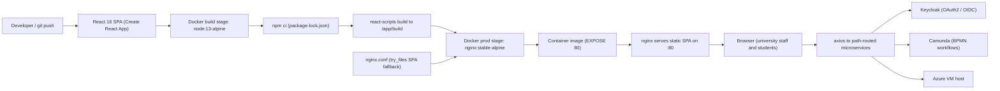

# Student Welfare Management System (ENIGMATRIX / welfare_fe)

> Case-study doc. Condensed version in `src/data/projects.data.tsx` (id `welfare-system`),
> site at `/projects/welfare-system`. Repo: `Enigmatrix-LoonsLab/welfare_fe` (private) · Live: ems.vpa.ac.lk
>
> Honest framing: **group project**, my role was **Full-Stack Developer (team member, not lead)**.
> My contributions were the **Mahapola scholarship + disciplinary data processes** and the
> **frontend containerization/deployment** (multi-stage Docker + nginx). It's the React frontend
> of the broader ENIGMATRIX university-management platform (~7 contributors, 40+ modules).

## One-liner
The React/Material-UI frontend for ENIGMATRIX — a role-based university-management platform for
the University of the Visual & Performing Arts — packaged as a multi-stage Docker image served by
nginx for reproducible, one-command deployment.

## Role & context
- **Role:** Full-Stack Developer on the team. Level 2 group software project (module IS 2901)
  mentored under the Faculty of IT (University of Moratuwa) and Loons Lab; real client = UVPA.
- **My contributions:** the Mahapola scholarship and disciplinary submission data processes, and
  the frontend's containerization + deployment (the `Dockerfile` and `nginx` serving config).
- _To confirm — exact responsibility split; team size (git shows ~7 authors)._

## Problem
The university's admissions, aptitude, examinations, finance, HR, scholarships (Mahapola),
medical, welfare and student-union processes ran manually across disconnected tools. The frontend
also had no consistent build/ship story — large CRA builds, dependency drift, and SPA deep links
404-ing on a plain web server. The deployment work closed that with a reproducible, container-based
build-and-serve pipeline. _To confirm — a baseline (manual processes / staff / students replaced)._

## Approach / flow
A multi-stage Docker build: a `node:13-alpine` stage runs `npm ci` (committed lockfile) then
`react-scripts build` (`GENERATE_SOURCEMAP=false`, raised heap) to emit hashed static assets; an
`nginx:stable-alpine` stage copies only the built assets + a custom `nginx.conf` and exposes :80.
nginx serves the SPA with `try_files $uri $uri/ /index.html` so client routes resolve on refresh.
The app calls path-routed microservices behind Keycloak (OIDC) and Camunda (BPMN) on an Azure VM.

## Tech stack
React 16.8, Create React App, Material-UI v4/v5 (MATX admin template), Redux + redux-thunk,
react-router-dom v5, Formik + Yup, axios, jwt-decode; Docker (multi-stage: node:13.12-alpine build,
nginx:stable-alpine serve). Integrated services (backend, not this repo): Keycloak (OAuth2/OIDC),
Camunda (BPMN), path-routed REST microservices on an Azure VM. System backend stack: Node.js,
Express.js, PostgreSQL, REST API.

## Best practices followed
1. Multi-stage Docker build — Node toolchain stays in the build stage; the final image ships only
   static assets on `nginx:stable-alpine` (small runtime, low attack surface).
2. Reproducible installs — `npm ci` against a committed `package-lock.json`.
3. Pinned base images (`node:13.12.0-alpine`, `nginx:stable-alpine`) for deterministic builds.
4. Production build hardening — `GENERATE_SOURCEMAP=false` + raised Node heap to avoid OOM.
5. SPA-correct serving — nginx `try_files … /index.html` history fallback + hashed asset names.
6. Role-based access in the app it serves — JWT route guards (`authRoles`) backed by Keycloak OIDC.

## Challenges → resolution
- **CRA build exhausted Node's heap and leaked source maps.** Fix: `--max_old_space_size=4096`
  and `GENERATE_SOURCEMAP=false` in the production build script.
- **React Router deep links 404'd on refresh under a plain web server.** Fix: nginx
  `try_files $uri $uri/ /index.html` so unmatched paths return the SPA shell.

## Outcomes
- A single deployable container image that builds the SPA and serves it on :80 with one
  `docker build`/`run` — no host Node setup.
- Minimal runtime image (nginx:stable-alpine; build toolchain excluded via multi-stage).
- Serves a frontend spanning 40+ modules across ~1,000 source files.
- **My feature contribution:** the Mahapola scholarship and disciplinary submission data processes.
- _To confirm — student/user counts, image size/build time, go-live status._

## Concepts & skills learnt
Multi-stage Docker builds & image-size optimization · nginx static/SPA serving with history
fallback · reproducible builds (`npm ci` + lockfile) · pinned base images · production build
hardening · OAuth2/OIDC (Keycloak) · JWT auth & RBAC · BPMN integration (Camunda) · microservices /
path-based routing · CRA/Webpack production builds · Azure VM deployment · Redux + Material-UI.

## Links
- **Live:** https://ems.vpa.ac.lk · **Repo:** `Enigmatrix-LoonsLab/welfare_fe` (private).
- _To confirm — live demo URL (Azure VM evidence in repo), report/SRS link._
