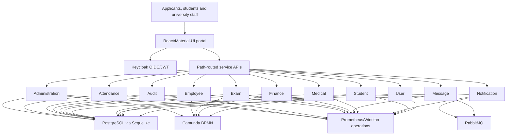
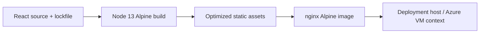

# ENIGMATRIX Welfare / University Management Platform

> Source- and document-verified analysis of `C:\projects\welfare-managment-system`, including the
> `welfare_fe` React application, the full `vpa-be` microservice tree, and five user/certificate PDF
> artifacts. The directory retains the original `managment` spelling.

- **Institution:** University of the Visual & Performing Arts
- **Project type:** Group-built university administration and welfare platform
- **Frontend:** React 16 / Create React App / Material-UI / Redux
- **Backend:** Eleven Node.js/Express/Sequelize services with PostgreSQL-oriented infrastructure

---

## One-liner

A large role-based university operations platform spanning admissions, welfare, examinations,
finance, HR, attendance, student services, medical workflows, messaging, audit, and notifications,
with a React portal, containerized microservices, Keycloak identity, and Camunda/RabbitMQ integration.

## Role and provenance

This is a team system, not a solo project.

- The `welfare_fe` repository has 28 commits, all authored by Mohamed MRI / Ifham Mohamed aliases.
- The `vpa-be` repository has 1,691 commits and many contributors; Ifham is not an obvious author in
  its top-level history.
- Prior portfolio material describes Ifham as a full-stack team member working on Mahapola/welfare
  and disciplinary frontend areas plus frontend containerization/deployment. The frontend history
  supports substantial client ownership, but exact feature ownership should be confirmed with commit
  diffs or team evidence before making narrower claims.
- The backend should be credited to the wider team unless individual contributions are established.

## Problem and organizational scope

University administration involves applicants, enrolled students, academics, welfare officers,
finance staff, exam staff, HR, medical staff, and administrators. These groups share identity and
student records but operate different processes with different approvals and audit requirements.

The system consolidates those processes behind a single portal while keeping major backend domains
as separate services. The checked-in guides confirm a real applicant journey involving account
creation, academic data, application completion, payment proof, institutional verification,
admission documents, and aptitude examination access.

## Top-level architecture

The exact integration mix varies by service. The architecture diagram expresses technologies found
across the backend, not a claim that every service connects to every infrastructure component.

## Repository map and scale

### Frontend

`welfare_fe` contains 1,147 tracked files, including approximately 822 JSX and 189 JavaScript files.
The application is based on the MATX administration template and has 37 top-level view areas. Large
feature groups include Human Resources, Course Management, aptitude/admissions, vehicles, welfare,
and a sizeable `Temp` area.

The breadth demonstrates a substantial portal, but raw file counts overstate unique functionality:
templates, duplicate/temporary variants, and generated assets are present.

### Backend services

The `vpa-be` repository has 12,534 tracked files, approximately 12,325 of them JavaScript. Each of
the eleven service directories includes a Dockerfile.

| Service | Route files | Model files | Migration files | Controller files | Use-case files | Test files |
|---|---:|---:|---:|---:|---:|---:|
| Administration | 284 | 199 | 323 | 961 | 1,083 | 3 |
| Attendance | 6 | 51 | 13 | 16 | 90 | 3 |
| Audit | 10 | 16 | 29 | 31 | 87 | 3 |
| Employee | 198 | 147 | 246 | 712 | 809 | 3 |
| Exam | 36 | 47 | 107 | 135 | 322 | 3 |
| Finance | 14 | 40 | 91 | 51 | 247 | 3 |
| `massage` (repository spelling) | 2 | 4 | 3 | 5 | 20 | 3 |
| Medical | 18 | 14 | 29 | 61 | 76 | 3 |
| Notification | 0 | 38 | 74 | 1 | 278 | 3 |
| Student | 70 | 82 | 147 | 258 | 435 | 3 |
| User | 2 | 2 | 3 | 15 | 16 | 3 |

These are filesystem counts, **not endpoint or business-capability counts**. The extreme controller
and use-case totals, near-constant three test files per service, and very large repository size
indicate duplicated/generated/backup code. They are useful audit signals rather than quality metrics.

## Frontend architecture

The portal uses React 16.8, Create React App, React Router 5, Redux/Redux Thunk, Material-UI v4/v5
packages, Formik/Yup, Axios, and JWT decoding. It also includes libraries for charts, PDFs, Excel,
dates, and rich administrative interfaces.

### Access and routing

Routes are grouped by feature and decorated with role metadata such as `authRoles`. Keycloak-backed
JWT identity is used to determine permitted client navigation. The browser calls path-routed APIs
for the underlying service domains.

Client guards improve navigation and reduce accidental exposure, but every backend service must
still authenticate and authorize requests independently.

### Functional areas

The source tree covers:

- applicant and aptitude-test registration;
- student and course administration;
- welfare/Mahapola-related screens;
- disciplinary and administrative workflows;
- human resources and employee functions;
- attendance;
- examinations and results;
- finance/payment-related flows;
- medical services;
- vehicles/transport;
- reporting, charting, PDF, and spreadsheet interactions;
- shared configuration, role-based navigation, and system administration.

Because the repository includes `Temp` and many duplicated variants, a screen's presence should not
automatically be reported as a production-complete workflow.

## Applicant journey confirmed by PDFs

The 10-page portal guide and 49-page Sinhala registration guide provide evidence beyond the code
tree. Together they show the following user process:

The shorter three-page aptitude instructions and certificate-head artifacts support the same
admissions/examination context. Sensitive banking or applicant details from the guides are not
reproduced here because they are unnecessary for technical documentation.

### PDF artifact inventory

| File | Purpose/evidence |
|---|---|
| `welfare_fe/src/app/views/PublicPages/Portal_guide.pdf` | 10-page English portal/application guide |
| `welfare_fe/src/app/views/PublicPages/Registering_aptitude_test.pdf` | 49-page Sinhala aptitude registration guide |
| `welfare_fe/src/app/views/dashboard/files/aptitude_test_instructions.pdf` | Three-page candidate instruction document |
| `welfare_fe/public/assets/CertificateHead.pdf` | One-page reusable certificate/application header asset |
| `welfare_fe/src/app/views/HumanResource/Designation/Recruitment/CertificateHead.pdf` | One-page duplicate used by HR recruitment views |

## Backend platform

Across services, the codebase uses Node.js and Express with Sequelize models/migrations and
PostgreSQL-oriented configuration. Infrastructure packages and source reference:

- Keycloak for OAuth2/OIDC identity;
- Camunda for BPMN/workflow orchestration;
- RabbitMQ/`amqplib` for asynchronous messaging;
- Prometheus instrumentation;
- Winston logging;
- scheduled/cron tasks;
- service-specific Docker images.

The use-case/controller layering attempts to separate HTTP delivery from business actions. The very
large and duplicated file surface makes consistency, discoverability, and regression control a major
engineering concern.

## Frontend delivery

The frontend has a multi-stage Dockerfile:

1. a `node:13-alpine` stage performs a lockfile-based `npm ci` and production build;
2. the generated static assets are copied into `nginx:stable-alpine`;
3. nginx serves the single-page application and falls back to `index.html` for client-side routes.

This keeps the Node toolchain out of the final image and makes the frontend a static deployment.
However, Node 13, React 16, CRA, and older Material-UI dependencies are now major maintenance and
security liabilities.

## Engineering strengths

- Major institutional domains are separated into eleven service boundaries.
- Sequelize migrations provide a versioned relational schema approach.
- Keycloak centralizes identity instead of duplicating password systems in every service.
- Camunda provides a suitable model for long-running, approval-heavy university processes.
- RabbitMQ supports decoupled notification/message work.
- Prometheus and Winston establish metrics/logging foundations.
- The frontend supports complex forms, validation, reports, and role-oriented navigation.
- Multi-stage Docker/nginx packaging produces a small static frontend runtime.
- End-user PDFs document the operational admissions flow.

## Challenges and responses

### Coordinating long-running approvals

Admissions, welfare, finance, and examination actions cross departments and cannot always finish in
one HTTP request. Camunda and asynchronous messaging are appropriate foundations for visible workflow
state and decoupled work.

### Serving many roles in one portal

Feature route groups and `authRoles` keep navigation tailored to each user. The backend still needs
consistent policy enforcement and tests because browser guards can be bypassed.

### Shipping an older CRA application

A reproducible lockfile build and multi-stage nginx image isolate compilation from serving. This
solves packaging, but not the long-term dependency-support problem.

### Managing a very large team codebase

The backend file layout indicates duplication and generated/backup artifacts. Without stronger
modular ownership, linting, tests, and pruning, bug fixes can be applied to the wrong copy or behave
differently between services.

## Security and repository audit

Seven tracked `.env` files were found in the backend tree. Their values were deliberately not copied
into this documentation. Even if current values are non-production, tracked environment files are a
secret-hygiene risk because credentials can persist in Git history. The team should inventory and
rotate any exposed secrets, purge them where appropriate, and commit only sanitized examples.

Other security priorities include:

- consistent token verification, audience/issuer checks, and server-side roles in every service;
- resource-level authorization, not only role-level access;
- auditability for student, medical, discipline, welfare, and finance records;
- data retention, deletion, encryption, and backup policy;
- rate limiting, input validation, safe file uploads, and dependency patching;
- secure service-to-service identity and RabbitMQ/Camunda credentials.

## Testing and maintainability

Each backend service has only three files under its test area in the audited count, which is not
proportionate to thousands of controllers/use cases/models. Coverage cannot be inferred, but the
distribution strongly suggests minimal scaffolding rather than comprehensive workflow tests.

The frontend's large JSX surface similarly lacks an established automated test baseline in this
audit. Admissions/payment and role-sensitive flows require integration and end-to-end tests, not
only unit tests of helpers.

## Outcomes

- The codebase models a broad university operational platform rather than a single welfare form.
- A large React portal, eleven containerized services, and shared identity/workflow/messaging
  technologies are present in source.
- User guides verify a multi-stage admissions/payment/admission-document flow.
- Ifham's frontend repository history and Docker/nginx source support a strong client delivery role.

No verified production uptime, user count, processing-time reduction, transaction volume, test
coverage percentage, or current deployment health was found. An Azure VM context appears in prior
documentation, but the live environment must be independently confirmed before publication.

## Current limitations and risks

- The frontend runs on an obsolete React/CRA/Node-era stack.
- The backend contains extreme duplication/generation and more than 12,000 JavaScript files.
- Seven `.env` files are tracked; secrets may require rotation and history remediation.
- Automated test scale is far below the business and code complexity visible in the repositories.
- Client route guards cannot replace consistent service-side authorization.
- The `massage` service name appears to be a misspelling of message/messaging and creates naming
  ambiguity.
- Temporary/duplicate frontend areas make production scope hard to determine.
- Health checks, deployment manifests, service ownership, API contracts, and release runbooks are
  not consistently established from the audit.
- Medical, disciplinary, welfare, and financial data create a high privacy and compliance burden.
- Exact Ifham feature ownership beyond the frontend repository needs commit-level confirmation.

## Recommended next steps

1. Rotate any credentials that were ever committed and replace `.env` files with safe examples and
   secret-manager deployment.
2. Inventory duplicate/generated/backend variants, identify canonical modules, and archive or remove
   obsolete copies through a reviewed migration.
3. Upgrade Node, React, routing, Material UI, and the build system in staged feature slices.
4. Define shared API/auth/error/observability standards and enforce them across all eleven services.
5. Add contract, authorization, workflow, and end-to-end tests for admissions, welfare, finance,
   examinations, and sensitive record access.
6. Document Camunda processes, RabbitMQ events, service ownership, deployment topology, backups, and
   incident response.
7. Reconcile the guides with the current UI and version each user document against a release.
8. Record exact team contributions before turning this analysis into a personal case study.

## Key concepts demonstrated

- Large React administration portals
- Microservice domain decomposition
- Keycloak OAuth2/OIDC and role-oriented UX
- Camunda BPMN workflow orchestration
- RabbitMQ asynchronous messaging
- Sequelize models and migrations
- Docker multi-stage builds and nginx SPA hosting
- Prometheus metrics and structured logging
- Admissions/payment workflow documentation
- Legacy modernization and repository security auditing

## Evidence map

| Evidence | What it establishes |
|---|---|
| `welfare_fe` route/view/component tree | 37 broad portal areas and large React client scope |
| Frontend package/build/Docker/nginx files | React 16-era stack and static container delivery |
| Eleven `vpa-be` service directories | Backend domain boundaries and Docker presence |
| Backend package/config/source scans | Express, Sequelize, Keycloak, Camunda, RabbitMQ, Prometheus, Winston, cron |
| Backend file-count audit | Very large duplicated/generated surface and sparse test distribution |
| Tracked `.env` scan | Secret-hygiene risk without exposing values |
| Portal and aptitude PDFs | Applicant, payment, verification, admission, and examination workflow |
| Git histories | Ifham-owned frontend history and team-owned backend history |

## Links

- **Local project root:** `C:\projects\welfare-managment-system`
- **Frontend:** `C:\projects\welfare-managment-system\welfare_fe`
- **Backend:** `C:\projects\welfare-managment-system\vpa-be`
- **Git remotes:** [frontend](https://github.com/Enigmatrix-LoonsLab/welfare_fe) and
  [backend](https://github.com/Enigmatrix-LoonsLab/vpa-be)
- **Remote visibility and public deployment:** not verified in the supplied material.
