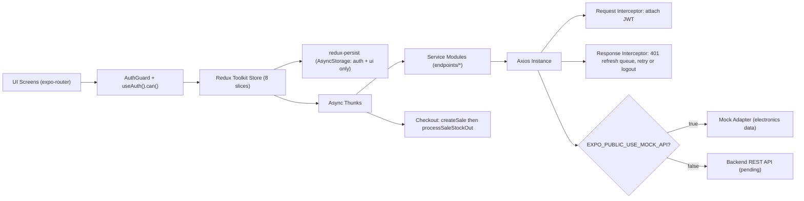

# X-POS — Cross-Platform Point-of-Sale App

> Case-study documentation. The condensed version of this lives in
> `src/data/projects.data.tsx` (project id `x-pos`) and on the site at
> `/projects/x-pos`; the CV carries the one-liner + concepts + a deep-link.

**Repo:** https://github.com/ifham-mohamed/x-pos

---

## One-liner
A cross-platform (iOS / Android / web) point-of-sale app for electronics-retail staff to
ring up sales, manage stock, and process returns, with role-based access spanning cashier
through super-admin.

## Role & context
- **Responsibility:** Designed and built the entire client/front-end — file-based
  navigation, the Redux state layer (8 slices), the typed API/service layer with auth
  interceptors, RBAC, and a swappable mock-backend for parallel development. (Single git
  author: Ifham Mohamed; the backend is wired-for but not in this repo.)
- **Scope:** Front-end mobile/web app only. Backend is pending (`EXPO_PUBLIC_API_URL` is a
  placeholder; the app currently runs against an in-process mock adapter).
- **Team / client / course:** _To confirm — solo/personal, client, employer, or course?_

## Problem
Electronics-retail checkout: cashiers need to ring up multi-item sales with line-level
discounts, deduct stock atomically, and handle returns, while owners restrict who can
discount, refund, or manage staff. The team also needed to build and demo the full app
before the backend existed.
_To confirm — the quantified prior gap (e.g. replaced a manual/spreadsheet process taking
N min/sale, or an existing POS that lacked role controls / offline tolerance)._

## Approach / flow
Components & data movement:

- **Presentation** — `expo-router` file-based routing with route groups `(auth)` and
  `(tabs)`; an `AuthGuard` in the root layout redirects on onboarding/auth state. UI built
  with atomic design (`atoms → molecules → organisms`) on react-native-paper (Material
  Design 3), themed light/dark via a `ui` slice + system scheme, with a custom floating-pill
  tab bar.
- **State** — Redux Toolkit store combining 8 slices (`auth, users, products, inventory,
  sales, salesItems, returns, ui`); redux-persist persists only `auth` + `ui` to
  AsyncStorage (whitelist).
- **Permissions** — centralized role→permission matrix (`permissions.ts`);
  `useAuth().can(permission)` gates screens and actions (e.g. checkout redirects users
  lacking `sales:process`; discount inputs hidden without `discounts:apply`).
- **Data access** — per-domain service modules (`services/endpoints/*`) call a single axios
  instance. A request interceptor attaches the JWT; a response interceptor does silent
  refresh-token rotation on 401 with a concurrent-request queue, falling back to logout.
- **Mock layer** — `axios-mock-adapter` (toggled by `EXPO_PUBLIC_USE_MOCK_API`) serves
  realistic electronics data with simulated 500 ms latency and passthrough for assets.
- **Checkout flow** — cart lives in `salesItems` → `createSale` thunk persists the sale →
  `processSaleStockOut` fires parallel `inventory/out` calls → success dialog computes change
  due; stock failures degrade gracefully ("Sale saved, but stock sync failed").

## Tech stack
- **Language:** TypeScript 5.9 (`strict: true`)
- **Framework / runtime:** React 19.1, React Native 0.81.5, Expo 54 (New Architecture
  enabled), expo-router 6 (file-based routing), react-native-web 0.21
- **State:** Redux Toolkit 2.11, react-redux 9, redux-persist 6, AsyncStorage 2.2
- **Networking:** axios 1.14, axios-mock-adapter 2.1
- **UI:** react-native-paper 5 (Material Design 3), react-native-reanimated 4,
  gesture-handler, dropdown-picker, expo-blur, `@expo-google-fonts/josefin-sans`
- **Auth/crypto:** JWT + refresh tokens; `md5` for an env-toggled client-side password-hash
  mode
- **Targets:** iOS, Android, Web

## Best practices followed
1. **Layered separation of concerns** — atomic-design components + per-domain service
   modules + Redux slices; screens never touch axios directly.
2. **RBAC via a single source of truth** — 5 roles × 14 permissions in one matrix, with role
   normalization (`superadmin`→`super_admin`, `staff`→`cashier`) and a `can()` gate reused
   across UI and route guards.
3. **Resilient auth** — response-interceptor JWT refresh with an `isRefreshing` flag +
   `failedQueue` that holds concurrent 401s and replays them after one refresh (prevents a
   refresh stampede), with forced logout on failure.
4. **Circular-dependency-safe wiring** — `injectStore()` plus runtime dynamic `import()` of
   thunks inside the interceptor to break the `api → store → slices → services → api` cycle.
5. **Disciplined persistence** — redux-persist whitelist limited to auth tokens + theme, so
   stale server data and PII aren't persisted across launches.
6. **API/domain decoupling + type safety** — strict TypeScript and explicit DTO→domain
   mappers (`mapProductApiToProduct`) with defensive coercion of loosely-typed fields like
   `is_active`.

> _Testing note:_ there is no automated test suite yet (no test runner/script in
> `package.json`); `axios-mock-adapter` is used for development mocking, not tests. Not
> listed as a strength — add it once specs exist.

## Challenges → resolution
- **Circular import deadlock** — the axios layer needs the store for the token, but the
  store imports slices that import the services that import axios.
  **Fix:** lazy `injectStore(store)` called once at bootstrap, plus runtime dynamic imports
  of the `refreshToken`/`logoutUser` thunks inside the interceptor instead of at module
  load.
- **Refresh stampede** — parallel requests all 401-ing at once would each trigger a separate
  token refresh.
  **Fix:** a single-flight refresh guarded by `isRefreshing`; other failed requests park in
  `failedQueue` and are resolved with the new token, then automatically retried.

## Outcomes
What shipped (concrete): a working cross-platform front-end covering 5 functional areas —
Dashboard, Sales/Checkout, Inventory, Returns, Profile — plus a Users-Management screen; 8
Redux slices; full auth flows (login, signup, forgot/reset password via deep link
`xpos://reset-password`, refresh, logout); RBAC for 5 roles; line-level discounts with
savings/change calculation; and a complete mock backend enabling backend-independent
development.

_To confirm — business/perf metrics: users/transactions handled, load/build time, bundle
size, demo-test results, adoption. If none yet, state "front-end complete; pending backend
integration and pilot."_

## Concepts & skills learnt
JWT authentication with refresh-token rotation · Axios request/response interceptors ·
Single-flight / request-queue (refresh-stampede prevention) · Role-based access control
(RBAC) & permission matrices · Redux Toolkit (`createSlice` / `createAsyncThunk`) · State
persistence & rehydration (redux-persist) · File-based routing (expo-router) & route guards ·
Atomic design component architecture · Cross-platform React Native / Expo (New Architecture) ·
Material Design 3 theming (light/dark) · Dependency injection to break circular imports ·
DTO-to-domain mapping & defensive type coercion · TypeScript strict mode · Mock-driven /
backend-agnostic development

## Links
- **Repo:** https://github.com/ifham-mohamed/x-pos
- **Demo:** _To confirm — hosted web build (Expo / Vercel) or APK / TestFlight?_
- **Report:** this document

---

## Still to confirm (fills the remaining TODOs in `projects.data.tsx`)
1. Was this solo/personal, for a client/employer, or a course?
2. Exact dates (start month → present/end).
3. The quantified problem (what was slow/manual/missing before).
4. Any real outcome metrics (users, transactions, bundle size, pilot results).
5. A demo link (web build / APK / TestFlight) and a screenshot for `public/images/projects/x-pos.png`.
