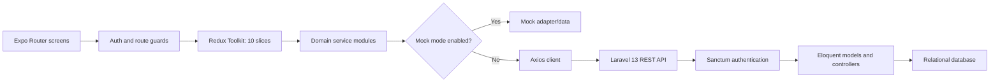
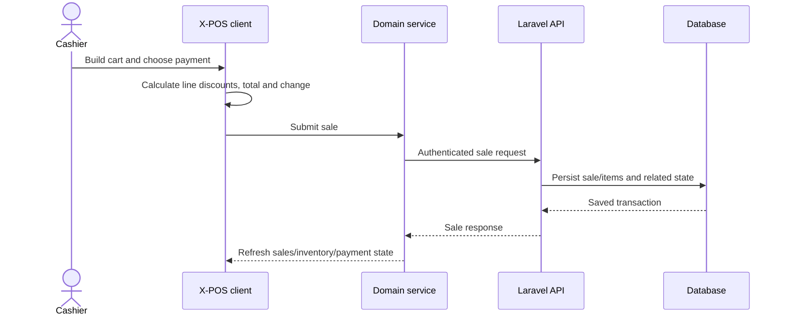

# X-POS - Cross-Platform Point of Sale

> Source-verified case study covering both repositories under `C:\projects\x-pos`: `X-Pos`
> (Expo/React Native client) and `pos_be` (Laravel API). This replaces the outdated claim that the
> backend was merely pending.

- **Project type:** Mobile/web point-of-sale client plus REST API
- **Client:** Expo 54, React Native 0.81, TypeScript
- **Backend:** Laravel 13, PHP 8.3, Sanctum
- **Status:** Integrated codebase pair with a mock-capable client; production integration unverified

---

## One-liner

A cross-platform POS system for sales, inventory, customers, payments, and returns, combining an
Expo client with persistent Redux state and a Laravel/Sanctum API while retaining a mock adapter for
parallel frontend development.

## Role and provenance

The two repositories have different ownership evidence:

| Repository | Commits | Tracked files | Provenance |
|---|---:|---:|---|
| `X-Pos` client | 3 | 99 | All commits authored by Ifham Mohamed |
| `pos_be` API | 35 | 76 | Primarily Rainas; approximately three commits attributable to Ifham aliases |

The defensible portfolio framing is: **Ifham owned the client and contributed a small portion to a
teammate-led backend**. It is not accurate to claim solo ownership of the combined system. Specific
backend contributions should be confirmed from the commit diff before publishing a more detailed
role statement.

## Problem and product scope

A point-of-sale application has to coordinate a fast checkout interaction with inventory, customer,
payment, return, and staff state. X-POS attempts to keep the cashier experience usable across mobile
and web while allowing frontend development to continue before every API is available.

Implemented source areas include:

- sign-in, session restoration, logout, and current-user behavior;
- users, products, inventory changes, customers, sales, sale items, payments, and returns;
- a cart/checkout-oriented client workflow;
- role-to-permission UI logic;
- a mock data adapter selected through configuration;
- a protected Laravel API using Sanctum tokens.

## Combined architecture

This switchable data-access boundary is the core integration strategy. Screens and Redux actions
target domain services; the services can resolve against mock behavior or the live API, reducing
the need for UI code forks.

## Client application

### Navigation and access

Expo Router provides file-based route groups for authentication and application areas. An auth guard
uses restored session state to decide whether users can enter protected routes. Deep-link support
includes a password-reset URI shape.

The client centralizes a role-to-permission matrix and uses `useAuth().can()`-style checks for route
and UI decisions. This improves consistency, but these checks are usability controls, not a security
boundary; the API must independently authorize each operation.

### State model

Ten Redux slices were found:

1. auth
2. customers
3. inventory
4. payments
5. products
6. returns
7. sales
8. sales items
9. UI
10. user

Redux Persist rehydrates selected state, and async thunks coordinate service requests. The split
aligns state with POS domains, although cross-slice checkout consistency must be tested carefully.

### Checkout behavior

The client includes line-level discounts, savings/change calculations, cart/sale-item management,
and payment-oriented state. Exact fiscal, tax, rounding, receipt, and hardware behavior should be
validated against the target business and jurisdiction before production use.

## Laravel backend

The backend contains nine Eloquent model files and 11 migrations. Its API routes expose roughly 29
operations across:

- authentication: login, logout, current user;
- user CRUD;
- product CRUD;
- inventory in, out, and adjustment;
- sales create/list/show;
- returns;
- customers;
- payments.

Except for login, the audited API routes are grouped behind Sanctum authentication. This establishes
identity but not necessarily role authorization: explicit role/permission middleware was not found
on the route surface reviewed.

Atomicity of the backend sale/inventory/payment write should be confirmed in controller/service code
and integration tests; a sequence diagram is not evidence of a database transaction.

## Technology stack

| Area | Technology |
|---|---|
| Cross-platform UI | Expo 54, React Native 0.81, React Native Web |
| Language | TypeScript on the client; PHP 8.3 on the server |
| Navigation | Expo Router 6 |
| State | Redux Toolkit, async thunks, Redux Persist |
| HTTP | Axios and domain service modules |
| Client access UX | Central role/permission matrix and guards |
| API | Laravel 13 |
| Authentication | Laravel Sanctum |
| Persistence | Eloquent models and migrations |
| Development mode | Configurable mock adapter/backend |

## Engineering strengths

- The client isolates screens from transport details behind domain service modules.
- Mock/live selection allows UI work and demos without removing the real API path.
- Ten domain-focused slices make state ownership discoverable.
- Authentication restoration and route guards reduce invalid screen access during startup.
- Permissions are centralized instead of duplicated as ad-hoc role checks in every component.
- The Laravel API covers the main POS resources and protects non-login routes with Sanctum.
- Migrations provide a versionable schema baseline rather than runtime synchronization.

## Challenges and responses

### Building before the API was complete

The client uses an adapter/configuration boundary so a mock implementation can satisfy the same
domain operations used by screens. This prevents the UI from becoming blocked on backend delivery.

### Sharing a client across native and web

Expo and React Native Web provide one route/component model. Platform-specific receipt printers,
cash drawers, barcode scanners, offline databases, and background tasks still need explicit adapters
if the product moves beyond software-only checkout.

### Keeping permissions consistent

One role/permission matrix avoids scattered client conditionals. The unresolved issue is server
parity: authorization must be implemented and tested in Laravel so bypassing the UI cannot elevate
privileges.

### Coordinating checkout state

Sales, sale items, inventory, payments, and returns are separate domains. A production POS must
guarantee transaction boundaries, idempotency, and reconciliation when requests fail or repeat.

## Outcomes

- The client implements a broad POS interaction surface across auth, products, inventory, customers,
  sales, payments, and returns.
- A real Laravel API is present; the former “backend pending” description is obsolete.
- Mock-backed development remains available without rewriting screen logic.
- The server exposes authenticated REST operations and a migration-backed domain model.
- The code demonstrates a team boundary in which Ifham led the client and participated lightly in
  the backend repository.

No verified deployment, active retailer, transaction volume, store listing, performance benchmark,
or hardware rollout was found. Functional code should not be described as a production POS rollout
without those artifacts.

## Current limitations and risks

- Git history does not support solo ownership of the combined project.
- Client RBAC is not an authorization boundary, and matching Laravel role middleware was not found.
- Backend automated tests are limited to Laravel example tests; sales, inventory, auth, return, and
  permission behavior lack meaningful coverage.
- Client automated tests were not established in the audit.
- The mock adapter can drift from the real API contract without shared schemas or contract tests.
- Offline transaction queuing, conflict handling, idempotency, and reconciliation are not proven.
- Receipt printing, barcode scanning, cash-drawer integration, tax rules, audit logs, and shift close
  controls are not established.
- Password reset/deep-link handling should be tested for token leakage and platform differences.
- Monetary values and rounding rules require a source audit before claiming accounting correctness.

## Recommended next steps

1. Add Laravel policies/role middleware and authorization tests for every resource/action.
2. Add database transactions and idempotency keys for sale, inventory, payment, and return workflows.
3. Generate or share an OpenAPI contract so mock, client types, and server behavior cannot drift.
4. Add client tests for calculations, permissions, rehydration, and mock/live switching.
5. Add backend integration tests for stock boundaries, duplicate submissions, returns, and ownership.
6. Define offline and hardware requirements before presenting the app as a deployed retail POS.
7. Record exact team contributions and deployment evidence in the portfolio entry.

## Key concepts demonstrated

- Expo/React Native cross-platform development
- File-based routing and guarded navigation
- Redux Toolkit domain state and persistence
- Adapter-based mock/live data access
- Laravel REST APIs and Sanctum authentication
- Eloquent models and migrations
- RBAC UX versus server authorization
- POS transaction and reconciliation concerns

## Evidence map

| Evidence | What it establishes |
|---|---|
| Client package/config files | Expo 54, RN 0.81, router, Redux, and web platform |
| Ten Redux slice files | Implemented client domain state |
| Client services/mock adapter | Swappable backend strategy |
| Laravel API route file | Auth, users, products, inventory, sales, returns, customers, and payments |
| Nine models and 11 migrations | Backend persistence scope |
| Test directories | Only minimal/example server coverage observed |
| Two Git histories | Ifham-owned client and teammate-led backend |

## Links

- **Local client source:** `C:\projects\x-pos\X-Pos`
- **Local backend source:** `C:\projects\x-pos\pos_be`
- **Git remotes:** [client](https://github.com/X-devsz/X-Pos) and
  [backend](https://github.com/X-devsz/pos_be)
- **Remote visibility, demo, and store listing:** not verified in the supplied material.
