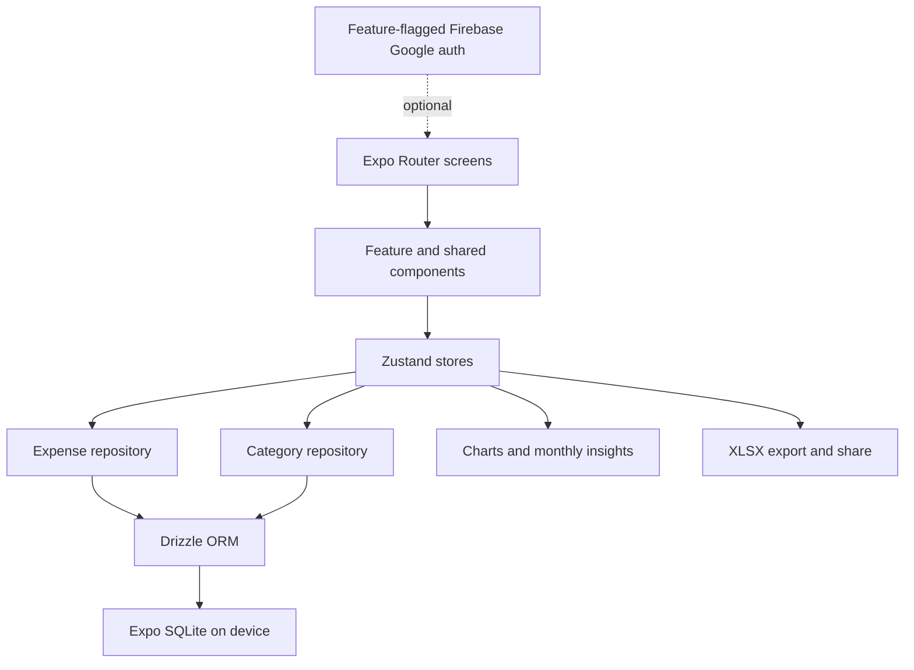
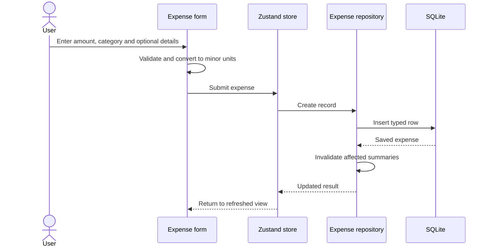

# X-Tracker - Offline-First Personal Expense Tracker

> Source-verified case study based on `C:\projects\X-Tracker` at commit `9b8233e`. Repository
> documentation was checked against the routes, database schema, repositories, stores, and package
> manifest so planned features are not confused with implemented behavior.

- **Project type:** Cross-platform personal finance application
- **Primary platform:** Expo / React Native
- **Ownership evidence:** 61 commits, all attributable to Ifham Mohamed aliases
- **Audited scale:** 164 relevant source/config/document files, including 70 TSX and 47 TypeScript
  files

---

## One-liner

An offline-first Expo expense tracker that stores money safely as integer minor units in SQLite,
supports fast expense and category workflows, presents monthly insights, and exports personal data
without requiring an account or network connection.

## Role and context

X-Tracker is a solo product and engineering project. Git history supports full ownership of the
checked-out repository. The codebase is structured as a Version 1 mobile application rather than a
prototype screen set: it has a local relational data layer, repositories, state stores, route
groups, charts, export utilities, design-system configuration, build configuration, and detailed
engineering documentation.

The repository README records 124 of 151 scoped features as complete for v1.0.0. That number is a
project checklist, not an independently executed acceptance-test result. This audit treats the
source code as the authority for implemented capabilities.

## Problem and product goals

Expense tools often make basic capture dependent on registration, connectivity, or a remote
service. That creates friction at the moment a transaction should be recorded and raises privacy
and portability concerns for personal financial data.

X-Tracker's design goals are:

- allow immediate guest-mode use;
- make create/edit/delete flows work fully offline;
- store currency without floating-point rounding errors;
- provide useful history and monthly category summaries on-device;
- let users control their data through spreadsheet export;
- keep optional identity and future sync separate from the local core.

## Architecture

### Layer responsibilities

| Layer | Responsibility |
|---|---|
| Expo Router | Screen navigation, route groups, edit identifiers, and tab layout |
| Components | Forms, cards, filters, selectors, charts, empty states, and design-system UI |
| Zustand | Feature state, selected periods, loading/error state, and repository coordination |
| Repositories | CRUD rules, soft deletion, summaries, ordering, and cache invalidation |
| Drizzle ORM | Typed queries and schema mapping |
| Expo SQLite | Durable on-device categories and expenses |
| Utilities | Currency/date handling, validation, spreadsheet construction, and sharing |

## Navigation and screens

The audited route tree contains 16 Expo route files. User-facing areas include:

- welcome, log-in, and sign-up routes under the authentication group;
- a tab shell for Home, History, Insights, and Settings;
- add-expense and edit-expense workflows;
- category management;
- route-level layouts that separate onboarding/authentication from the main application.

Authentication is currently feature-flagged off, so guest mode is the functional path. Firebase
configuration and Google-auth scaffolding should be understood as future/optional capability, not
a requirement for local expense tracking.

## Data model

The implemented database has two domain tables.

### `categories`

| Field | Purpose |
|---|---|
| `id` | Text UUID primary key |
| `name` | User-visible category name |
| `icon` | Icon identifier |
| `colorToken` | Design-system colour reference |
| `sortOrder` | User-controlled ordering |
| `isArchived` | Hides a category without destroying history |
| `createdAt`, `updatedAt` | Audit timestamps |
| `deletedAt` | Soft-delete timestamp |

### `expenses`

| Field | Purpose |
|---|---|
| `id` | Text UUID primary key |
| `amountMinor` | Integer amount in the currency's minor unit |
| `currency` | Currency code associated with the amount |
| `categoryId` | Foreign key to `categories` |
| `occurredAt` | Transaction date/time used by history and summaries |
| `note` | Optional user description |
| `merchant` | Optional merchant/payee |
| `paymentMethod` | Optional payment channel |
| `createdAt`, `updatedAt` | Audit timestamps |
| `deletedAt` | Soft-delete timestamp |

Indexes on occurrence date, category, and deletion state support the dominant range, grouping, and
active-record queries. Category-name uniqueness is enforced in repository logic rather than by a
database unique constraint; concurrent or bypassed writes therefore remain a data-integrity risk.

## Core workflows

### Capture an expense

Money is persisted as an integer `amountMinor`, avoiding binary floating-point errors in totals.
The display layer formats that value using its currency instead of treating a decimal string as the
source of truth.

### Browse and understand spending

The expense repository can list entries by date range, calculate monthly totals, and build category
breakdowns. The Home and Insights experiences consume those aggregates for summaries and charts,
while History provides a chronological browsing/editing surface. Repository-level caching avoids
recomputing unchanged periods; write operations invalidate the affected cached data.

### Correct or remove data

Expenses support update, soft delete, and restore operations. Categories can be edited, archived,
soft-deleted, restored, and reordered inside a transaction. Soft deletion preserves referential
history and creates a path for recovery instead of permanently dropping a record on the first
delete action.

### Export

The application uses the XLSX ecosystem and the platform share flow to create a portable spreadsheet
from the user's data. Export is local-first and does not require handing transaction data to a
project-owned server.

## Technology stack

| Area | Technology |
|---|---|
| Application | Expo 54, React Native 0.81, React, TypeScript 5.9 |
| Navigation | Expo Router |
| UI system | Tamagui 1.144 and tokenized application components |
| State | Zustand |
| Persistence | Expo SQLite and Drizzle ORM |
| Visualization | React Native Gifted Charts |
| Export | XLSX generation and native sharing |
| Optional identity | Firebase / Google authentication, feature-flagged off |
| Delivery | Expo Application Services configuration |

## Offline-first design

The local SQLite database is the primary data store, not a cache behind a mandatory API. Reads and
writes complete without a network round trip. This makes the core feature set available in weak or
absent connectivity and keeps personal finance data on the device by default.

This also defines a future sync constraint: if cloud synchronization is introduced, the local UUIDs,
timestamps, soft-delete markers, and conflict rules must remain first-class rather than replacing
the database with a thin remote cache.

## UX and design system

- Tamagui tokens centralize colour, spacing, typography, and platform styling.
- Purpose-built input, category, history, and summary components keep screens focused on orchestration.
- Empty, loading, and error states are represented in the feature structure.
- Category icons and colours make spending breakdowns scannable.
- Routes keep frequent capture close to the tab experience while settings and management remain
  available without crowding the main dashboard.

## Engineering practices

- Strict TypeScript types span schema, repositories, stores, and components.
- Domain persistence is isolated behind repositories rather than embedded in screen code.
- UUID identifiers are generated locally and do not require server allocation.
- Soft deletion and category archival protect historical references.
- Reorder writes use a transaction to avoid partially applied category positions.
- Summary caches are invalidated after mutations.
- The repository contains structured product, architecture, quality, and defect documentation.

## Defect resolution evidence

The checked-in bug tracker records 13 resolved issues: one critical, two high, six medium, and four
low severity. Important examples include:

- replacing an invalid Tamagui border-width token that caused a native crash;
- removing or changing unsafe native animation usage;
- correcting a dropdown implementation that produced circular React nodes and crashes;
- repairing Tamagui extractor/configuration behavior;
- resolving lockfile and dependency consistency problems;
- correcting History screen state behavior.

These records demonstrate disciplined triage and learning across React Native's JavaScript/native
boundary. They do not substitute for an automated regression suite.

## Outcomes

- A usable offline expense-capture loop is implemented from screen to SQLite persistence.
- Users can maintain categories and transaction history without an account.
- Monthly totals and category breakdowns are computed locally and visualized in the app.
- Integer minor-unit storage provides a sound currency foundation.
- Soft deletion, restoration, archival, and spreadsheet export improve user control over data.
- The codebase has a clean separation among route, state, repository, ORM, and storage concerns.

No production analytics, store-install count, crash-free-session metric, or benchmark result was
found. The repository's feature-completion percentage should not be presented as external adoption
evidence.

## Current limitations and risks

- No automated unit, integration, component, or end-to-end tests were found, despite documented
  quality gates.
- Firebase authentication is disabled and cloud synchronization is not implemented.
- Budgets, multi-device sync, observability, and later security gates remain roadmap items.
- Database uniqueness does not protect category names; repository-only validation can be bypassed.
- Backup/restore behavior beyond spreadsheet export is not established.
- Local data protection depends on the device and Expo SQLite defaults; field-level encryption or a
  documented threat model was not found.
- Currency conversion is outside the current model; summaries should not add unlike currencies
  unless the UI explicitly separates them.
- The route and component counts indicate a substantial UI, but release readiness still requires
  real-device regression testing and store-policy review.

## Recommended next steps

1. Add repository tests for minor-unit math, date boundaries, soft deletion, category uniqueness,
   ordering transactions, and summary-cache invalidation.
2. Add component and device-level tests for capture, edit, delete/restore, filters, and export.
3. Add a database unique strategy for normalized active category names.
4. Document multi-currency summary behavior and prevent accidental cross-currency totals.
5. Define encrypted backup and sync conflict semantics before enabling cloud synchronization.
6. Add crash reporting and privacy-preserving operational metrics for production builds.
7. Validate accessibility, small-screen layouts, and Android/iOS behavior on physical devices.

## Key concepts demonstrated

- Offline-first mobile architecture
- Expo Router and React Native
- SQLite with Drizzle ORM
- Repository and state-store separation
- Correct monetary representation
- Soft deletion and transactional ordering
- Local aggregation and chart visualization
- Spreadsheet export and data portability
- Feature flags for optional identity
- Native defect triage

## Evidence map

| Evidence | What it establishes |
|---|---|
| `package.json` and Expo configuration | Current platform, dependencies, and build scripts |
| `app` route tree | 16 route/layout files and the user-facing navigation model |
| Drizzle schema | Implemented categories/expenses tables, indexes, and soft-delete fields |
| Expense/category repositories | CRUD, restore, range queries, summaries, ordering, and cache rules |
| Zustand stores | Application state and repository orchestration |
| Components and utilities | Forms, charts, formatting, export, and design-system use |
| README and planning documents | Product scope, checklist status, and roadmap claims |
| Bug tracker | Thirteen recorded fixes and their severity distribution |
| Git history | Solo ownership across 61 commits |

## Links

- **Local source:** `C:\projects\X-Tracker`
- **Git remote:** [github.com/X-devsz/X-Tracker](https://github.com/X-devsz/X-Tracker)
  _(remote is verified locally; public visibility is not)._
- **Demo/store listing:** not found in the supplied repository.
